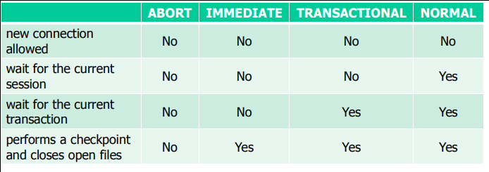

## What is a SID? Check the SID on your machine.
System Idendtifier: A Unique Identifier for an instance on the system

```bash
$ echo $ORACLE_SID
# -> orcl
```
## What are the differences between a OLTP instance and a DWH instance? Which SQLs do you run on which machine?

DWH vs	OLTP database

OLTP Databases handle many small and common actions in real time. DWH on the other hand have few complex queries but the data they work with is consistent and don't hae to be validated.

Both use relational Databases and any implementation of sql can be used.

## `SHUTDOWN` your instance and check the uptime on your machine.

Opening the SQL Console
```bash
sqlplus sys/oracle as sysdba

# SQL*Plus: Release 11.2.0.2.0 Production on Mon Oct 10 04:44:06 2016
#
# Copyright (c) 1982, 2010, Oracle.  All rights reserved.
#
#
# Connected to:
# Oracle Database 11g Enterprise Edition Release 11.2.0.2.0 - Production
# With the Partitioning, OLAP, Data Mining and Real Application Testing options
```

```sql
shutdown immediate;

-- Database closed.
-- Database dismounted.
-- ORACLE instance shut down.

SELECT STARTUP_TIME FROM V$INSTANCE;

-- *
-- ERROR at line 1:
-- ORA-01012: not logged on
-- Process ID: 9205
-- Session ID: 21 Serial number: 1029
```
## STARTUP your instance and check the uptime on your machine
```sql
startup;
-- ORACLE instance started.

--  Total System Global Area  456146944 bytes
--  Fixed Size                  1344840 bytes
--  Variable Size             348129976 bytes
--  Database Buffers          100663296 bytes
--  Redo Buffers                6008832 bytes
--  Database mounted.
--  Database opened.

SELECT STARTUP_TIME FROM V$INSTANCE;

-- STARTUP_T
--  ---------
--  10-OCT-16
```

## What are the differences of shutting down a database in the following modes:
- `ABORT`
- `IMMEDIATE`
- `TRANSACTIONAL`
- `NORMAL`


