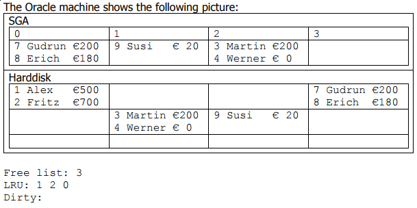

## 1

```sql
UPDATE bank_account
SET amount = amount - 20
WHERE account_id = 7;
COMMIT;
```

- **Free:** 3
- **LRU:** 1 2 0
- **Dirty:** 0

## 2

```sql
SELECT *
FROM bank_account
WHERE account_id = 9;
COMMIT;
```

- **Free:** 3
- **LRU:** 2 0 1
- **Dirty:** 1 0

## 3

```sql
FREE ONE BLOCK
```

- **Free:** 2 3
- **LRU:** 0 1
- **Dirty:** 1 0

## 4

```sql
SELECT *
FROM bank_account
WHERE account_id = 3;
COMMIT;
```

- **Free** : 3
- **LRU:** 0 1 2
- **Dirty:** 1 0 2

## 5

```sql
UPDATE bank_account
SET amount = amount + 100
WHERE account_id = 9;
COMMIT;
```

- **Free:** -
- **LRU:** 0 1 2 3
- **Dirty:** 1 0 2 3

## 6

```sql
FREE ONE BLOCK
```

- **Free:** 0
- **LRU:** 1 2 3
- **Dirty:** 1 2 3
