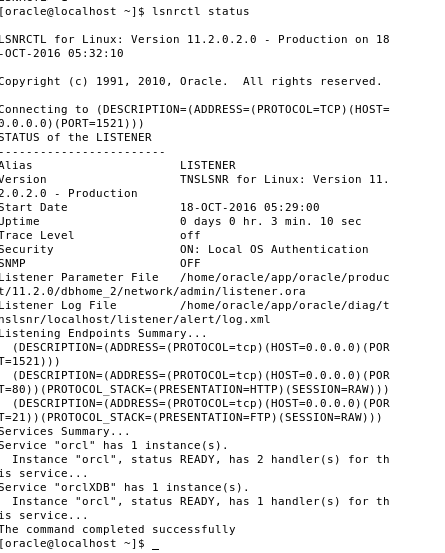
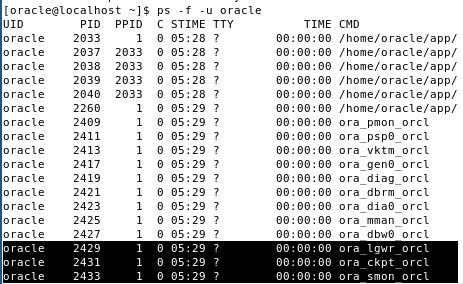

## 1
Describe the tasks of the following processes
### System Monitor (SMON)
- Performing instance recovery, if necessary, at instance startup.
- Recovering terminated transactions that were skipped during instance recovery because of file-read or tablespace offline errors.
- SMON recovers the transactions when the tablespace or file is brought back online.
- Cleaning up unused temporary segments.

### Process Monitor (PMON)
- Monitors other background processes and performs process recovery when a server or dispatcher process terminates abnormally.
- Responsible for cleaning up the database buffer cache and freeing resources that the client process was using.

### Database Writer (DBWR)
Writes modified block inside the cache back to the harddrive

### Log Writer (LGWR)
Writes redo log entries to the online redo log (after a complet transaction)

### Archiver (ARCn)
Copies the online redo log to offline storage (harddrive)

## 2
Check if the listener is currently running.



## 3
### Use an SQL-Statement to find the SMON, PMON and LGWR process.

```sql
select PID, SPID, PNAME, USERNAME
from v$process
where pname is not null
order by pname;
```
**Output (shortened)**
```
PID SPID                     PNAME USERNAME      
---------- ------------------------ ----- ---------------

 11 2429                     LGWR  oracle
  2 2409                     PMON  oracle
 13 2433                     SMON  oracle
```

### What is the Oracle PID?
An internal process id managed by oracle

### What is the operating system PID?
The Operating System Process Identifier is handled by the Operating System and is used to keep a track of all processess running on the operating system.

## 4
Use the ps command to find the SMON, PMON and LGWR process.


### Is the operating system PID the same?
No, the Oracle PID is diffent from the Unix PID, but the SPID inside the Database query is the same as the operating System pid.
