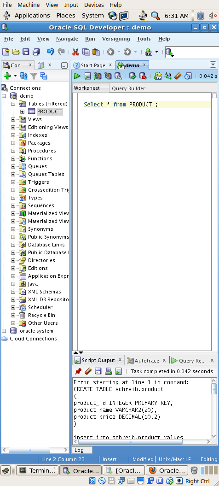
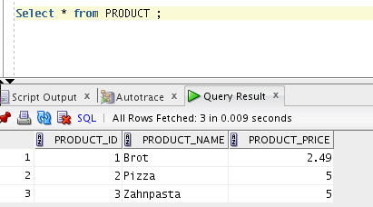

Create a new tablespace

```sql
CREATE SMALLFILE TABLESPACE "SHOP_SCHREIB" DATAFILE '/home/oracle/app/oracle/oradata/orcl/shop_scheib1' SIZE 200M AUTOEXTEND ON NEXT 10M MAXSIZE 300M , '/home/oracle/app/oracle/oradata/orcl/shop_schreib2' SIZE 100M LOGGING EXTENT MANAGEMENT LOCAL SEGMENT SPACE MANAGEMENT AUTO

```

Create a new user

```sql
CREATE USER "SCHREIB" PROFILE "DEFAULT" IDENTIFIED BY "*******" DEFAULT TABLESPACE "SHOP_SCHREIB" TEMPORARY TABLESPACE "TEMP" ACCOUNT UNLOCK
GRANT UNLIMITED TABLESPACE TO "SCHREIB"
GRANT "CONNECT" TO "SCHREIB"
GRANT "RESOURCE" TO "SCHREIB"
```

Create the table and insert some lines:

```sql
CREATE TABLE schreib.product
(
product_id INTEGER PRIMARY KEY,
product_name VARCHAR2(20),
product_price DECIMAL(10,2)
);

CREATE TABLE schreib.product
(
product_id INTEGER PRIMARY KEY,
product_name VARCHAR2(20),
product_price DECIMAL(10,2)
);

insert into schreib.product values (1, 'Brot', 2.49);
insert into schreib.product values  (2, 'Pizza', 5);
insert into schreib.product values  (3, 'Zahnpasta', 5);

```







