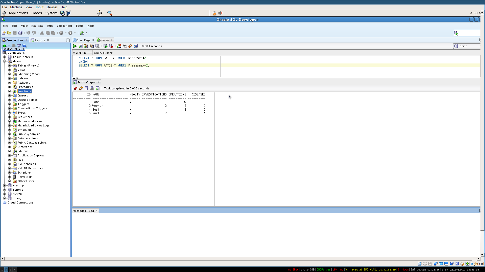
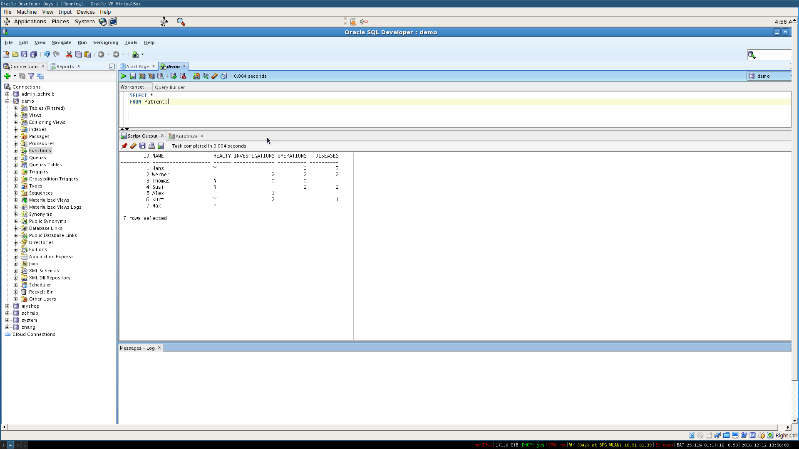
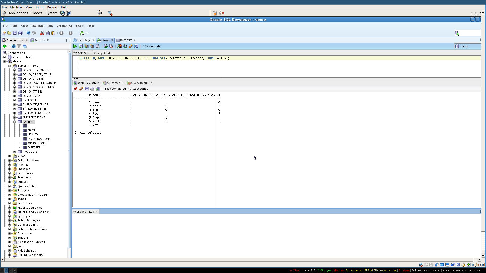
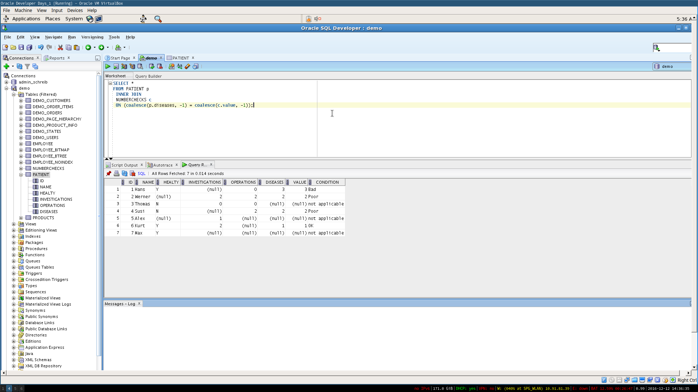
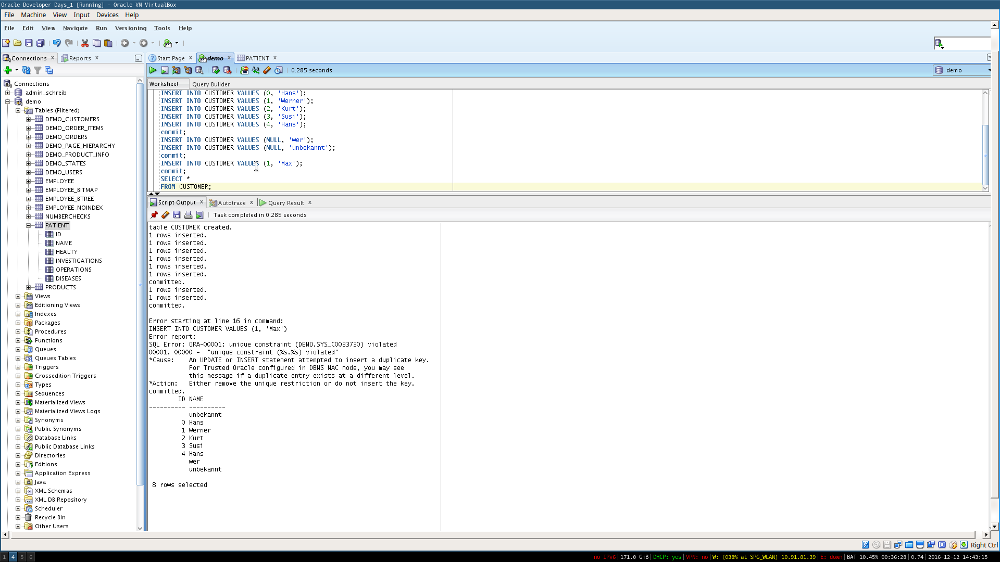

## Create the Tables Patient and NumberChecks

```sql

DROP TABLE Patient;
DROP TABLE NumberChecks;


CREATE TABLE Patient
(
       ID INTEGER,
       Name VArCHAR(20),
       Healty CHAR(1),
       Investigations INTEGER,
       Operations INTEGER,
       Diseases INTEGER
);

commit;
INSERT INTO Patient VALUES (1, 'Hans', 'Y', NULL, 0, 3);
INSERT INTO Patient VALUES (2, 'Werner', NULL, 2, 2, 2);
INSERT INTO Patient VALUES (3, 'Thomas', 'N', 0, 0, NULL);
INSERT INTO Patient VALUES (4, 'Susi', 'N', NULL, 2, 2);
INSERT INTO Patient VALUES (5, 'Alex', NULL, 1, NULL, NULL);
INSERT INTO Patient VALUES (6, 'Kurt', 'Y', 2, NULL, 1);
INSERT INTO Patient VALUES (7, 'Max', 'Y', NULL, NULL, NULL);

commit;

CREATE TABLE NumberChecks
(
       Value      INTEGER,
       Condition    VARCHAR(20)
);

INSERT INTO NumberChecks VALUES (NULL, 'not applicable');
INSERT INTO NumberChecks VALUES (0,    'Good');
INSERT INTO NumberChecks VALUES (1,    'OK');
INSERT INTO NumberChecks VALUES (2,    'Poor');
INSERT INTO NumberChecks VALUES (3,    'Bad');
INSERT INTO NumberChecks VALUES (4,    'Very bad');

commit;
```
## What is the result of the following SQL-querys?




### Rewrite the Query to get all lines!

```sql

SELECT *
FROM Patient;
```




### Rewrite the query to get also the lines with `NULL` in it.

```sql
SELECT ID, NAME, HEALTY, INVESTIGATIONS, COALESCE(Operations, Diseases) FROM PATIENT;

```



### Rewrite the query (coalesce), to join also the lines with NULL in it

```sql
SELECT *
FROM PATIENT p
 INNER JOIN
 NUMBERCHECKS c
 ON (coalesce(p.diseases, -1) = coalesce(c.value, -1));
```



### Testing SQL Queries

#### 1


The NULL = NULL condition wil not be evaluated as true, therefore, they wont be joined

#### 2



Since Null is always unique, the uniquie key constrained is fullfilled. But it's impossible to add to ids with the same value, as the uniquie key constrain is not fulfilled
