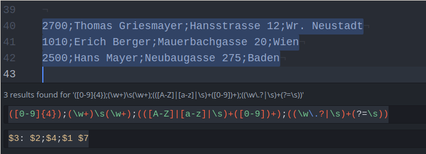
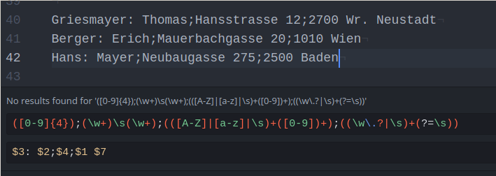
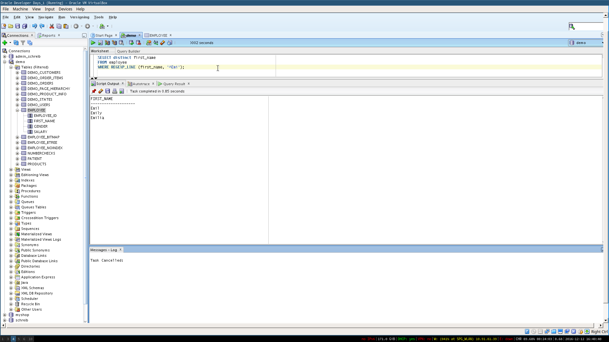

## Create a regular expression to check the accountname
- 3 Alphanumerical characters
- *Dash* (-)
- 3 Digits
- 1-3 Alphanumerical characters

```
([A-Z]|[a-z]){3}-[0-9]{3}([A-Z]|[a-z])+
```

## Create a regular expression for the file user.txt

```
PLZ ([0-9]{4})
  ;
Vorname (\w+)
  \s
Nachname (\w+)
  ;
Straße (([A-Z]|[a-z]|\s)+([0-9])+)
  ;
Ort ((\w\.?|\s)+(?=\s))

Zusammengesetzt:
([0-9]{4});(\w+)\s(\w+);(([A-Z]|[a-z]|\s)+([0-9])+);((\w\.?|\s)+(?=\s))

Replacement String:
$3: $2;$4;$1 $7
```




## Use a Regular Expression within an SQL Statement
```sql
SELECT distinct first_name
FROM employee
WHERE REGEXP_LIKE (first_name, '^Emi');
```


