## Create a TABLESPACE

```sql
CREATE SMALLFILE TABLESPACE "SCHREIB_EXPLAIN"
  DATAFILE '/home/oracle/app/oracle/oradata/orcl/wael_exp01.dbf'
    SIZE 100M AUTOEXTEND ON NEXT 1M MAXSIZE UNLIMITED,
  '/home/oracle/app/oracle/oradata/orcl/wael_exp02.dbf'
    SIZE 100M AUTOEXTEND ON NEXT 1M MAXSIZE UNLIMITED LOGGING EXTENT MANAGEMENT LOCAL SEGMENT SPACE MANAGEMENT AUTO;
 ```

 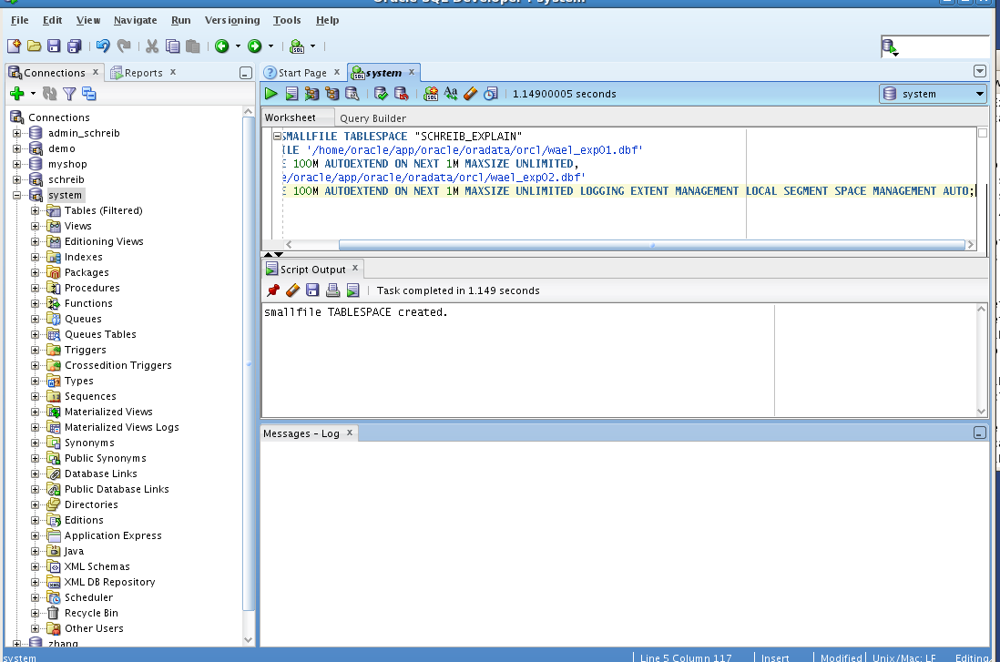


## Create an user

 ```sql
CREATE USER "SCHREIB_EXPLAIN"
  PROFILE "DEFAULT"
  IDENTIFIED BY "oracle"
  DEFAULT TABLESPACE "SCHREIB_EXPLAIN"
  TEMPORARY TABLESPACE "TEMP"
  ACCOUNT UNLOCK;

  GRANT SELECT ANY DICTIONARY TO "SCHREIB_EXPLAIN";
  GRANT UNLIMITED TABLESPACE TO "SCHREIB_EXPLAIN";
  GRANT CONNECT TO "SCHREIB_EXPLAIN";
  GRANT RESOURCE TO "SCHREIB_EXPLAIN";
  GRANT CREATE TABLE TO "SCHREIB_EXPLAIN";
  GRANT ALTER SYSTEM TO "SCHREIB_EXPLAIN";
```

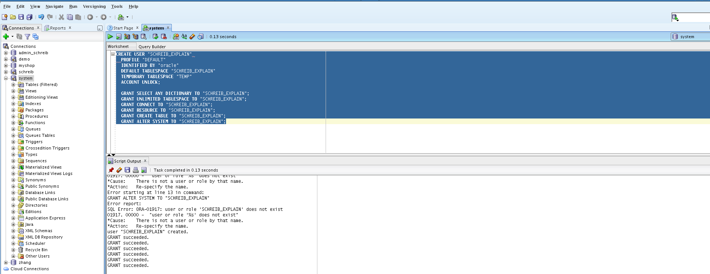


## Create tables and fill the Table with Values

Use the SCHREIB_EXPLAIN user:

```sql
-- THanks to Wael for the Generated Data!

-- Customer
CREATE TABLE CUSTOMER (  CUSTOMER_ID INTEGER,  FIRST_NAME      VARCHAR(20),  CREDIT       DECIMAL(10,2) );
INSERT INTO CUSTOMER VALUES (1, 'Thomas',200);
INSERT INTO CUSTOMER VALUES (2, 'Andrea',3000);
INSERT INTO CUSTOMER VALUES (3, 'Werner',300);
INSERT INTO CUSTOMER VALUES (4, 'Alexander',150);
INSERT INTO CUSTOMER VALUES (5, 'Thomas',250);
INSERT INTO CUSTOMER VALUES (6, 'Anderas',90);
INSERT INTO CUSTOMER VALUES (7, 'Wael',70);
INSERT INTO CUSTOMER VALUES (8, 'Hans',900);
INSERT INTO CUSTOMER VALUES (9, 'Franz',870);
INSERT INTO CUSTOMER VALUES (10, 'Felix', 690);
commit;

-- Sales
CREATE TABLE SALES ( SALES_DATE DATE, PRODUCT_ID NUMBER, CUSTOMER_ID INTEGER, PIECES INTEGER );

create or replace
PROCEDURE TESTDATA AS
X INTEGER;
PRD INTEGER;
ANZ INTEGER;
BEGIN
  FOR X IN 1..400000 LOOP
    PRD := DBMS_RANDOM.VALUE(1, 6);
    IF (DBMS_RANDOM.VALUE(0,1) < 0.7) THEN
      ANZ := 1;
    ELSE
      ANZ := DBMS_RANDOM.VALUE(2, 10);
    END IF;

    INSERT INTO SALES
    SELECT TO_DATE(TRUNC(DBMS_RANDOM.VALUE(TO_CHAR(TO_DATE('1-jan-2000'),'J'),TO_CHAR(TO_DATE('21-dec-2012'),'J'))),'J') as "SALES_DATE",
           CAST(DBMS_RANDOM.VALUE(0, 23) as INTEGER)*100+CAST(DBMS_RANDOM.VALUE(0, 59) as INTEGER) as "PRODUCT_ID",
          CAST(DBMS_RANDOM.VALUE(1, 10) as INTEGER) as "CUSTOMER_ID",
          CASE PRD
             WHEN 1 THEN (900 * ANZ)
             WHEN 2 THEN (1200 * ANZ)
             WHEN 3 THEN (250 * ANZ)
             WHEN 4 THEN (1550 * ANZ)
             WHEN 5 THEN (15300 * ANZ)
             WHEN 6 THEN (18950 * ANZ)
          END as "PIECES"
    FROM  DUAL;
  END LOOP;
END TESTDATA;

-- Then Run the PROCEDURE TESTDATA
```

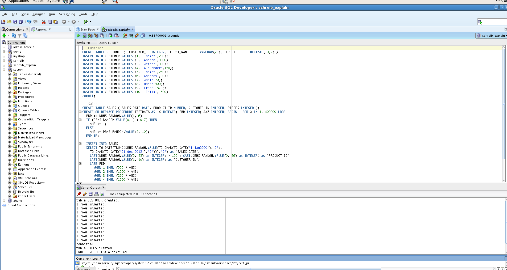


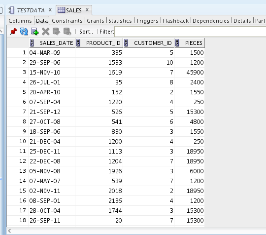

## 1

List the number of pieces, sold of a specific Product

```sql
SELECT  PRODUCT_ID,
        sum(PIECES) as PIECES
FROM    SALES
GROUP BY PRODUCT_ID
ORDER BY PRODUCT_ID;
```

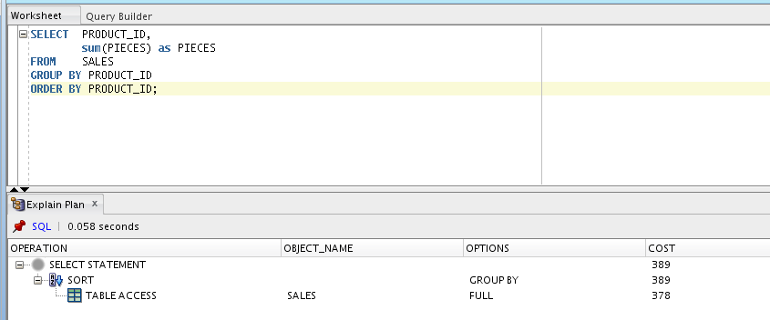


## 2

List the number of piece of a specific Product, sold to customer with ID 2

```sql
SELECT  PRODUCT_ID,
        sum(PIECES) as PIECES
FROM    SALES
WHERE   CUSTOMER_ID = 2
GROUP BY PRODUCT_ID
ORDER BY PRODUCT_ID;
```

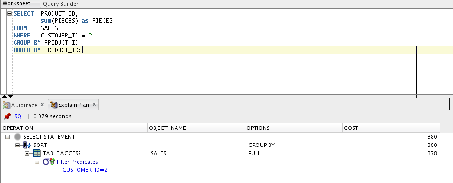


## 3
List the number of pieces, sold of a specific Product (with INDEX)

```sql
CREATE INDEX idx2 ON SALES (PRODUCT_ID);
commit;

SELECT  PRODUCT_ID,
        sum(PIECES) as PIECES
FROM    SALES
GROUP BY PRODUCT_ID
ORDER BY PRODUCT_ID;
```

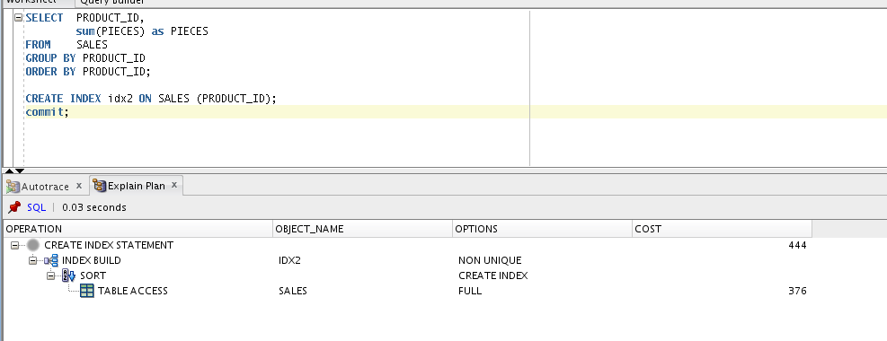

## 4

List all Customers that bought something (HASH Join)

```sql
SELECT  s.customer_id, first_name
FROM    SALES s
inner join customer c on (c.customer_id = s.customer_id);
```

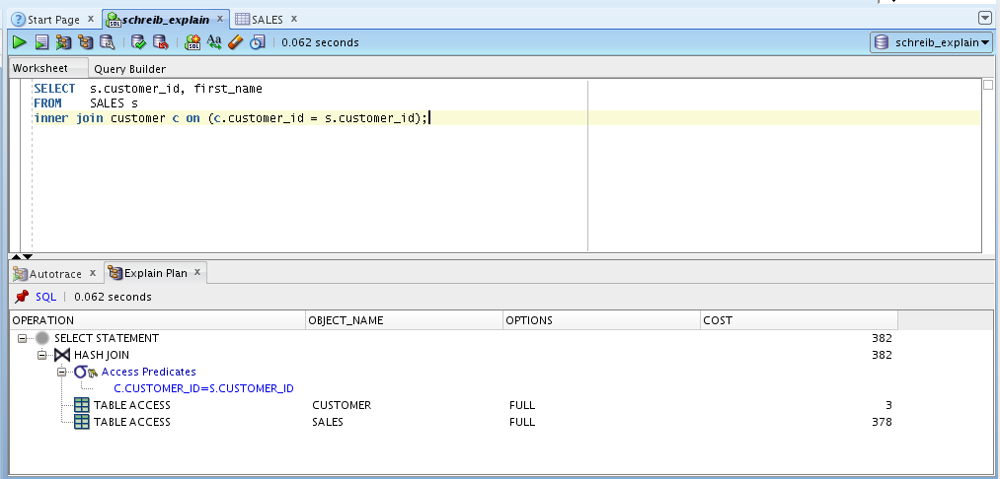


## 5

List all Customers that bought something (Merge Join)

```sql
SELECT  s.customer_id, first_name
FROM    SALES s
inner join customer c on (c.customer_id = s.customer_id);
order by s.customer_id
```

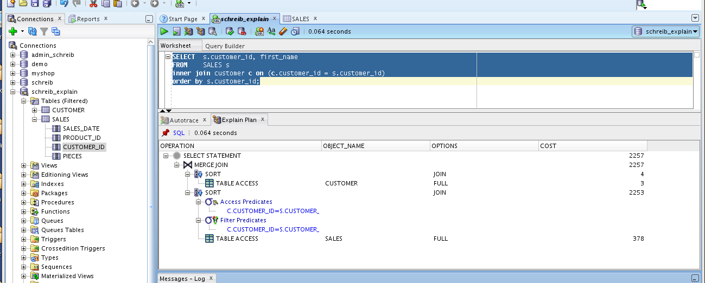

## 6

List all products, the customer with id 2 bought (Sort Join)

```sql
CREATE INDEX idx3 ON SALES (customer_id);
CREATE INDEX idx4 ON customer (customer_id);
commit;

SELECT  distinct first_name, PRODUCT_ID
FROM    SALES s
inner join customer c on (c.customer_id = s.customer_id)
WHERE s.CUSTOMER_ID = 2;
```

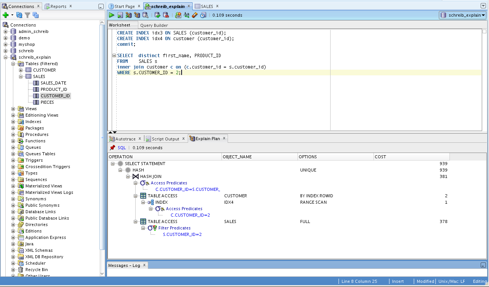

## Turn on statistical function
```sql
BEGIN
  DBMS_AUTO_TASK_ADMIN.ENABLE(
  client_name => 'auto optimizer stats collection',
  operation => NULL,
  window_name => NULL);
END;
```

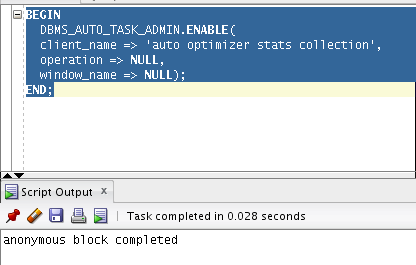


## Turn off statistical function

```sql
BEGIN
DBMS_AUTO_TASK_ADMIN.DISABLE(
client_name => 'auto optimizer stats collection',
operation => NULL, window_name =>
NULL);
END;
```

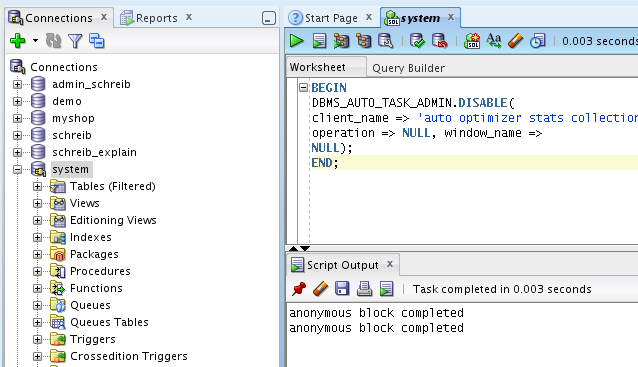
