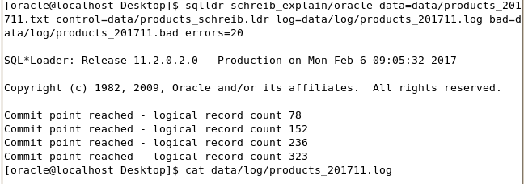
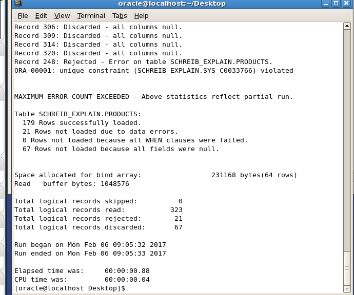
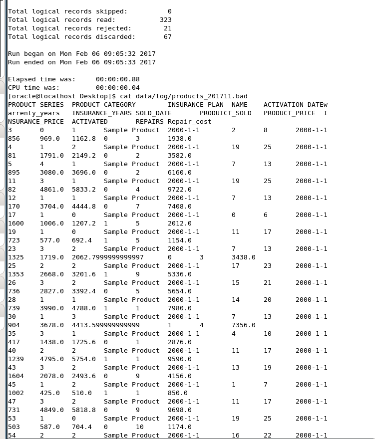
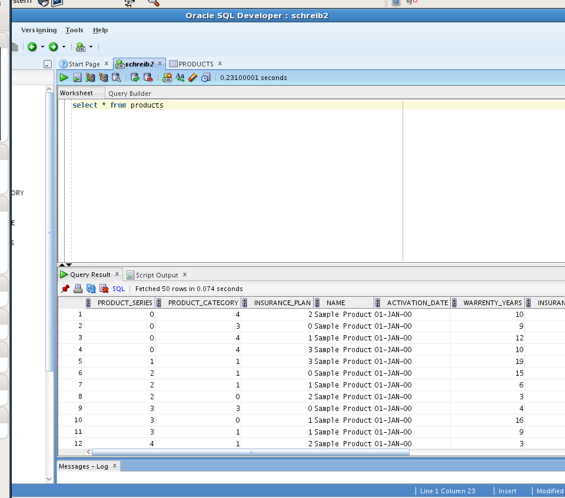

**Pro Tipp** Use `trailing nulcols` if you have some error in your test data generator or database model (like I did) and don't want to go back and change it.
It just appends null on the end of incomplete rows. Just make sure to take your screenshots on way that won't make it obvious that you cheated.

## products_schreib.ldr

```sql
LOAD DATA
APPEND
INTO TABLE schreib_explain.products
FIELDS TERMINATED BY '\t'
OPTIONALLY ENCLOSED BY '"'
TRAILING NULLCOLS
(
PRODUCT_SERIES,
PRODUCT_CATEGORY,
INSURANCE_PLAN,
NAME,
ACTIVATION_DATE date "yyyy-mm-dd",
WARRENTY_YEARS,
iNSURANCE_YEARS,
SOLD_DATE date "yyyy-mm-dd",
PRODUCTS_SOLD,
product_price,
insurance_price,
activated,
repairs,
repair_cost
)

```

Create a new directory inside the data directory for logs (see previous course)

Execute the follwing command - modified to accomodate your project - in your Desktop directory:

```bash
sqlldr schreib_explain/oracle data=data/products_201711.txt control=data/products_schreib.ldr log=data/log/products_201711.log bad=data/log/products_201711.bad errors=20
```



## Contents of logfile



## Contents of bad file



## Contents of Database


