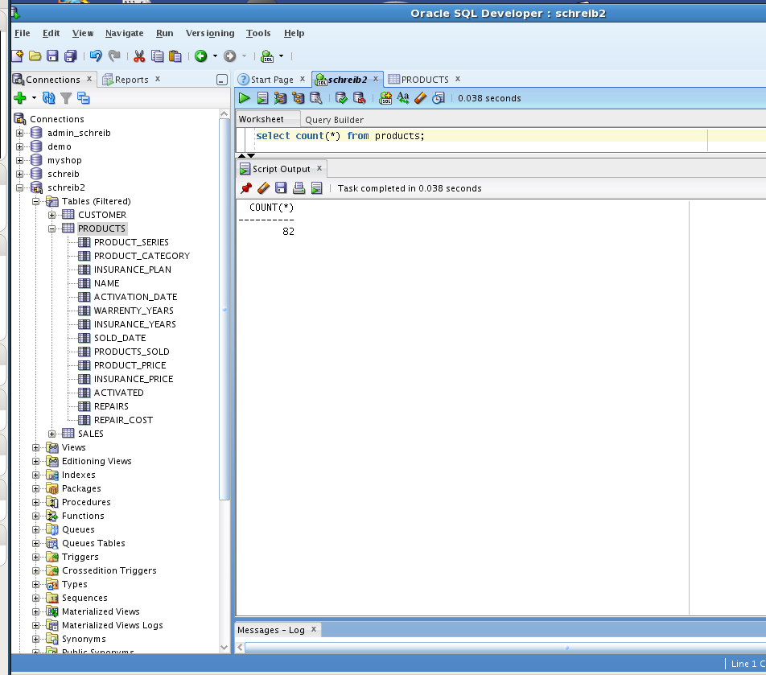
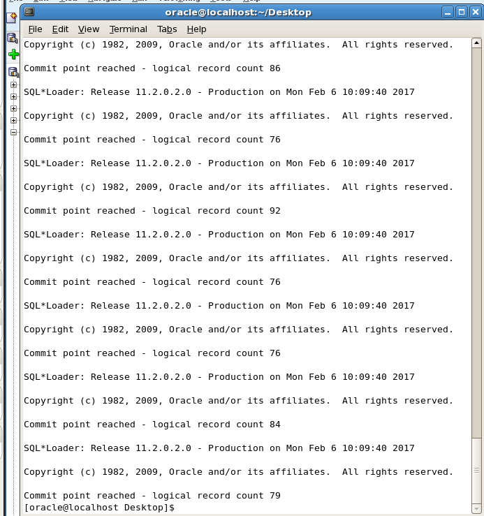
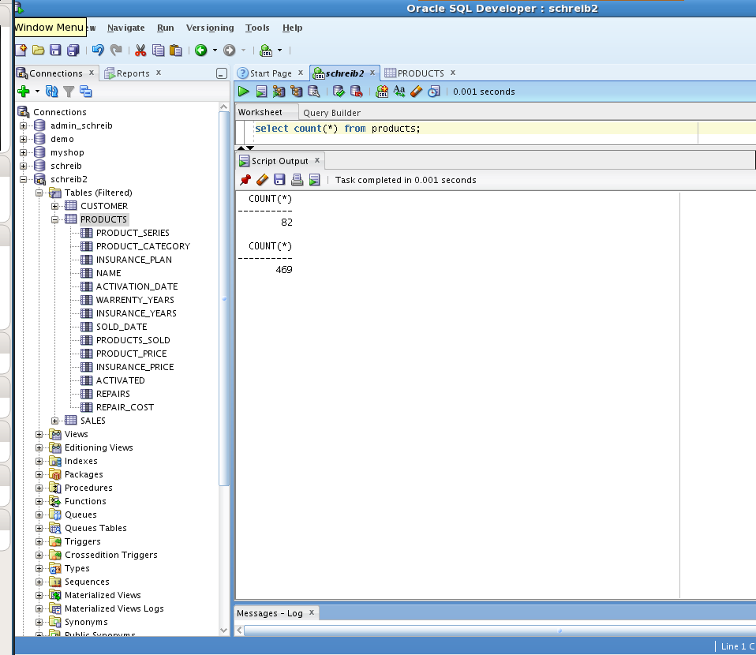
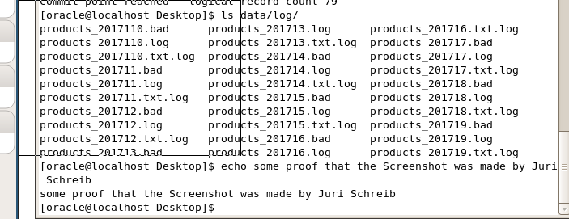

Create a bash script to load multiple files

## project_schreib.sh

```bash
for FILE in `ls data/*.txt`
do
export FILENAME=`basename $FILE`
export FILEBASE=`echo $FILENAME |
sed -e 's/\..*//'`
sqlldr schreib_explain/oracle data=data/$FILEBASE.txt control=data/products_schreib.ldr log=data/log/$FILEBASE.log bad=data/log/$FILEBASE.bad errors=20
done
```

Place the script on the Desktop Folder

```bash
cd Desktop
touch project_schreib.sh
chmod +x project_schreib.sh
```

Open the File in the editor and paste your script into it

Before running the Script, make sure to execute to the count command, so we can prove, that the script actually made a difference




Then, run the script inside the Desktop directory

```bash
./project_schreib.sh
```



Lets see if the size of Database entries changed



And lets have a look if we have new .log and .bad files


