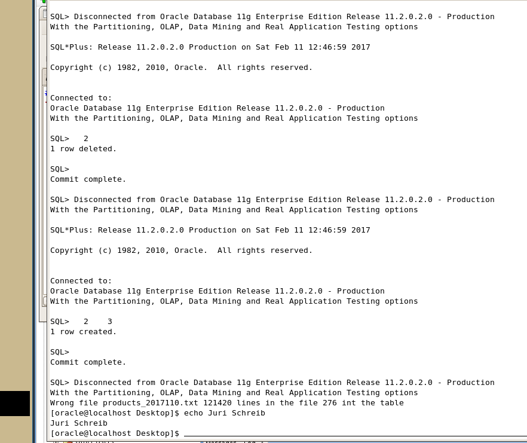

Add a Check to the Script we created last lesson, that ensures that the tmp table never has more than 50 rows

## project_schreib.sh

```bash
#!/bin/bash
for FILE in `ls data/*.txt`; do
  export FILENAME=`basename $FILE`
  export FILEBASE=`echo $FILENAME | sed -e 's/\..*//'`

  sqlldr schreib_explain/oracle data=data/$FILEBASE.txt control=data/products_schreib.ldr log=data/log/$FILEBASE.log bad=data/log/$FILEBASE.bad errors=20
  sqlplus schreib_explain/oracle <<!
    DELETE FROM products
    WHERE FILE_ID in
    (
    SELECT FILE_ID
      FROM LOAD_DATE
      WHERE FILE_NAME = '$FILENAME'
    );
    COMMIT;
!
  sqlplus schreib_explain/oracle <<!
    DELETE FROM LOAD_DATE
      WHERE FILE_NAME = '$FILENAME';
    COMMIT;
!
  sqlplus schreib_explain/oracle <<!
    INSERT INTO LOAD_DATE VALUES
      (SEQ_FILE_ID.nextval, '$FILENAME',
      to_date('$FILEDATE', 'YYYYMMDD'), sysdate);
    COMMIT;
!

export LINES_FILE=`grep "Lines" data/$FILENAME | sed -e 's/[^0-9]*//g'`
export LINES_TABLE=`sqlplus schreib_explain/oracle <<! | grep '!!!' | sed -e 's/[^0-9]*//g'
   SELECT '!!!' || count(*) as LINES_TABLE
   FROM   products_tmp;
!
`
if [ $LINES_FILE -gt $[$LINES_TABLE+50] -o $LINES_FILE -lt $[$LINES_TABLE-50] ]
then
   >&2 echo Wrong file $FILENAME $LINES_FILE lines in the file $LINES_TABLE int the table
   exit 17
fi
echo $LINES_FILE $LINES_TABLE >>lines.txt

  sqlplus schreib_explain/oracle <<!
    INSERT INTO products
      SELECT tmp.*, fid.FILE_ID
      FROM products_tmp tmp
      INNER JOIN (
        SELECT FILE_ID
        FROM LOAD_DATE
        WHERE FILE_NAME = '$FILENAME'
      ) fid
        ON 1=1;
    DELETE FROM products_tmp;
    COMMIT;
!
done;
```

Manually change a File to a invalid Row Count



# DONE!

<iframe width="560" height="315" src="https://www.youtube.com/embed/3GwjfUFyY6M" frameborder="0" allowfullscreen style="margin: 0 auto; display: block;"></iframe>
