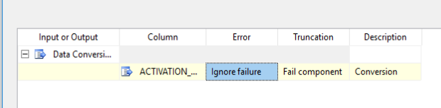

## Creating a new Database and Table

Connect to the Microsoft Database and create a new Database:
*Databases -> New Database*

Select proucts_schreib, open a new query.

Run the same sql create table script that we used in the DWH excersises

```sql
create table products(
        product_series integer,
        product_category integer,
        insurance_plan integer,
        name  varchar(255),
        activation_date date,
        warrenty_years integer,
        insurance_years integer,
        sold_date date,
        products_sold integer,
        product_price decimal(7,2),
        insurance_price decimal(7,2),
        activated integer,
        repairs integer,
        repair_cost decimal(7,2),
        primary key(product_series, product_category, insurance_plan)
      )
```

### Result


## Creating the Integration Service

*Note: If a Null Pointer Exception occurs on project creation, just restart the application*

Connection Manager -> New Connection -> OLE DB Connection


Add a Textfile from your Project that should be imported to the VM.

Connection Manager -> New Flat File Connection


Automatically set the Data Type of each Column


### Create the Workflow

Add a ForEach Loop Container from the Sidebar


Add a new Variables


### Add copy files task


### Add a Data Flow task

Add a flat file source to the Dataflow task

Add transformation (derived column)

 substring([ACTIVATION_DATE],1,4) + "-"  + substring([ACTIVATION_DATE],5,2) + "-" +  substring([ACTIVATION_DATE],7,2)

 

Add a Data Conversion




Add OLEDB Destination


## Run


I had an Issue where, Null Collumns would not be ignored correctly, so I added a confitional split


