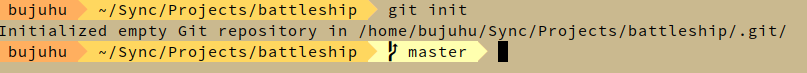
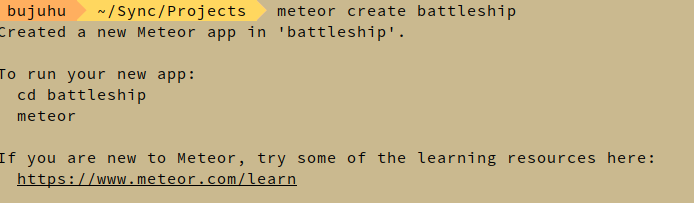
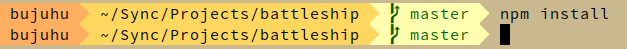
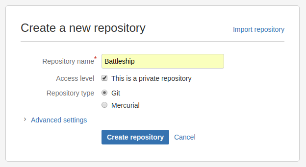
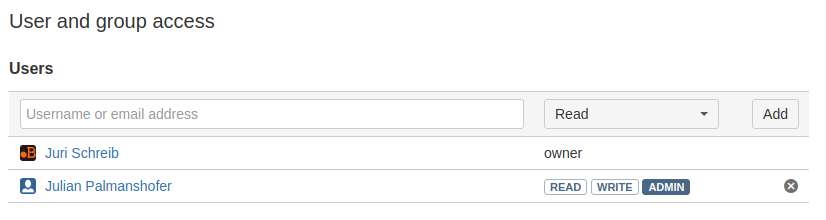
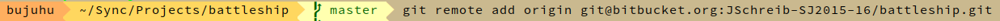
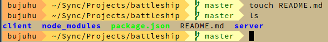

# Battleship 2
## Erstellung des Projekts

### Git Projekt initialisieren
Zunächst wird mit `git init` ein neus Git repository initalisiert



### Meteor Projekt erstellen
Danach wird mit dem Befehl `meteor create battleship` ein neues [Meteor](https://www.meteor.com/) Projekt angelegt.

Aufgrund einer instabielen Internetverbindung musste der erste Erstellungsversucht abgebrochen und ein 2. gestartet werden.



Beim 2. Versuch wurde die Erstellung es Projektes erfolgreich abgeschlossen.

### Node Packet Manager abhängikeiten installieren
Nach der erstellung des Projektes werden mit dem Befehl `npm install` alle fehlenden Abhängikeiten installiert.



Es sind bereits alle Abhängikeiten installiert

## Erstellung des Remote Repository

Es wird auf Bitbucket ein remote Repository erstellt, damit das andere Projektteammitglied auch auf das Projekt zugreifen kann.

### Erstellung des Repository auf Bitbucket
Auf Bitbucket in der Menüleiste wird auf `Repositories > Create Repository` geklickt.



### Projektteammitglieder Einalden
Auf der Startseite des Projetks unter `Settings > User and group access` das Projektteammitglieder Julian Palamshofer hinzugefügt und Adminrechte gewährt.



### Git Remote hinzufügen
Dem lokalen Git Projekt wird mitd dem Kommando `git remote add origin git@bitbucket.org:JSchreib-SJ2015-16/battleship.git` ein remote repository hinzugefügt, wobei JSchreib-SJ2015-16 der Benutzername des Bitbucket Accounts ist.

**Hinsweis** Damit dies richtig funktioniert muss zuvor mit dem Befehel `ssh-keygen` ein SSH Key erstellt, und dann den Public Key (~/.ssh/id_rsa.pub) dem Bitbucket Profil hinzufügen. Andernfalls ist es nicht möglich sich mit Bitbucket zu Authentifizieren.



## Readme Datei erstellen
Als Projekterklärung und 'Getting started' Guide wird die Datei `README.md` hinzugefügt. Zunächst bleibt diese noch leer. Die Endung md steht für [MARKDOWN](https://guides.github.com/features/mastering-markdown/) und ist eine spezielle Syntax zu erstellung von Formatierten Texten. Der Vorteil dieses Formats ist es das dieses auf der Weboberfläche von Bitbucket direkt dargstellt werden kann.



Danach wird die README Datei mit den ersten Inhalten befüllt. Die README Datei ist allerdings noch nicht vollständig und wird im Laufe des Projekts weiterhin aktualisiert.

### Inhalt der Readme Datei
```markdown
# Battleship
Battleship is a game that acts as a fun little pastime. This Web version of Battleship allows you to battle opponents over the Internet in highly strategic and intense 1v1 battles. It is *really* amazing.

## Technical Details
Battleship is build on top of [Meteor](https://www.meteor.com/). To get started with Meteor please check out their G[etting Started Guide](https://www.meteor.com/tutorials).

## Reports
This Project is Part of my Network Engineering Class. Because of that we have to report our progress regularly. If you're interested in them you can find them [here](http://nvs.schreib.at), but keep in mind that they are in German.

## Getting started
## Documentation
```
