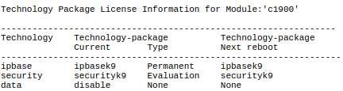

# Configure and Verify a Site-to-Site IPsec VPN Using CLI
# Part 1: Configure IPsec Parameters on R1
## Step 1: Test Connectivity
Ping from PC-A to PC-C


## Step 2: Enable the Security Technology Package

Das Kommando zur aktivierung es technology-packages wird wie in der Angabe im Konfigurationsmodus ausgeführt
 ```
 license boot module c1900 technology-package securityk9
 ```


Die running-config wird gespeichert und der Router wird neugeladen

```
copy running-config startup-config
reload
```


Sicher gehen, dass das technology package aktiviert ist

```
show version
```


## Step 3: Identify interesting traffic on R1

Es wir eine Access list configuriert, welche später genutzt wird, damit IPSec VPN weiß, welcher Traffic verschlüsselt werden soll und welcher nicht

```
access-list 110 permit ip 192.168.1.0 0.0.0.255 192.168.3.0 0.0.0.255
```

## Step 4: Configure the IKE Phase 1  ISAKMP policy on R1.
Die Befehle werden wie in der Angabe ausgeführt.
Ein neuer shared crypto key wird konfiguriert.

```
crypto isakmp policy 10
encryption aes 256
authentication pre-share
group 5
exit
crypto isakmp key vpnpa55 address 10.2.2.2
```

## Step 5: Configure the IKE Phase 2 IPsec policy on R1.
Eine VPN transform-set und die crypto map werden erstellt.

```
crypto ipsec transform-set VPN-SET esp-aes esp-sha-hmac
crypto map VPN-MAP 10 ipsec-isakmp
description VPN connection to R3
set peer 10.2.2.2
set transform-set VPN-SET
match address 110
```

*Die eingegebenen Kommandos in Schritt 4 und 5*


## Step 6: Configure the crypto map on the outgoing interface
```
interface s0/0/0
crypto map VPN-MAP
```


# Part 2: Configure IPsec Parameters on R3
Die selbe Konfiguration wird nun am Router R3 vorgenommen. Es werden nurmehr


## Step 1: Enable the Security Technology Package

Wie beim ersten Router wird das Technology Package aktiviert

*Config Mode*
 ```
 license boot module c1900 technology-package securityk9
 ```

*Enable Mode*
```
copy running-config startup-config
reload
```


Sicher gehen, dass das technology package aktiviert ist

```
show version
```


## Step 2: Configure router R3 to support a site-to-site VPN with R1.


```
access-list 110 permit ip 192.168.3.0 0.0.0.255 192.168.1.0 0.0.0.255
```


## Step 3: Configure the IKE Phase 1 ISAKMP properties on R3.
Die Befehle werden wie in der Angabe ausgeführt.
Ein neuer shared crypto key wird konfiguriert.

```
crypto isakmp policy 10
encryption aes 256
authentication pre-share
group 5
exit
crypto isakmp key vpnpa55 address 10.1.1.2
```

## Step 4: Configure the IKE Phase 2 IPsec policy on R3.
Eine VPN transform-set und die crypto map werden erstellt.

```
crypto ipsec transform-set VPN-SET esp-aes esp-sha-hmac
crypto map VPN-MAP 10 ipsec-isakmp
description VPN connection to R3
set peer 10.1.1.2
set transform-set VPN-SET
match address 110
exit
```

*Die eingegebenen Kommandos in den Schritten 2 bis 4*


## Step 5: Configure the crypto map on the outgoing interface
```
interface s0/0/1
crypto map VPN-MAP
```


# Part 3: Verify the IPsec VPN
## Step 1: Verify the tunnel prior to interesting traffic.
```
show crypto ipsec sa
```


Es wurden noch keine Pakete durch den Tunnel verschickt
## Step 2: Create interesting traffic.


Der Computer mit der IP Adresse 192.168.3.3 wurde erfolgreich gepingt
## Step 3: Verify the tunnel after interesting traffic.
```
show crypto ipsec sa
```


Es wurden verschlüsselte Pakete geloggt.
## Step 4: Create uninteresting traffic.


Der Computer mit der IP Adresse 192.168.2.3 wurde erfolgreich gepingt
## Step 5: Verify the tunnel.


Die anzahl der verschlüsselten Pakete hat sich nicht erhöht
