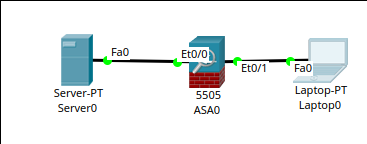
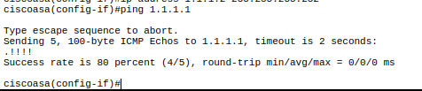
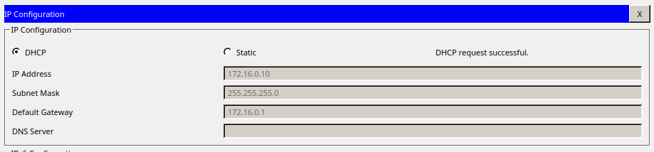
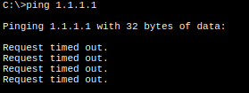

# ASA Firewall Konfiguriation


## Simuliertes Netzwerk erstellen
Da ich zu dieser Übung nicht Anwesend war, wird die Übungsaufgabe im Cisco Packet Tracer simuliert. Dabei wird zunächst ein Netzwerk, bestehend aus einem PC, einer ASA Firewall und einem Server, welcher das äusere Simuliert, erstellt.

Der Server bekommt die IP Adresse 1.1.1.1




## Konfiguration des Netzwerks nach Angabe

Vor der Konfiguration wird der standard DHCP Pool deaktiviert

```
no dhcp enable inside
no dhcpd address 192.168.1.5-192.168.1.36 inside
```

### Vlan konfiguration

**VLAN 1**

```
inteface vlan 1
nameif inside
security-level 100

no ip address
ip address 172.16.0.1 255.255.255.0
exit
```

**VLAN 2**

Da es im gegensatz zur Testumgebung im Labor keinen weiteren dhcp sServer gibt, wird fürs "Outer" interface eine statische ip Adresse gewählt

```
interface vlan 2
nameif outside
security-level 0

no ip address
ip address 1.1.1.2 255.255.255.252
exit
```

### Zuweisung der Vlans zu die entsprechenden Ports

```
int et0/0
switchport access vlan 2
no shutdown
exit

int et0/1
switchport access vlan 1
no shutdown
exit

```
### Testen der erreichbarkeit des Server von der Firewall



### Nat Konfiguration

```
object network LAN
subnet 172.16.0.0 255.255.255.0
nat (inside,outside) dynamic interface
exit
```

### Default Route setzen

```
route outside 0.0.0.0 0.0.0.0 1.1.1.1
```

### DHCP Konfiguration

```
dhcpd auto_config outside
dhcpd address 172.16.0.10-172.16.0.20 inside
dhcpd enable inside
```

### Testen

Bekommt der PC eine DHCP Adresse? (Erwartetes Ergenbnis: Ja)



**Ja**

Ist der Server (1.1.1.1) von dem PC aus erreichbar? (Erwartetes Ergenbnis: Ja)



**Nein**

#### Troubleshooting

Im Simulationsmodus vom Packet Tracer ist zu sehen, das das ICMP Paket beim zurücschicken von der Firewall gedroppt wird.

Bei der Kontrolle der Konfiguration der ASA ist Aufgabefallen, dass das VLAN 1 nicht dem interface zugewiesen ist.

Beim wiederholten Versuch diesen Konfigurationsparameter zuzuweißen, schlägt der Router ohne eine Fehlermeldung auszugeben fehl.

Ich gehe entweder von einem Bug in der im Packet Tracer vorhandenen Firmware oder im Packettracer selbst aus, den ich selbst nicht beheben kann.
