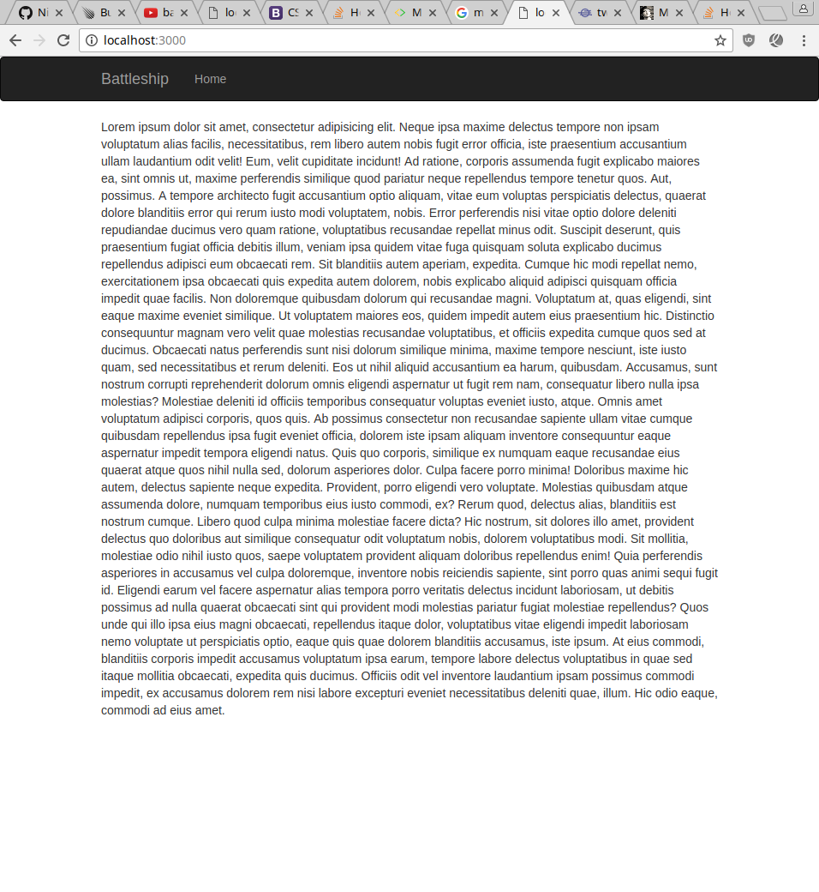

# Battleship 3
Im laufe dieser Stunde wird eine "statische" Homepage erstellt, auf dieser Nutzer informationen zum Spiel erhalten, und das Spiel starten können wird

Dazu werden die vorhanden Dokumente `client/main.html`, `client/main.css` und `client/main.js` modifiziert.

## Einbinden der Abhängikeiten

Um das erstellen einer Grafischen Benutzeroberfläche möglichst rasch erfüllen zu können, verwenden wir (Bootstrap)[https://getbootstrap.com/], ein CSS Framework welches uns erlaubt schnell Elemente zu erstellen. Mit Meteor kann dieses einfach mit dem Befehl `twbs:meteor add boostrap` hinzugefügt werden

## Erstellen von Layouts

Um das Einheitliche Desiign einer Website zu gewährleisten, werden in Meteor Layouts verwendet. Diese erlauben einen Grundlegenden Aufbau einer Website immer wieder zu verwenden und dann auf den Unterschiedlichen Seiten nurmehr den "Inhalt" abzuändern.

In diesem Schritt wird ein neues Layout erstellt, das für die Startseite verwendet werden soll

### 1. Datei erstellen
Die Datei `client/navbar.html` wird angelegt, welche das neue Layout beinhaltet.

Dieses besteht einfach aus der Bootstrap Menüleiste und einem Platzhalte indem weitere Inhalte hinzugefügt werden können.

In der Datei wird ein template Tag mit der bezeichnung `default` erstellt, um das Layout zu erstellen.
### 2. Metainformationen hinzufügen

Um Smartphones und Tablets mitzuteilen, das unsere Website responsive ist, und nicht skaliert werden muss, wird der `<meta name="viewport" content="width=device-width, initial-scale=1">` Tag im Head des Layouts eingefügt

### 3. Layout anlegen

Der Inhalt wird zunächst einfach eine Bootstrap Menüleiste mit einigen Pllatzhalter Links sein.

### Seiteninhalt anlegen

In der Datei `main.html` wird ein neues Template mit der Bezeichnung `home` gewählt, welcher das `default` Layout nutzen soll. Es wird zunächst nur ein Platzhalter Text angezeigt.

### 4. Route Datei anlegen

Damit das Programm weiß, wann welche Seite angezeigt und welches Layout verwendet werden soll, müssen diese dem Router mitgeteilt werden. Darin wird dem `home` Template das Layout `default` zugewiesen. Ausserdem wird eingestellt das diese Seite angezeigt werden soll wenn die Url `/` aufgerufen wird.

Vor dem Ausführen des Codes muss nich mit dem Befehl `meteor add iron:router` das notwenidige Meteor Package installiert werden.

# Zwischenstand

So sieht die Startseite von Battleship zurzeit aus:

