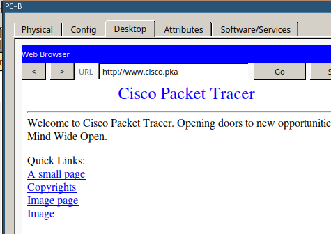

# Packet Tracer 1.1.1.2

## Part 1

### Step 1 - Send a Ping from one end to the Network to the other end.

Pinging PC3 (10.1.0.2) from PC1

### Step 2 - Trace the route from PC1 to determine where in the path connectivity fails.

Use the Tracert Command, targeting the IP of PC3

### Step 3 - Correct the Network Problem

The furtherst reachable Ip is 10.100.100.6, and is assigned to RouterC

The Interfaces on RouterC are all enabled and up

The IP Address `10.100.100.17` is outside the `10.100.100.8/30` Network and therfore invalid. The Host Range for this Network is `10.100.100.9 - 10.100.100.10`. Since RouterD already uses `10.100.100.10`, we assign RouterC the ip Adress `10.100.100.9` on the Serial0/0/0 interface.

## Part 2 - Compare Tracert to the Traceroute Command

The Command finished sucsessfully

The only notable differnece is, that on the output of the router, the target device Ip is not shown.

## Part 3 - Extended Traceroute

The only values without the default options chosen are the target IP address (10.1.0.2) and the Source address (10.100.100.1)

The timepout value adjustes how long the Systems waits for an answer before reporting a timeout.

The timeout parmeter needs to be adjusted to test special, extremely slow networks. Otherwise, the command will always report a timeout

# Packet Tracer 1.2.3.6

## Step 1 - Determine the connectivity issue between PC-01 and web server.

The Ip Address of this computer is set to `172.168.1.3` instead of 172.16.1.3

The Issue is beeing corrected, and connectivity is tested avterwards

### connectivity Testing

The Website is accessible using the Domain

## Step 2 - Determine the connectivity issue between PC-02 and web server.

PC-02 has an invalid default gateway (`172.16.1.11` instead of `172.16.1.1`)

The issue is beeing corrected.

### Connectivity Testing

PC-02 is fully connected to the Network

## Step 3 - Determine the connectivity issue between PC-A and web server.

The Computer is correctly configured, so the router configuration will be checked.

### Connect to the Router

Choose a PC with a fully working connection and connect to the router using ssh

Checking the Ip Configuratio for the Router

The Ip Address configured on Interface G0/1 is invalid. It should be `172.16.2.1` instead of `172.16.3.1`

### Testing Connectivity

PC-A can now connect to the Network

## Step 4: Determine the connectivity issue between PC-B and web server.

The IP COnfiguration seems fine.

Pinging the Webserver using the IP Adress works, bot not using the domain. This looks like an issue of DNS Server COnfiguration.

The DNS Server is changed to 209.165.201.3

PC-B is now fully connected to the Network
