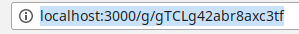
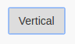
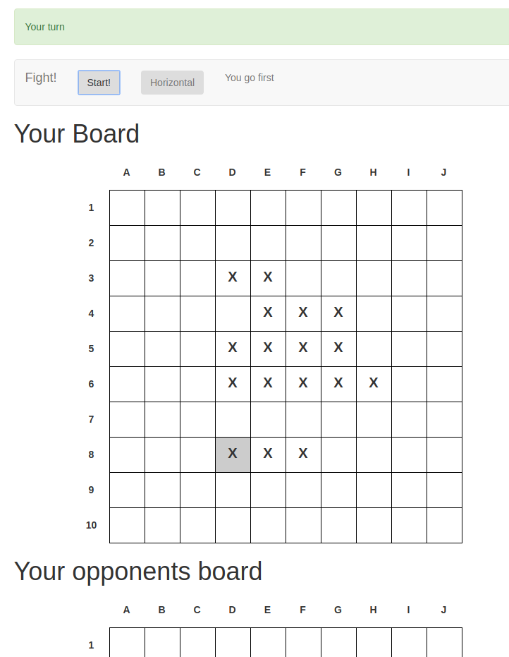

# Battleship User Documentation

## Creating a Game

To create a new Game navigate to the Game configuration Site by clicking on **Quick Play** on the Homepage.

In the current Version of Battleship, no game configuration options exist. So continue by pressing the Submit button

You will be redirected to another Page that looks like this:

Notice that on the Top, it says that it is waiting for another Player. Look in **Joining a Game** to learn how to invite another Player.

## Joining a Game
To join an existing Game, the creator has to send you the Link of the current Game by copying the URL from the Address bar.

After you recieved the URL enter it into a webbrowser and open the Page. You will be greeted by a Page that looks like this:

To join the Game, click on the Blue Join Game Button on the top Left corner.

After you clicked it, the Blue Box should disappear for both players.

Both player should see a text appear inside the grey Bar, which tells them who goes first:

## Playing the Games

### Placeing ships

In the first phase of the Game you can place your Ships on the Gameboard.

You will see the name and the length of the Ship you place inside the Grey Bar on the Top.

You can toggle the Rotation of the Ship by clicking on the Horial button

To place the Ship click on a box inside your Board. Clicking on a Box will put the top left part of the Ship on the Board.

After placeing the first Ship, the Ship description inside the Grey Bar will change and **X** will appear where you set the Ship.

Continue to place all Ships in this fashion

After you placed all ships, the Ship description will change into a Start Button.

When you press Start, a blue Box will apperar.

It means that only one Player finished placing all ships and pressed the start button.

The Game will proceed after both Players clicked the Start Button.

### Playing

After the Game Stars a Second board will appar. On the Top you will see a Box that indicates which turn it currently is.

When its your turn use the Bottom board to guess the locations of the opponetn Ships. If you miss a ship, the box will be colourd blue, if you hit a ship, it will be colored red.

THe guesses of your opponent will be highlited in the top gameboard by grey boxes

*Missed Ship*

*Hit Ship*

*Highlighted Guesses of your opponent.*

After you sunken all ships of your opponents a message will apperar

You can continue playing after that
