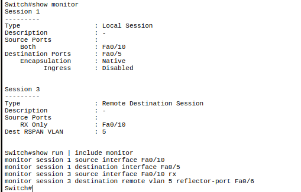
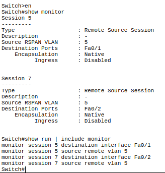
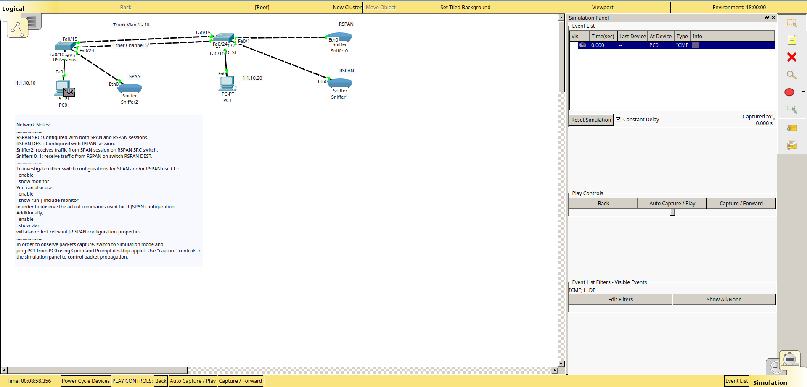
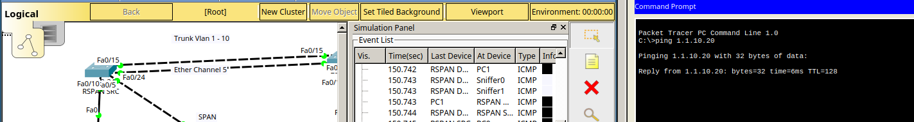
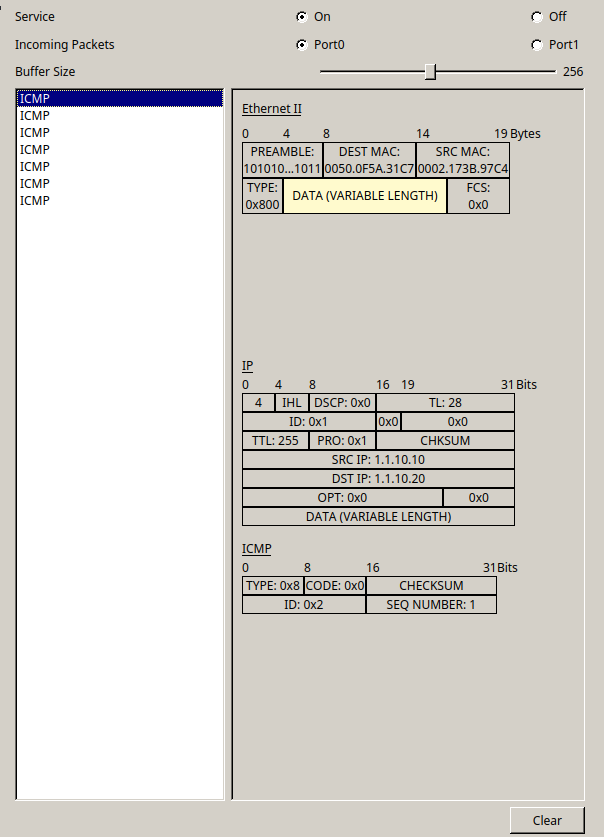
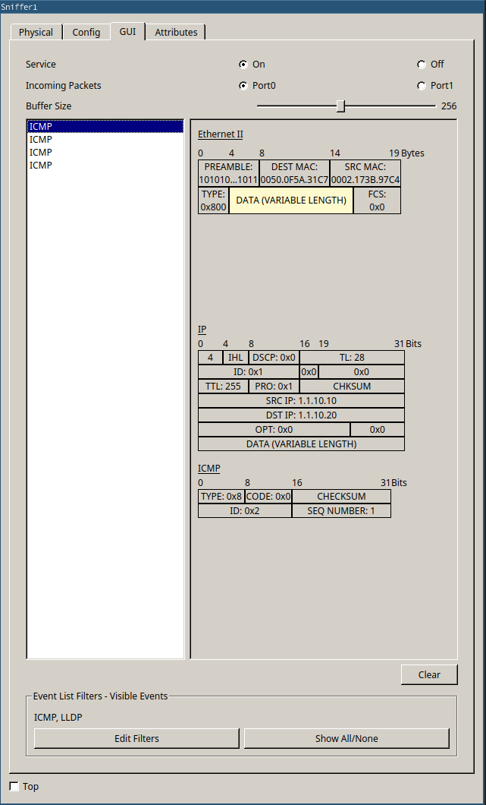
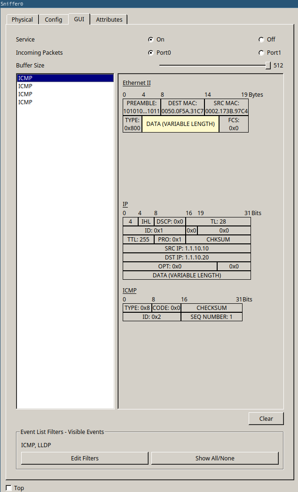

---
title:
layout: report
date: 2017-01-09
task:
description: Erfüllung der Aufgabenstellung
subject: nvs
---

## Monitroing (RSPAN) Configuration

### Switch RSPAN_SRC

### Switch RSPAN_DEST

## Monitoring Simulieren

## Ping Kommando testen

### Sniffer 2

### Sniffer 1

### Sniffer 0

Die Übertragenen Pakete wurden von allen Sniffern empfangen
