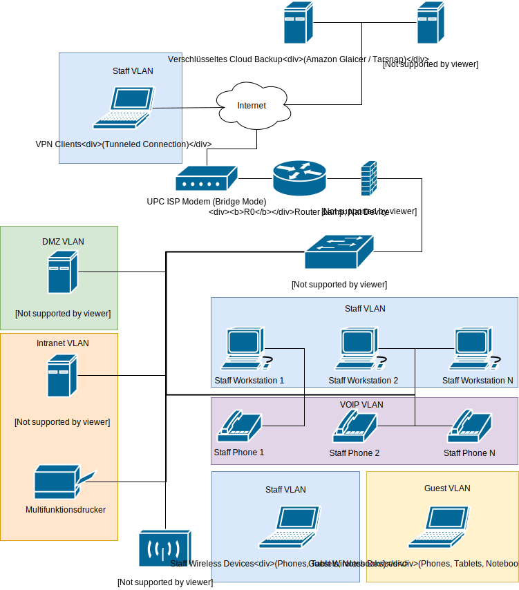

# KMU 1 Netzwerkplanung

## Netze

ID | Name | Network Address | Subnet
-- | --
1 | Management | 10.0.0.0 | 255.255.255.0
10 | DMZ | 10.0.10.0 | 255.255.255.0
20 | Intranet | 10.0.20.0 | 255.255.255.0
30 | VOIP | 10.0.30.0 | 255.255.255.0
40 | Staff | 10.0.40.0 | 255.255.255.0
50 | Guest | 10.0.50.0 | 255.255.255.0

## Netzwerkgeräte

### Server und Netzwerkgeräte

Hostname | IP | VLAN | Gateway | DNS
-- | --
R0 | *ISP provided Public IP* | - | - | *ISP Provided DNS Server*
 | 10.0.0.1 | 1 | - | -
 | 10.0.10.1 | 10  | - | -
 | 10.0.20.1 | 20 | - | -
 | 10.0.30.1 | 30 | - | -
 | 10.0.40.1 | 40 | - | -
 | 10.0.50.1 | 50 | - | -
 | 10.0.50.1 | 60 | - | -
FW0 | 10.0.0.2 | 1 | 10.0.0.1 | 10.0.0.1
SW0 | 10.0.0.3 | 1 | 10.0.0.1 | 10.0.0.1
AP0 | 10.0.0.4 | 1 | 10.0.0.4 | 10.0.0.4
Acadia | 10.0.10.2 | 10 | 10.0.10.1 | 10.0.10.1
Badlands | 10.0.20.2 | 20 | 10.0.20.1 | 10.0.20.1
Drucker | 10.0.20.100 | 20 | 10.0.20.1 | 10.0.20.1
Redwood | *Hoster provided Public IP* | - | - | *Hoster provided public DNS Server*
Cloud Backup | *N/A* | - | - | -

### Endnutzergeräte

Hostname | IP | VLAN | Gateway | DNS
-- | --
Staff Phone | *(DHCP)* 10.0.30.2 - 10.0.30.254 | 30 | 10.0.30.1 | 10.0.30.1
Staff Workstations, VPN Clients & Staff wireless Devices | *(DHCP)* 10.0.40.2 - 10.0.40.254 | 40 | 10.0.40.1 | 10.0.40.1
Guest Wireless Devices | *(DHCP)* 10.0.50.2 - 10.0.50.254 | 50 | 10.0.50.1 | 10.0.50.1

