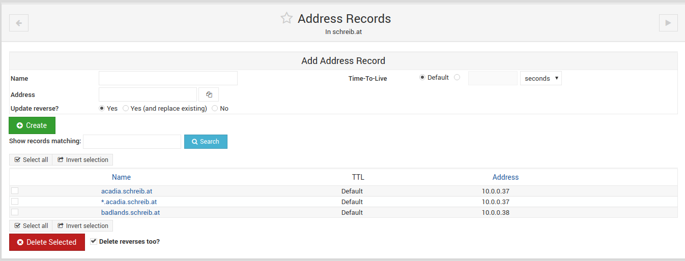
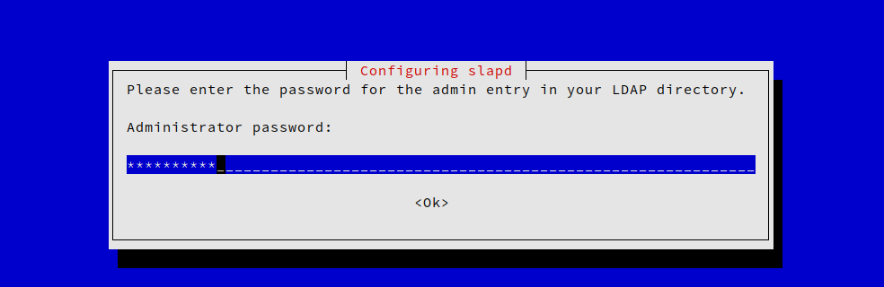

# Aufsetzen von Badlands

Um den Server im Unterricht demonstrieren zu können wird Badlands innerhlab einer Virtuellen Maschine erstellt.

Das root passwort wird auf ciscoclass gesetzt. Der SSH Server wird automatisch mit installiert.

Danach wird die Installation voollständig ausgeführt.

Zur einfacheren konfiguration wird auf dem Gerät Webmin installiert

## ssh

SSH wurde bereits bei der Installation vorkonfiguriert. In den Konfigurationsdateien wird der root login aktiviert

## Webmin

Damit der Server einfacher verwaltet werden kann, wird nach dem selben Prozess der letzen Übung Webmin auf dem Server installiert.

## Bind (DNS)

Der DNS Server Bind wird mit dem befehl `apt-get install bind9` installiert.

### Konfiguration

Es wird eine neue Master Zone für die Domain `schreib.at` erstellt.

Es werden A Records für den Adressbereich konfiguriert:

## LDAP

Die Pakete `slapd ldap-utils ldapscripts` werden installiert.

Das Administrator Passwort wird auf ciscoclass gesetzt

### Konfiguration

Es wird ein SSL Zertifikat für LDAP generiert

