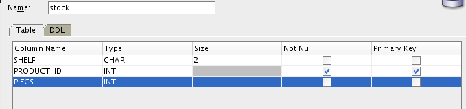

# Isolation Level

Team Members
- Juri "Sphagetti Jurinese" Schreib
- Jia-Jun "JJ" Zhang

##Create Tables using the SQl Devleoper

Tables -> Create Table...

**Note:** *Make sure to select a User that can create tables.*

**Note:** *Check the Advanced Checkbox to set foreign key constrains and "advanced" data types such as int*

### Customer


```sql
CREATE TABLE schreib.CUSTOMER
(
  CUSTOMER_ID INT NOT NULL
, FIRST_NAME VARCHAR(20)
, CREDIT DECIMAL(10, 2)
, CONSTRAINT CUSTOMER_PK PRIMARY KEY
  (
    CUSTOMER_ID
  )
  ENABLE
)
```

### Product

We reuse the Product table from the last lesson

```sql
CREATE TABLE schreib.product
(
product_id INTEGER PRIMARY KEY,
product_name VARCHAR2(20),
product_price DECIMAL(10,2)
);
```

### Stock
**Note:** *Remember to Add the foreign key constrians*



### Sales


## Insert statements for the Product Table

```sql
insert into schreib.product values
(1, 'Schnitzel', 6.9);
insert into schreib.product values
(2, 'Pizza', 5.9);
insert into schreib.product values
(3, 'Nudel', 6.5);
insert into schreib.product values
(4, 'Sushi', 8.9);
insert into schreib.product values
(5, 'Spetzle', 9.9);
insert into schreib.product values
(6, 'Bacon', 8.9);
insert into schreib.product values
(7, 'Banane', 3.9);
insert into schreib.product values
(8, 'Apfel', 2.9);
insert into schreib.product values
(9, 'Durchfall', 99.9);
insert into schreib.product values
(10, 'Birne', 1.9);
```


## Create User Zhang

*The process of user creation is documented in* [6_Rigts](6_Rights)

# Test the commands

As long as no commit statement is executed, no changees are visible for the other user.

*Like last time, unneccesary to document, since we're already late for this one*
