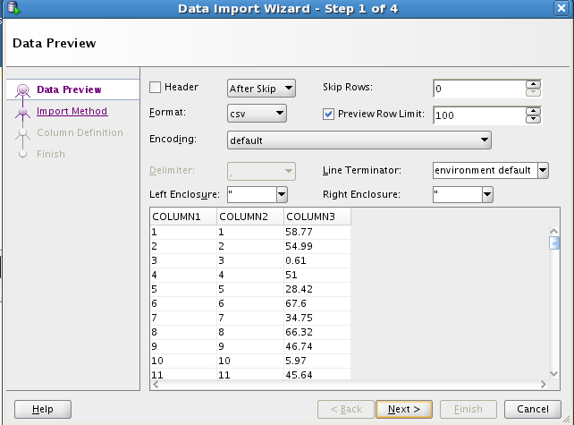
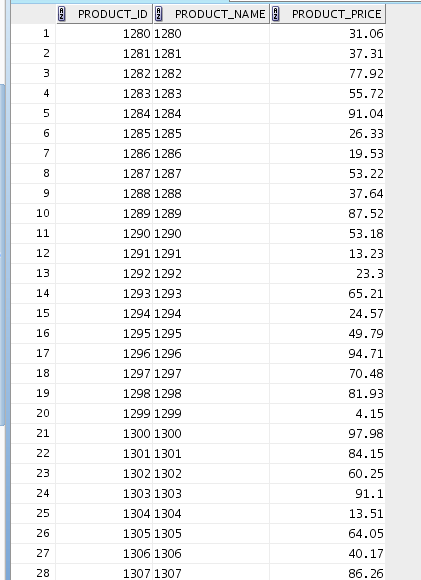
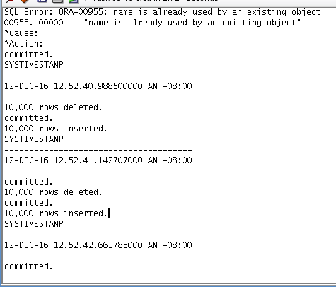

# Preperation

## Generate a CSV to import into the Database
```csv
ROW	PID	PNAME	PTYPE	PRICE
A2	1	Coca Cola	drink	2.3
C2	2	Ham sandwich	sandwich	2.5
B1	3	Salami sandwich	sandwich	2.5
D2	4	Hot Dog	sausage	3
A1	5	Fanta	drink	2.1
C1	6	Vienna Sausage	sausage	2.8
B2	7	Bratwurst	sausage	3.5
E2	8	Sprite	drink	2.3
E1	9	Frankfurters	sausage	2.4
D1	10	Ice Tea	drink	1.9

```

## Import the Data into the Database


## Verify the Data has been succsessfully imported


# Tasks

## Create a Bitmap Index on the ptype

| A1 | A2 | B1 | B2 | C1 | C2 | D1 | D2 | E1 | E2
---|---
drink | **1** | **1** | 0 | 0 | 0 | 0 | **1** | 0 | 0 | **1**
sandwich | 0 | 0 | **1** | 0 | 0 | **1** | 0 | 0 | 0 | 0
sausage | 0 | 0 | 0 | **1** | **1** | 0 | 0 | **1** | **1** | 0

## Show the result of the follwing SQL Statements

```sql
SELECT ptype,
 count(*)
FROM products
GROUP BY ptype;
INSERT INTO products VALUES (11, ' Knackwurst', 'sausage', 1.8);

```


## Create a BTree Index on the pprice column


## Show the result of the following SQL Statements
```sql
SELECT *
FROM products
WHERE price = 2.8;
INSERT INTO products VALUES (11, ' Knackwurst', 'sausage', 1.8);
```


index | rid | rid | rid
--- | ---
0 | B2
1 | A2 | A1 | D1
2 |
3 |
4 |
5 | C1 | E2
6 |
7 | D2
8 | C2 | B1
9 | E1

last char | nr | nr%10
---|---
a | 1 | 1
e | 5 | 5
g | 7 | 7
h | 8 | 8
s | 19 | 9
t | 20 | 0

## Show the result of the following SQL Statements

```sql
SELECT *
FROM products
WHERE pname LIKE '%sandwich';
INSERT INTO products VALUES (11, ' Knackwurst', 'sausage', 1.8);
```


## Create the following tables in the MYSHOP schema


The Data Model was already created in [6_Rights](../06_Rights)

## Fill the Product Table with 10.000 Lines

### Generate Testdata using Libreoffice

Excerpt

```csv
1,1,58.77
2,2,54.99
3,3,0.61
4,4,51
5,5,28.42
6,6,67.6
7,7,34.75
8,8,66.32
9,9,46.74
10,10,5.97
11,11,45.64
12,12,68.5
13,13,63.56
14,14,44.68
15,15,51.18
16,16,32.17
17,17,56.77
18,18,85.05
19,19,59.62
20,20,44.49
21,21,45.41
22,22,15.79
23,23,8.12
24,24,63.69
25,25,56.46
26,26,39.95

```

### Import the Data





### Create additional Tables, insert Data and check the time

```sql
CREATE TABLE myshop1.product_noindex(
  product_id INTEGER PRIMARY KEY,
  product_name VARCHAR(20),
  product_price DECIMAL(6,2)
);


CREATE TABLE myshop1.product_btree(
  product_id INTEGER PRIMARY KEY,
  product_name VARCHAR(20),
  product_price DECIMAL(6,2)
);

Create INDEX idx_btree on product_btree (product_price);
commit;

-- Flush
DELETE FROM product_noindex;
COMMIT;

insert into myshop1.product_noindex select * from myshop.product;

select systimestamp from dual;

-- Flush
DELETE FROM myshop1.product_btree;
COMMIT;

insert into myshop1.product_btree select * from myshop1.product;
select systimestamp from dual;
```



NoIndex duartion: **0.5 seconds**

B-Tree duration: **1.4 seconds**
