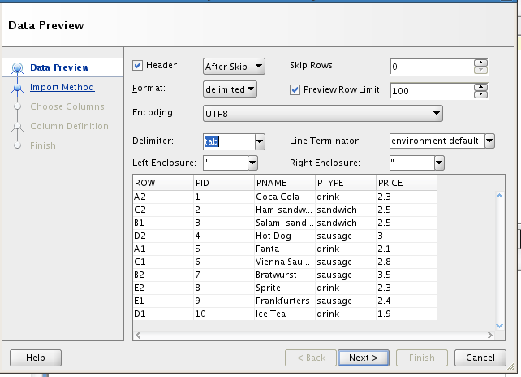
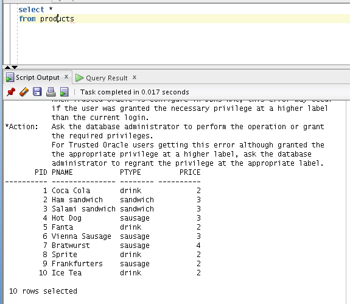
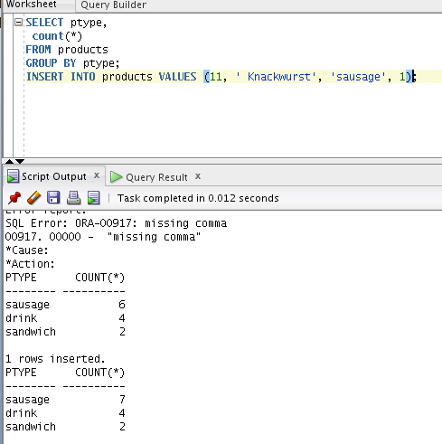
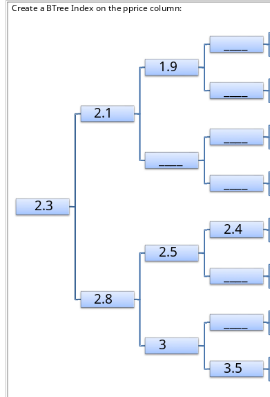
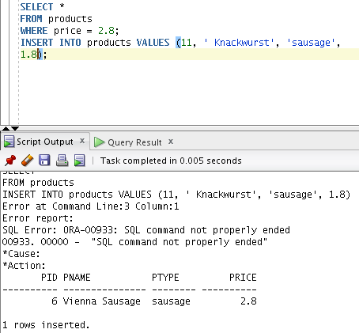
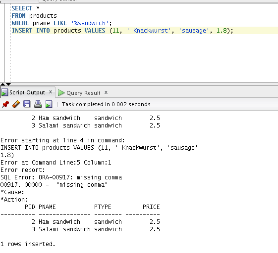
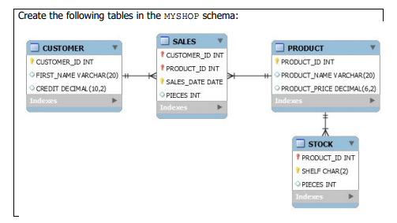
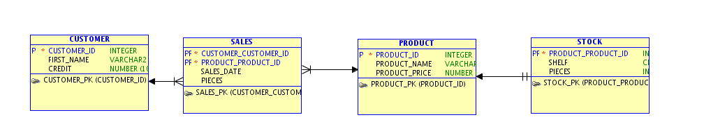

12---
title: 9 Rights
layout: report
date: 2016-11-28
task: Rights Uebung_001
taskHref: http://griesmayer.com/?menu=Oracle&semester=Semester_3&topic=06_Rights
subject: dbi
---

# Preperation

## Generate a CSV to import into the Database
```csv
ROW	PID	PNAME	PTYPE	PRICE
A2	1	Coca Cola	drink	2.3
C2	2	Ham sandwich	sandwich	2.5
B1	3	Salami sandwich	sandwich	2.5
D2	4	Hot Dog	sausage	3
A1	5	Fanta	drink	2.1
C1	6	Vienna Sausage	sausage	2.8
B2	7	Bratwurst	sausage	3.5
E2	8	Sprite	drink	2.3
E1	9	Frankfurters	sausage	2.4
D1	10	Ice Tea	drink	1.9

```

## Import the Data into the Database




## Verify the Data has been succsessfully imported




# Tasks

## Create a Bitmap Index on the ptype

| A1 | A2 | B1 | B2 | C1 | C2 | D1 | D2 | E1 | E2
---|---
drink | **1** | **1** | 0 | 0 | 0 | 0 | **1** | 0 | 0 | **1**
sandwich | 0 | 0 | **1** | 0 | 0 | **1** | 0 | 0 | 0 | 0
sausage | 0 | 0 | 0 | **1** | **1** | 0 | 0 | **1** | **1** | 0

## Show the result of the follwing SQL Statements

```sql
SELECT ptype,
 count(*)
FROM products
GROUP BY ptype;
INSERT INTO products VALUES (11, ' Knackwurst', 'sausage', 1.8);

```


## Create a BTree Index on the pprice column



## Show the result of the following SQL Statements
```sql
SELECT *
FROM products
WHERE price = 2.8;
INSERT INTO products VALUES (11, ' Knackwurst', 'sausage', 1.8);
```



index | rid | rid | rid
--- | ---
0 | B2
1 | A2 | A1 | D1
2 |
3 |
4 |
5 | C1 | E2
6 |
7 | D2
8 | C2 | B1
9 | E1

last char | nr | nr%10
---|---
a | 1 | 1
e | 5 | 5
g | 7 | 7
h | 8 | 8
s | 19 | 9
t | 20 | 0

## Show the result of the following SQL Statements

```sql
SELECT *
FROM products
WHERE pname LIKE '%sandwich';
INSERT INTO products VALUES (11, ' Knackwurst', 'sausage', 1.8);
```



## Create the following tables in the MYSHOP schema



Data Model in SQL Develper Data Modeler



Apply the Model to the Database

## Fill the Product Table with 10000 Lines
