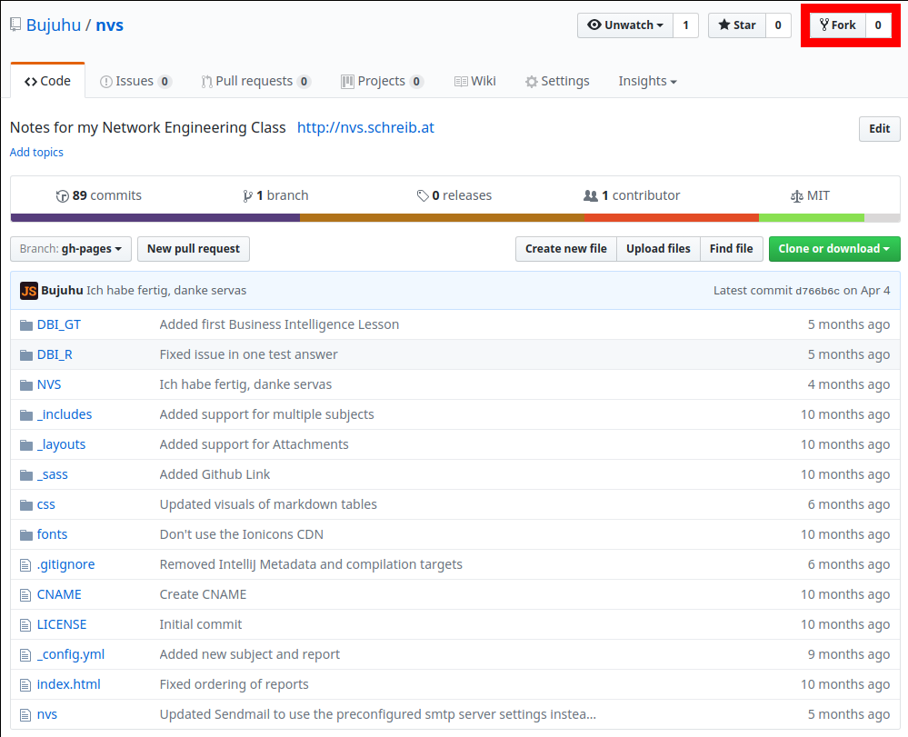

# Unterstützen

Es gibt 2 Möglichkeien eigene Beiträge auf nvs.schreib.at zu veröffentlichen

## Methode 1, Markdown File einschicken

Verfasst euren Beitrag im [Markdown Format](https://guides.github.com/features/mastering-markdown/) und schickt ihn dann an meine E-Mail Adresse - [juri@schreib.at](mailto:juri@schreib.at). Dabei zu beachten gibt es nur, dass Bilder und Anhnäge auf einem externen Server gehosted und im Dokument korrekt verlinkt werden müssen.

Ich werde mich dann darum kümmern den Beitrag auf der Webseite einzubinden

## Methode 2, Pull Request

Die für mich viel weniger Arbeit verursachende Methode ist die erstellung eines Pull Requests auf Github. Ich werde versuchen hier Schrittweise zu erklären, wie man dies macht

### Schritt 1, das Projekt Forken und clonen

Dazu navigiert man zur [Github Seite des Projekts](https://github.com/Bujuhu/nvs) und klickt, wenn man eingeloggt ist, auf "Fork" am oberen rechten Bildschirmrand



Danach sollte das Github Projekt auf eurem Github Benutzerkonto verfügbar sein.


Ist das Geschafft, kann das Projekt mit dem Git Clienten deiner Wahl, das Projekt von eurem Profil geklont werden können.

### Schritt 2, das Projekt bearbeiten

Das Verzeichnis des Projekts sollte in etwa so aussehen


Um einen neuen Beitrag zu erstellen muss man in den `_contributions` Ordner Navigieren und den Beispiel Ordner kopieren und umbenennen


### Setzen der Variablen

Innerhalb des neuen Ordners sollte dann eine Datei sein die `index.md` heißt und folgedndermaßen aussieht:

```
---
title: Beispiel  # Titel des Dokuments
date: 1970-01-01 # Veröffentlichungsdatum
author: Max Mustermann # (Optional) Autor
class: 5XHIF 17/18 # (Optional) Klasse und Jahrgang des Autors
task: Aufgabenstellung # (Optional) Beschreibung der Aufgabenstellung
taskHref: https://kaufensie.jetzt # (Optional) Link der Aufgabenstellung
---

Markdown Text

```

Am Anfang des Dokuments müssen Variablen definiert werden. Ein Titel `title` und ein Datum `date` im Format `YYYY-MM-DD` sind pflicht. Sollte als Datum ein Zeitpunkt in der Zukunft gewählt werden, wird das Dokument erst ab diesem Datum einsehbar.

Nicht verwendete Variablen, welche optional sind, können einfach rausgelöscht werden.

### Verfassen vom Text

Unterhalb des Blocks beginnt dann der eigentliche Textinhalt des Dokuments. Innerhalb dieses Bereichs kann [Markdown](https://guides.github.com/features/mastering-markdown/) und HTML verwendet werden um das Dokument zu formatieren.

### Einbinden von Bildern und Anhängen

Um andere Datein anzuhängen, müssen diese - wie im Beispielprojekt Demonstriert - einfach im selben Verzeichnis liegen wie die Markdown Datei. Diese sind dann unterhalb des Textes auf der Webseite verfügbar.


*Nur Bilder im PNG Format werden als Bilder erkannt, alle andern Bildformate werden als Anhänge, angezeigt*

Bilder können auch mithilfe von Markdown direkt in den Text eingebunden werden. Dazu muss man einfach `` verwenden

## Schritt 3, Testen

Hat man den Text vervollständigt, ist es möglich, bevor man es mir zuschickt zu testen. Dazu muss [Jekyll](https://jekyllrb.com/) installiert sein und im Hauptverzeichnis mit dem Befehl `jekyll serve` ausgeführt werden. Danach sollte eine Testinstanz auf [http://localhost:4000](http://localhost:4000) erreichbar sein.

Dort sollte dann unter der Kategorie **Beiträge**, das neue Dokument gelistet sein.


## Schritt 4, einen Pull Request erstellen

Nach dem Änderungen commited und auf Github gepushed worden sind, ist es möglich auf Github einen Pull-Request zu eröffnen um deinen Beitrag auf der Hauptseite einzubinden.

Dazu gehe wieder auf die [Github Seite des Projekts](https://github.com/Bujuhu/nvs), klicke auf *Pull Requests*


und dann auf *New Pull Request*


Danach sollte es möglich sein, das Projekt auf deinem Profil als *Head Fork* und das Hauptprojekt auf meinem (Bujuhu) Profil als *Base Fork* auszuwählen und einen Pull Request zu erstellen.

Danach muss ich nurmehr kontrollieren, ob alles richtig ist und dann kann ich die Datei auf meine Seite pushen!
