# Create Tablespace
Oracle Enterprise Manager -> Tablespaces -> Create

**Note:** In the screenshot below should the *Increment* field shout be filled with '100' instead of 10

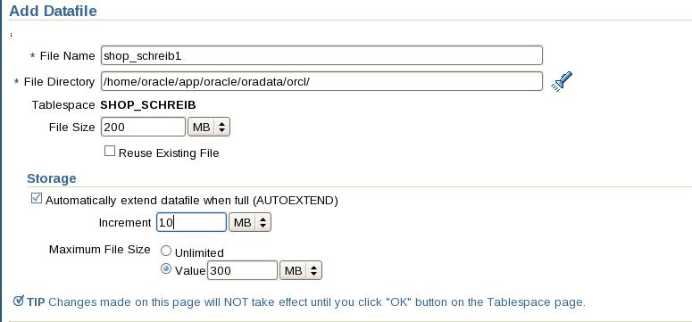

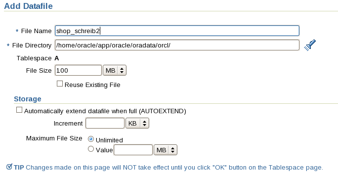

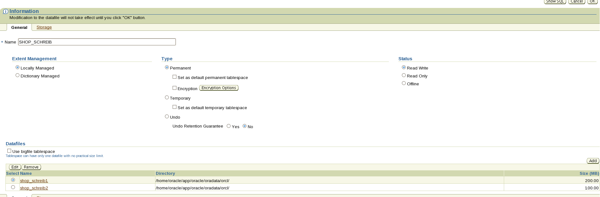

```sql
CREATE SMALLFILE TABLESPACE "SHOP_SCHREIB" DATAFILE '/home/oracle/app/oracle/oradata/orcl/shop_schreib1' SIZE 200M AUTOEXTEND ON NEXT 100M MAXSIZE 300M , '/home/oracle/app/oracle/oradata/orcl/shop_schreib2' SIZE 100M LOGGING EXTENT MANAGEMENT LOCAL SEGMENT SPACE MANAGEMENT AUTO
```

**Note:** *Make sure to grant any additonal rights to evrey user that is needed for your Lesson. Make sure you read ahead. Otherwhise you need to return here and make changes at a later point.*

# Create Admin User NVS_Schreib

Oracle Enterprise Manager -> Users -> Create


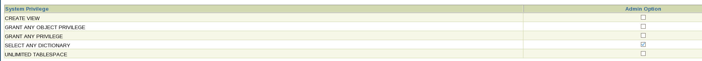

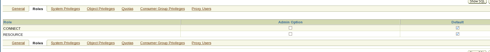

```sql
CREATE USER "ADMIN_SCHREIB" PROFILE "DEFAULT" IDENTIFIED BY "*******" DEFAULT TABLESPACE "USERS" TEMPORARY TABLESPACE "TEMP" ACCOUNT UNLOCK
GRANT CREATE VIEW TO "ADMIN_SCHREIB"
GRANT GRANT ANY OBJECT PRIVILEGE TO "ADMIN_SCHREIB"
GRANT GRANT ANY PRIVILEGE TO "ADMIN_SCHREIB"
GRANT SELECT ANY DICTIONARY TO "ADMIN_SCHREIB" WITH ADMIN OPTION
GRANT UNLIMITED TABLESPACE TO "ADMIN_SCHREIB"
GRANT "CONNECT" TO "ADMIN_SCHREIB"
GRANT "RESOURCE" TO "ADMIN_SCHREIB"
```

# Create a new User myshop

OEM -> Users -> Create

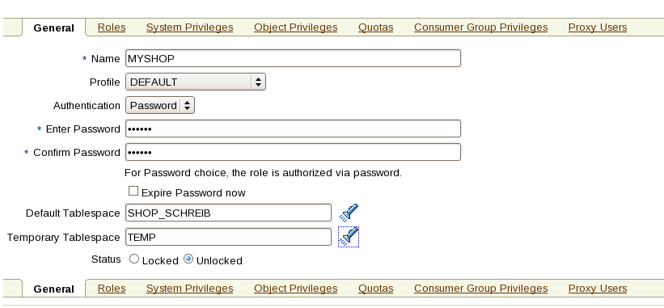

Set Quota for SHOP_schreib to UNLIMITED

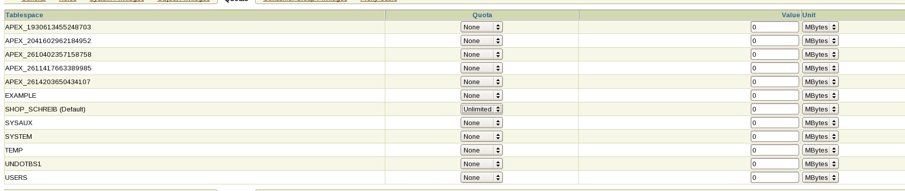

```sql
CREATE USER "MYSHOP" PROFILE "DEFAULT" IDENTIFIED BY "*******" DEFAULT TABLESPACE "SHOP_SCHREIB" TEMPORARY TABLESPACE "TEMP" QUOTA UNLIMITED ON "SHOP_SCHREIB" ACCOUNT UNLOCK
GRANT "CONNECT" TO "MYSHOP"
```

**Note:** *I renamed the User MYSHOP to MYSHOP1 because MYSHOP already existed.*

Add new Connections to the sqldeveloper


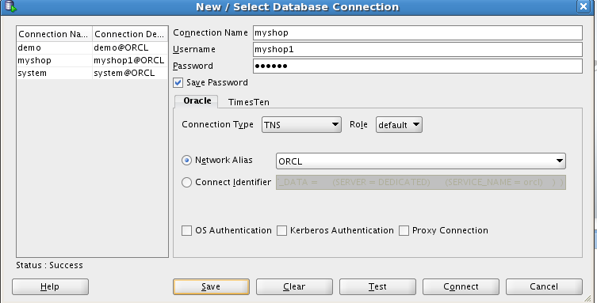

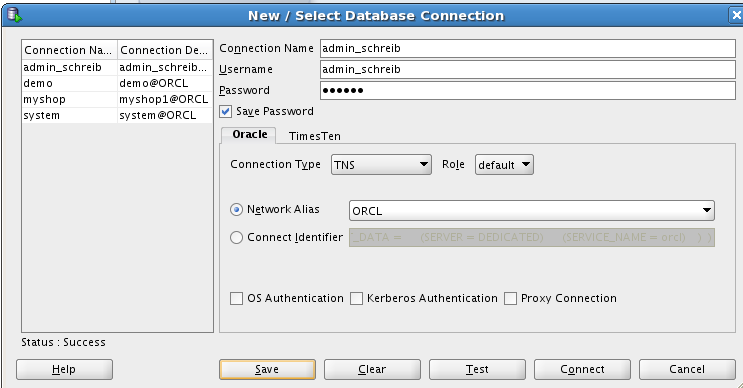

# Create the Table and insert some lines

Execute the follwing commands using the **system user** conneciton:

**Note:** *You're not really supposed to use the System user, but after griesmayers tutorial you don't grant any rights to any users to create new Tables.*

```sql
CREATE TABLE myshop1.product
(
product_id INTEGER PRIMARY KEY,
product_name VARCHAR2(20),
product_price DECIMAL(10,2)
);

insert into myshop1.product values (1, 'Brot', 2.49);
insert into myshop1.product values (2, 'Pizza', 5);
insert into myshop1.product values (3, 'Zahnpasta', 5);
```

# Create the User Schreib

OEM -> Users -> Create

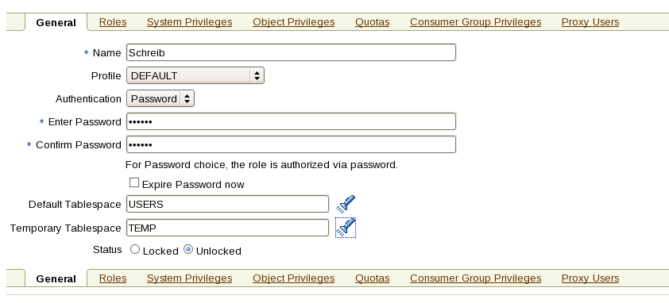

Object Privileges -> Select Object Type **Table** -> Add

*Ignore the Error*

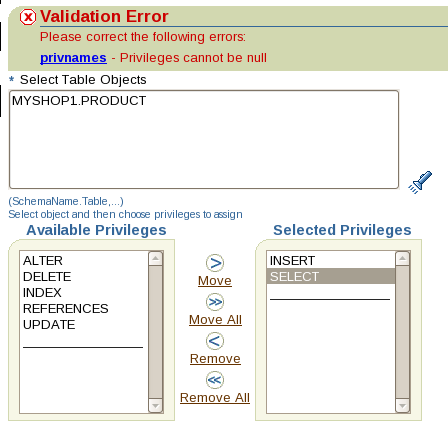

Object Privileges -> Select Object Type **Table Column** -> Add

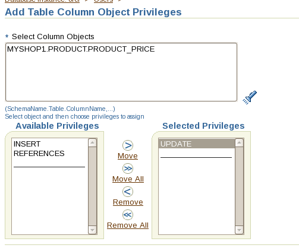

**Note:** *I didn't find any way to grant any rights to a User conditionally (e.g. to allow delete, if price is smaller than 100) so I just skipped that*

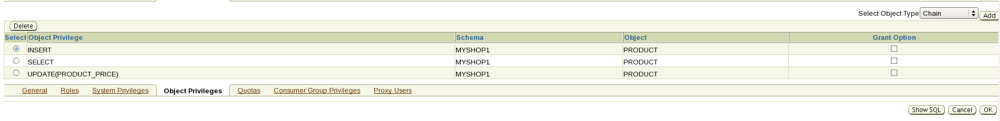

```sql
CREATE USER "SCHREIB" PROFILE "DEFAULT" IDENTIFIED BY "*******" DEFAULT TABLESPACE "USERS" TEMPORARY TABLESPACE "TEMP" ACCOUNT UNLOCK
GRANT INSERT ON "MYSHOP1"."PRODUCT" TO "SCHREIB"
GRANT SELECT ON "MYSHOP1"."PRODUCT" TO "SCHREIB"
GRANT UPDATE (PRODUCT_PRICE) ON "MYSHOP1"."PRODUCT" TO "SCHREIB"
GRANT "CONNECT" TO "SCHREIB"
```


# Test the Rights!
*I skipped this part because it's already too late. Test the Right by running some sql queries (select, insert, delete) on the User you want to test of*

---
# Outdated version
```sql
create smallfile tablespace "shop_schreib" DATAFILE
'/home/oracle/app/oracle/oradata/orcl/shop_schreib1.dbf' size 200M autoextend on next 100M maxsize 300M,
'/home/oracle/app/oracle/oradata/orcl/shop_schreib2.dbf' size 100m logging extent management local segment space management auto

```

Create a new user

```sql

create user "ADMIN_SCHREIB" profile "DEFAULT" identified by "pass" default tablespace "shop_schreib" temporary tablespace "temp" account unlock
grant grant any object privilege to "ADMIN_SCHREIB"
grant grant any privilege to "ADMIN_SCHREIB"
grant selct any dictionary to "ADMIN_SCHREIB" with admin option    
grant unlimited tablespace to "ADMIN_SCHREIB"
grant "CONNECT" to "ADMIN_SCHREIB"
grant "RESOURCE" to "ADMIN_SCHREIB";
```

Create the table and insert some lines:

```sql
CREATE TABLE schreib.product
(
product_id INTEGER PRIMARY KEY,
product_name VARCHAR2(20),
product_price DECIMAL(10,2)
)

insert into schreib.product values
  (1, 'Brot', 2.49),
  (2, 'Pizza', 5),
  (3, 'Zahnpasta', 5)
```

  Create a new user

```sql
create user "SCHREIB" profile "DEFAULT" identified by "pass" default tablespace "shop_schreib" temporary tablespace "temp" account unlock
grant select, insert on schreib.product to "SCHREIB"
grant insert to "SCHREIB"
grant update(product_price) on schreib.product to "SCHREIB"
grant delete on schreib.product_delete to "SCHREIB"
```
