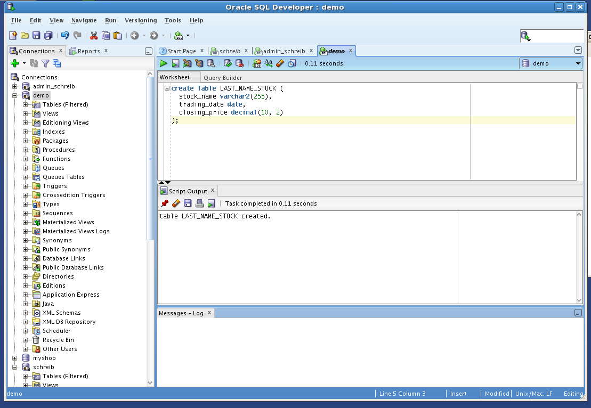
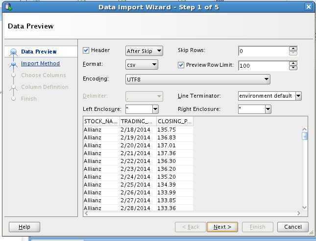
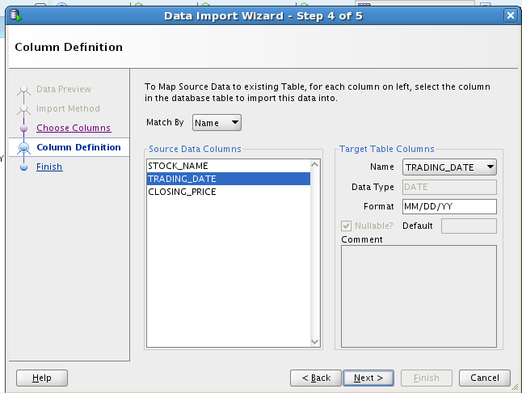
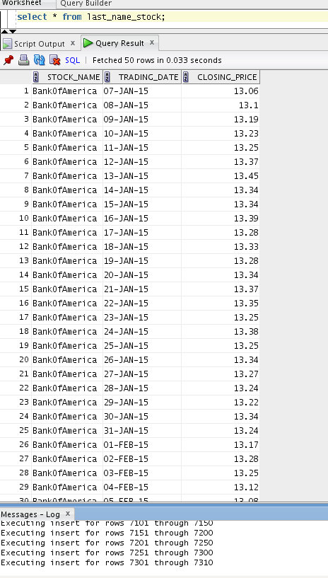
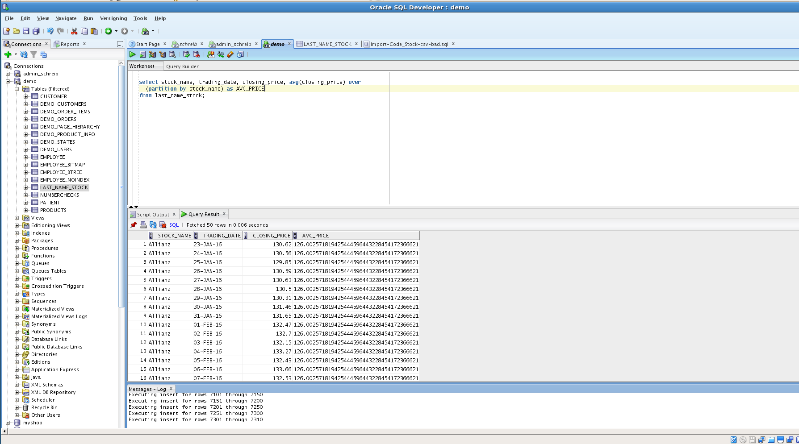
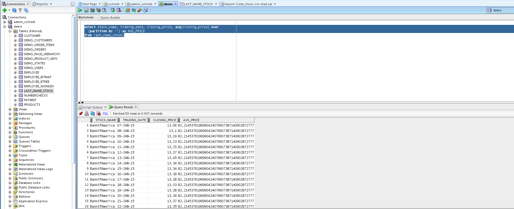
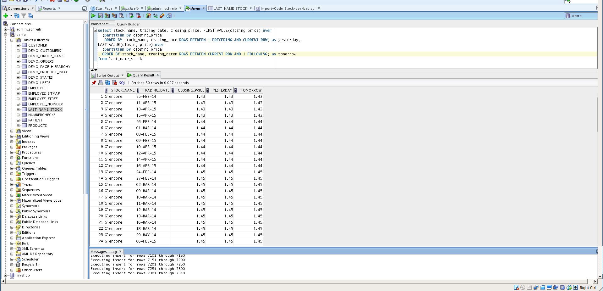
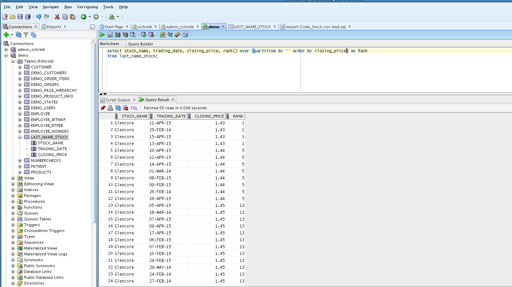

Add the followng Table:

```sql
Create Table LAST_NAME_STOCK (
  stock_name varchar2(255),
  trading_date date,
  closing_price decimal(10, 2)
);
```



Fill the table with Data from the *Code_Stock.xlsx* file







## Average per Stock

```sql
select stock_name, trading_date, closing_price, avg(closing_price) over
  (partition by stock_name) as AVG_PRICE
from last_name_stock;
```



## Total Average

```sql
select stock_name, trading_date, closing_price, avg(closing_price) over
  (partition by '') as AVG_PRICE
from last_name_stock;
```



## Yesterday & Tomorrow

```sql
select stock_name, trading_date, closing_price, avg(closing_price) over
  (partition by '') as AVG_PRICE
from last_name_stock;
```

```sql
select stock_name, trading_date, closing_price, FIRST_VALUE(closing_price) over
  (partition by closing_price
   ORDER BY stock_name, trading_date ROWS BETWEEN 1 PRECEDING AND CURRENT ROW) as yesterday,
LAST_VALUE(closing_price) over
  (partition by closing_price
  ORDER BY stock_name, trading_datem ROWS BETWEEN CURRENT ROW AND 1 FOLLOWING) as tomorrow
from last_name_stock;
```



## Rank function

```sql
select RANK(1.43) WITHIN GROUP (ORDER BY closing_price)
```


