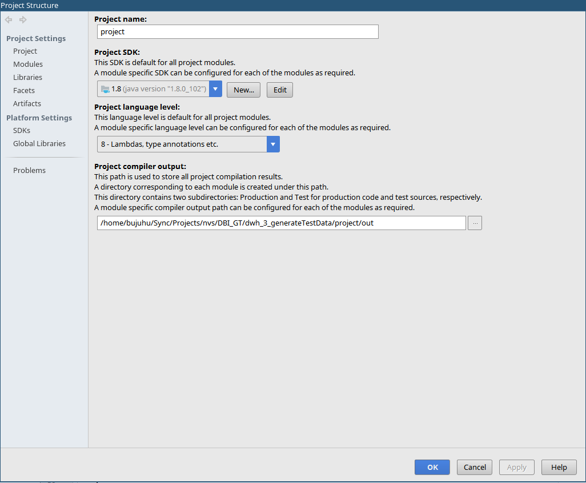
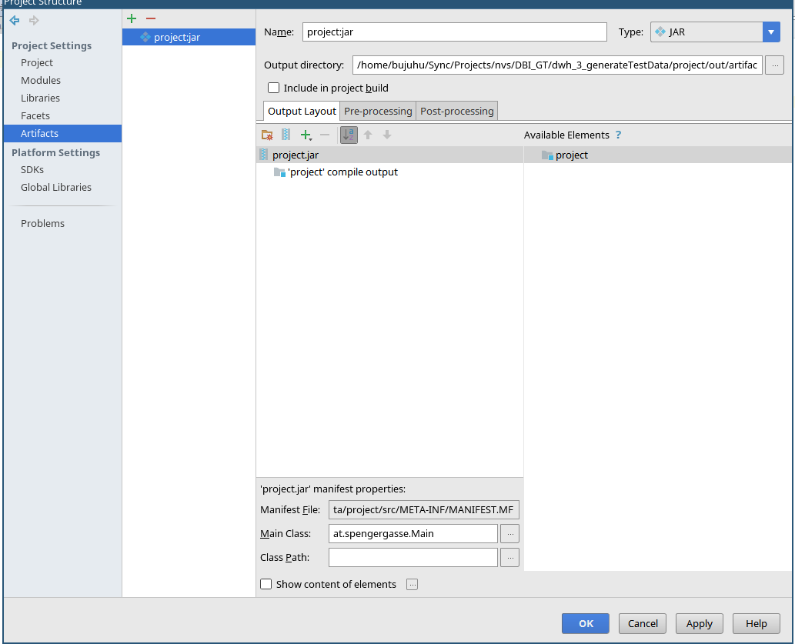
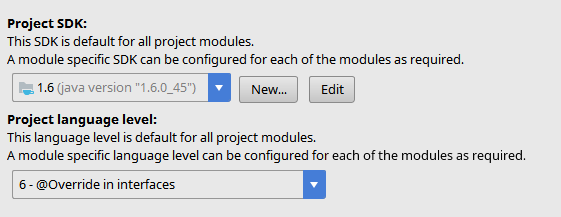
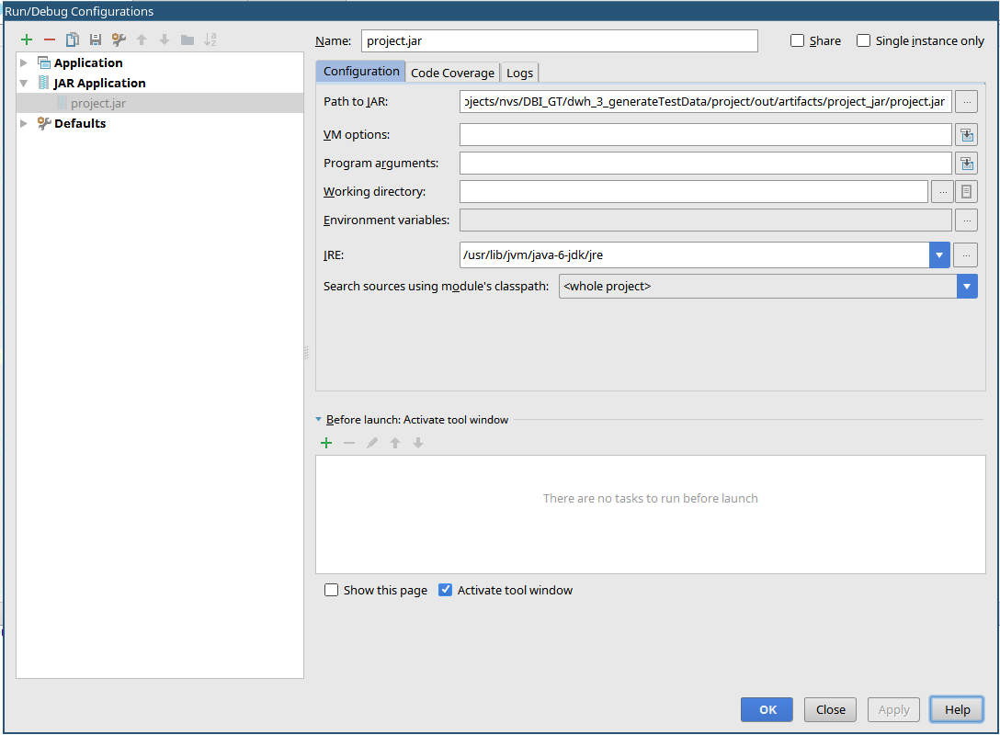
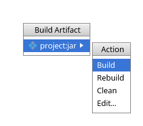
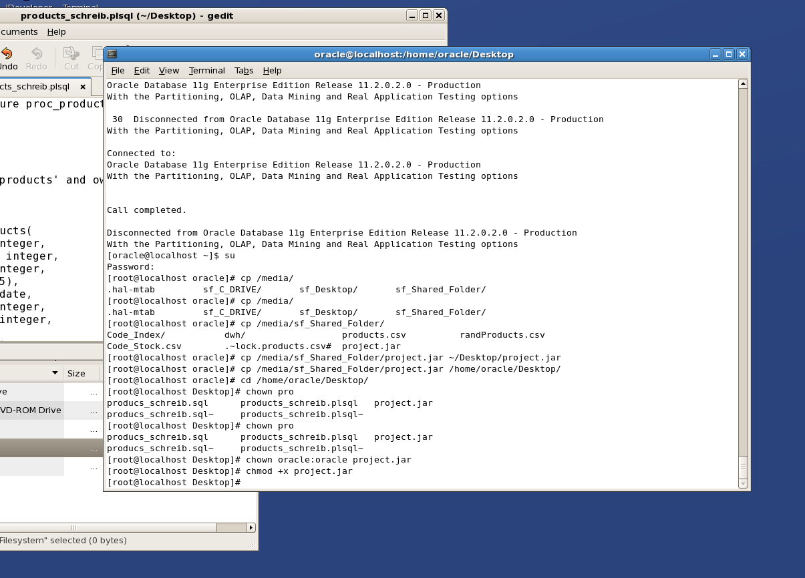
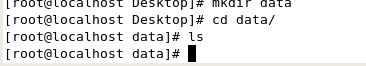
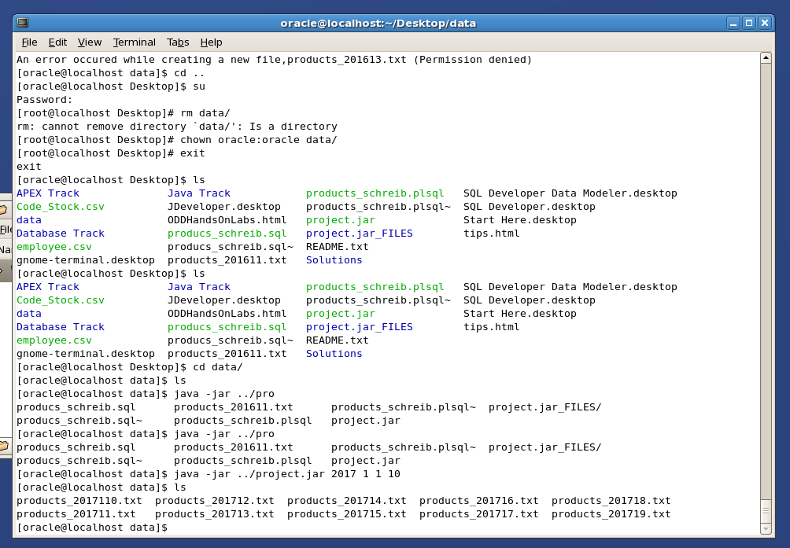

This Course requires that [GenerateTestData](../dwh_3_generateTestData)  was completed earilier

## Step 1: Compile application to jar

**Press ctrl+alt+shift+S**

**Artifacts -> + -> Jar -> from Module with dependencies**

Specify the Main Class of your Project

Make sure to Specify the java 1.6 runtime enviroment, so it will run in this very up to date virtual maschine. Donload the jdk here [Java 6 JDK & JRE](http://www.oracle.com/technetwork/java/javase/downloads/java-archive-downloads-javase6-419409.html)

**Changeching the Build settings** (Press ctrl+alt+shift+S)

Change Project SDK to 1.6 and language level to 6

**Changeing the Run settings** (Optional for debugging)

Then on the Menubar of the Main windows select **build -> build artifact**

After that, you should have the generated jar file inside out/artifacts/*project_name*_jar/*project_name*.jar

Copy the file to your virtual machine using the shared folder

Create a data directory

Make sure to transfer ownership of all created files and folders to the **oracle** user using `chown oracle:oracle filename` and make the jar file executable using `chmod +x jarname.jar`

Execute the jar file

**Done!**
