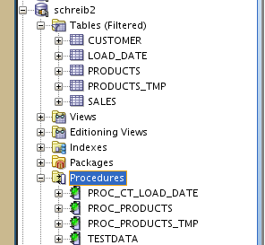

Copy the SQL Scripts from last time from DWH 4 and append TMP to the table and procedure name

## products_schreib_TMP.plsql

```sql
create or replace procedure proc_products_tmp as
   v_tablecnt number;
begin
  select count(*)
    into v_tablecnt
    from all_tables
    where table_name = 'products_tmp' and owner = 'schreib_explain';

  if v_tablecnt = 0 then
    execute immediate
      'create table products_tmp(
        product_series integer,
        product_category integer,
        insurance_plan integer,
        name  varchar(255),
        activation_date date,
        warrenty_years integer,
        insurance_years integer,
        sold_date date,
        products_sold integer,
        product_price decimal(7,2),
        insurance_price decimal(7,2),
        activated number,
        repairs integer,
        repair_cost decimal(7,2),
        primary key(product_series, product_category, insurance_plan)
      )';
  end if;
end;
```

## products_schreib_TMP.sql

```sql
call proc_products_tmp();
exit;
```

Append the File ID to the original plsql procedure from DWH 4 as the last table column.
Additionally, add a foreign key constraint between file_id of this table to Load_Date.file_id.
We will create the Table Load_Date on a later point

## products_schreib.plsql

```sql
create or replace
procedure proc_products as
   v_tablecnt number;
begin
  select count(*)
    into v_tablecnt
    from all_tables
    where table_name = 'products' and owner = 'schreib_explain';

  if v_tablecnt = 0 then
    execute immediate
      'create table products(
        product_series integer,
        product_category integer,
        insurance_plan integer,
        name  varchar(255),
        activation_date date,
        warrenty_years integer,
        insurance_years integer,
        sold_date date,
        products_sold integer,
        product_price decimal(7,2),
        insurance_price decimal(7,2),
        activated number,
        repairs integer,
        repair_cost decimal(7,2),
        file_id integer,
        foreign key(file_id) references load_date(file_id),
        primary key(product_series, product_category, insurance_plan)
      )';
  end if;
end;
```

Create the Load_Date Table creation procedure

## loadDate_schreib.sql

```sql
CREATE OR REPLACE PROCEDURE PROC_CT_LOAD_DATE as
v_tabcnt number;
BEGIN
  SELECT count(*) into v_tabcnt
    FROM ALL_TABLES
    WHERE OWNER = 'schreib_explain' and
    TABLE_NAME = 'LOAD_DATE';

  if v_tabcnt = 0 then
    EXECUTE IMMEDIATE
      'CREATE TABLE LOAD_DATE
      (
      FILE_ID INTEGER,
      FILE_NAME VARCHAR(40),
      FILE_DATE DATE,
      LOAD_DATE TIMESTAMP,
      PRIMARY KEY (FILE_ID)
      )';
      end if;

  SELECT count(*) into v_tabcnt
    FROM ALL_SEQUENCES
    WHERE SEQUENCE_OWNER = 'schreib_explain' and
    SEQUENCE_NAME = 'SEQ_FILE_ID';

  if v_tabcnt = 0 then
    EXECUTE IMMEDIATE
    'CREATE SEQUENCE SEQ_FILE_ID
    START WITH 1';
    end if;
  END PROC_CT_LOAD_DATE;
```

## loadDate_schreib.sql

```sql
call PROC_CT_LOAD_DATE();
exit;
```
Make sure to document the follwoing parts

Drop the existing Table of your Project and run the Scripts you've just created in the follwoing order

- loadDate.plsql
- project_tmp.plsql
- project.plsql
- loadDate.sql
- project_tmp.sql
- project.sql

using the `sqlplus `command

```
sqlplus username/password @Path/to/File
```


Lets run the procedures we have just created/modified

If you have issues executing the PlSQL Files, you can just run them using the sql developer. Just make sure, the screenshots make it seem like, you executed the file using the scripts.




Adopt the File Loader Script to accomodate for the Datbase Changes. Make sure to change the ldr file from last lesson to the new **project_tmp** table

## products_schreib.sh

```bash
#!/bin/bash
for FILE in `ls data/*.txt`; do
  export FILENAME=`basename $FILE`
  export FILEBASE=`echo $FILENAME | sed -e 's/\..*//'`
  sqlldr schreib_explain/oracle data=data/$FILEBASE.txt control=data/products_schreib.ldr log=data/log/$FILEBASE.log bad=data/log/$FILEBASE.bad errors=20
  sqlplus schreib_explain/oracle <<!
    DELETE FROM products
    WHERE FILE_ID in
    (
    SELECT FILE_ID
      FROM LOAD_DATE
      WHERE FILE_NAME = '$FILENAME'
    );
    COMMIT;
!
  sqlplus schreib_explain/oracle <<!
    DELETE FROM LOAD_DATE
      WHERE FILE_NAME = '$FILENAME';
    COMMIT;
!
  sqlplus schreib_explain/oracle <<!
    INSERT INTO LOAD_DATE VALUES
      (SEQ_FILE_ID.nextval, '$FILENAME',
      to_date('$FILEDATE', 'YYYYMMDD'), sysdate);
    COMMIT;
!
  sqlplus schreib_explain/oracle <<!
    INSERT INTO products
      SELECT tmp.*, fid.FILE_ID
      FROM products_tmp tmp
      INNER JOIN (
        SELECT FILE_ID
        FROM LOAD_DATE
        WHERE FILE_NAME = '$FILENAME'
      ) fid
        ON 1=1;
    DELETE FROM products_tmp;
    COMMIT;
!
done;

#this is how enterprise software looks like in 2017 bois and grills
#Why are these sql scripts inline, and not functions?
#But then again, the whole thing doesn't make a lot of sense
```


Check if the Script filled the Database with Data
(If this didn't work you can try to call the sql statements inside the script manually).
(You can also try to disable fk and pk constraints by editing tables (hover with mouse over table in sidebar -> right click -> edit))


Generate new Data and rerun the script.


Check if something changed


**Done**
