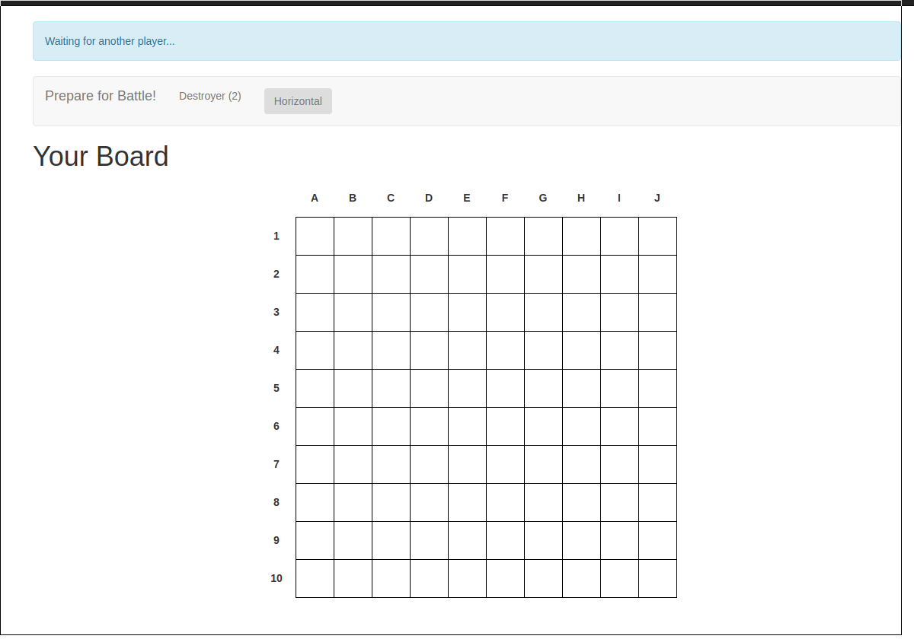
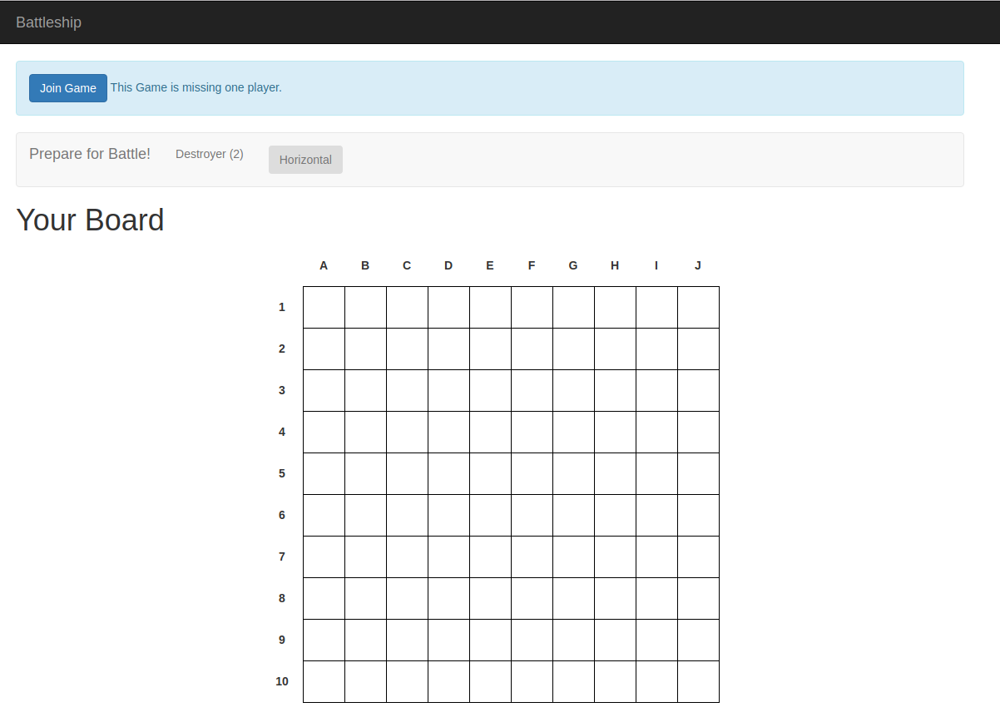
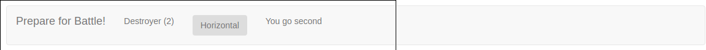
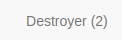
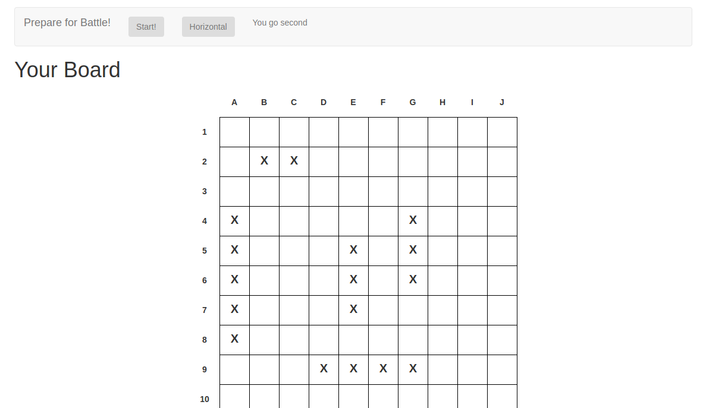
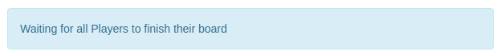
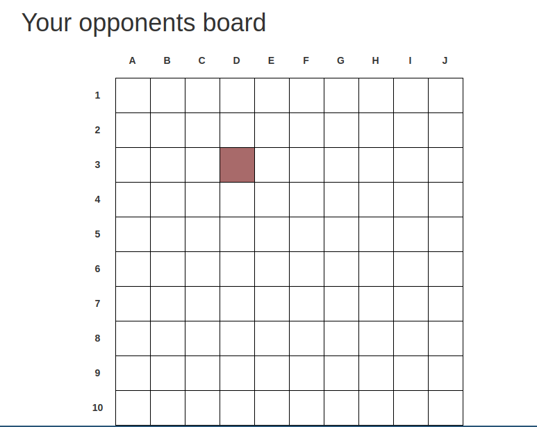
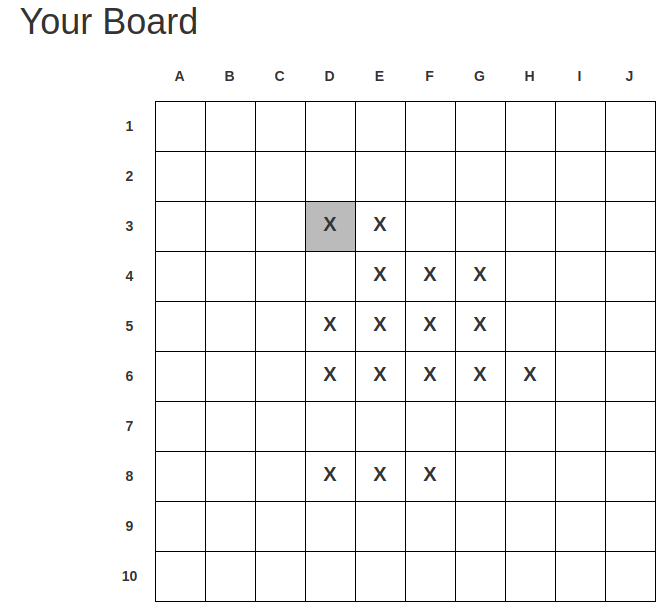

# Projektinformationen

## Arbeitszeit

- **Julian Palmanshofer** 17 Stunden
- **Juri Schreib** 23 Stunden

Ein Großteil der Zeit waren wir damit beschäftigt, das Meteor Framework kennen zu lernen und uns mit den Best Practices vertraut zu machen.

## Durchgeführte Arbeiten

**Julian Palmanshofer**
- Graphische Benutzeroberfläche
- Programmlogik

**Juri Schreib**
- Serverseitige Entwickung
- Programmlogik
- Client / Server Schnitstelle


# Battleship User Documentation

## Creating a Game

To create a new Game navigate to the Game configuration Site by clicking on **Quick Play** on the Homepage.


In the current Version of Battleship, no game configuration options exist. So continue by pressing the Submit button


You will be redirected to another Page that looks like this:



Notice that on the Top, it says that it is waiting for another Player. Look in **Joining a Game** to learn how to invite another Player.

## Joining a Game
To join an existing Game, the creator has to send you the Link of the current Game by copying the URL from the Address bar.


After you recieved the URL enter it into a webbrowser and open the Page. You will be greeted by a Page that looks like this:



To join the Game, click on the Blue Join Game Button on the top Left corner.

After you clicked it, the Blue Box should disappear for both players.

Both player should see a text appear inside the grey Bar, which tells them who goes first:




## Playing the Games

### Placeing ships

In the first phase of the Game you can place your Ships on the Gameboard.

You will see the name and the length of the Ship you place inside the Grey Bar on the Top.



You can toggle the Rotation of the Ship by clicking on the Horial button


To place the Ship click on a box inside your Board. Clicking on a Box will put the top left part of the Ship on the Board.


After placeing the first Ship, the Ship description inside the Grey Bar will change and **X** will appear where you set the Ship.

Continue to place all Ships in this fashion



After you placed all ships, the Ship description will change into a Start Button.

When you press Start, a blue Box will apperar.



It means that only one Player finished placing all ships and pressed the start button.

The Game will proceed after both Players clicked the Start Button.

### Playing

After the Game Stars a Second board will appar. On the Top you will see a Box that indicates which turn it currently is.


When its your turn use the Bottom board to guess the locations of the opponetn Ships. If you miss a ship, the box will be colourd blue, if you hit a ship, it will be colored red.

THe guesses of your opponent will be highlited in the top gameboard by grey boxes


*Missed Ship*



*Hit Ship*



*Highlighted Guesses of your opponent.*

After you sunken all ships of your opponents a message will apperar


You can continue playing after that

Battleship Technical Documentation

## Getting Started

### Prepare for Development

The Project is written using [Meteor](https://www.meteor.com/). Follow the instructions on the Website to install Meteor on your system. After that you should be able to execute `meteor` in the root directory of this project to install all dependencies and get a test instance running.

### Project Structure

#### Directory Structure

```js
|
|- client
|    |- stylesheets /* Stylesheets go here */
|    |- main.js /* Import /imports/startup/client */
|
|- server
|    |- main.js /* Import /imports/startup/server */
|
|-imports
    |- api /* API: Server publications and Methods */
    |    |- [model] /* Name of the Model provided by the API */
    |    |    |- [model].js /* API definition */
    |
    |- startup
    |    |- client
    |    |    |- index.js /* Import Modules that should be run on the Client */
    |    |    |- routes.js /* URL Routes declaration */
    |    |
    |    |- server
    |        |- index.js /* Import Modules that should be run on the Server */
    |
    |- ui
         |- layouts /* Layout Templates */
         |    |- [layout].html /* html Blaze Template */
         |    |- [layout].js /* javascript Blaze Template */
         |
         |- pages /* Page Templates */
         |    |- [page].html /* html Blaze Template */
         |    |- [page].js /* javascript Blaze Template */

```

### Application Workflow

When a Player generates a new Game a Game Object will be created inside the Database. As more and more information is collected about the Game, the Model, the furhter it will be extended. Since Meteor runs on MongoDb we don't have to define a fixed schema and are free to do so.

## Developing
### User Interface
The follwing Packages are available for the client:
- [https://getbootstrap.com/](Bootstrap)
- [https://t4t5.github.io/sweetalert/](Sweetalert)
- [https://jquery.com/](jQuery)

Feel free to use them to make your development ecperience easier and to keep the design consistend.

### Logic
Most of the Applicaiton logic is located in the follwing Files:
- `/imports/ui/pages/game.html`
- `/imports/ui/pages/game.js`
- `/imports/api/game/index,js`

If you want to modify the programming logic, the best bet is to start orienting and looking in the files listed above.

Refer to the Source Code Documentation to gain more insight of the inner workings of the Project

##Source Code Documentation

## Modules

### Games Module

**Location** /imports/api/games/games.js

#### Exports

##### Games
- **Type**
 - [Mongo.Collection](https://docs.meteor.com/api/collections.html)

#### Publications

##### games.findByID
 Retrieve a Game Object from the Database using its ID

- **Params**
 - gameID {String} the Database ID of the current Game
- **Provides**
 - Games.find {function}

#### Methods

##### games.create
Adds a new Game Object to the Database

- **Params**
 - game {Object} the newly gemerated game object
- **Returns**
 - result {Object} The Result of the Database Query

##### games.findByID
Adds a new Game Object to the Database

- **Params**
 - id {String} The Id of the Game Object
- **Returns**
 - game {Object} game object

##### games.addOpponent
Adds an Opponent to the an existing Game Object

- **Params**
 - gameId {String} The Id of the Game Object
 - sessionId {String} The Id of the Opponents Session
- **Returns**
 - result {Object} result of the Database Query

##### games.addBoard
Adds a Users Board with placed ships to a Game Object

- **Params**
 - gameId {String} The Id of the Game Object
 - sessionId {String} Id of the user session
 - board {Object} The board of the user
- **Returns**
 - result {Object} result of the Database Query

##### games.addTurn
Adds a Users Turn (trying to hit an opponents ship) to a Game Object

- **Params**
 - gameId {String} The Id of the Game Object
 - sessionId {String} Id of the user session
 - turn {Object} The turn Object of the User
- **Returns**
 - result {Object} result of the Database Query

##### games.checkIfTurnWasHit
Cheks if a Turn hits or missed a Ship

- **Params**
 - gameId {String} The Id of the Game Object
 - sessionId {String} Id of the user session
 - turn {Object} The turn Object of the User
- **Returns**
 - result {Object} current game object. Will be null when all Ships were misse.

## Templates

### Game

**Location** /imports/ui/pages/game.js

#### Helpers

##### games
Retrieves a Game Object form the Database

**Returns**
- {Object} Game Model

##### fullLobby

**Param**
- game {Object} Game Model
**Returns**
- {Boolean} true if the current Game has already enough Players

##### currentPlayer
**Param**
- game {Object} Game Model
**Returns**
- {Boolean} true if the current User is a player in the current Game

##### determinedOrder
**Param**
- game {Object} Game Model
**Returns**
- {Boolean} true if the person who is going first was already determined by the Server

##### order
**Param**
- game {Object} Game Model
**Returns**
- {String} returns either 'first' or 'second' depending of the User is going first or second

##### spectator
**Param**
- game {Object} Game Model
**Returns**
- {Boolean} true if the current game has enough players and the user is not a player

##### placeShip

**Returns**
- {String} Description of the next Ship that will be placed.

##### gameStarted

**Param**
- game {Object} Game Model
**Returns**
- {Boolean} true if both players submmited their boards and they start to make turns

##### gameStartInitiated
**Param**
- game {Object} Game Model
**Returns**
- {Boolean} true if one player submitted their board

##### yourtTurn

**Param**
- game {Object} Game Model
**Returns**
- {Boolean} true if its the current players turn

### Events

All Events have one [event](https://developer.mozilla.org/en-US/docs/Web/API/Event) parameter

#### click .join-game

A new player joins the current Game

#### click .direction

Toggles between Horizontal and Vertical Ship orientation

#### click #prepareBoard .gameboard

Places a new Ship on the Players board

#### click .startGame

Starts the Game, by submitting each Players gameBoard to the Server

#### click #opponentboard.active .gameboard

executes a new TUrn of the current Player and submits it to the Database
