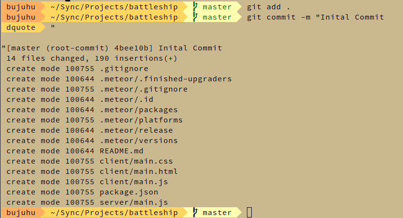
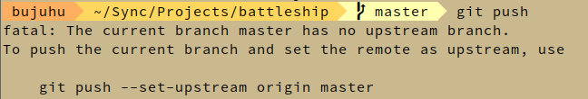
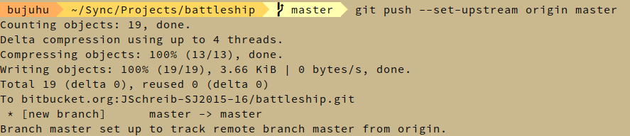
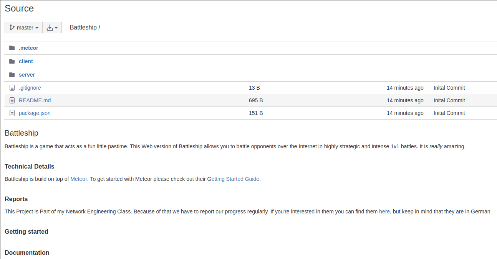
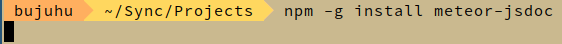
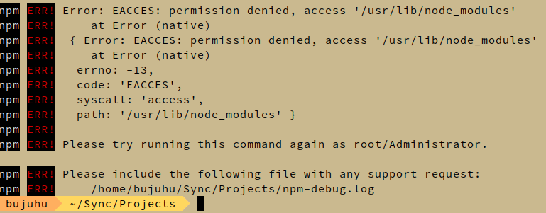
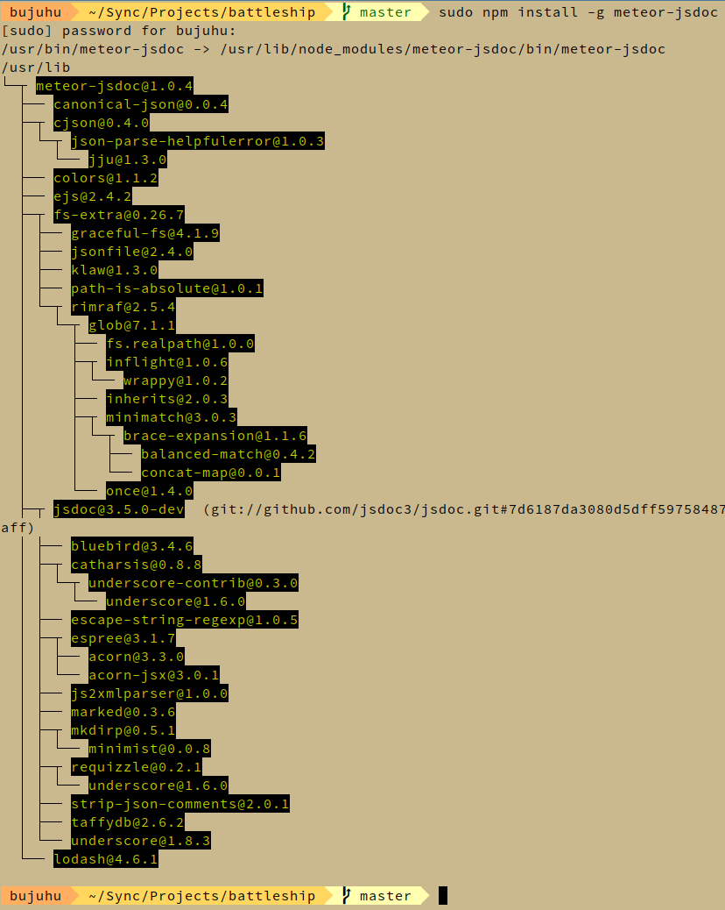
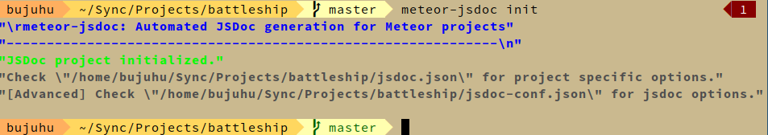
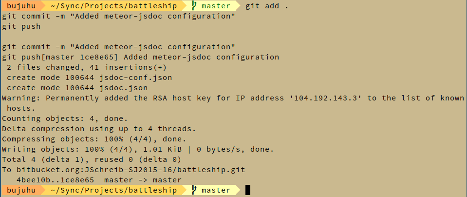

# Battleship 3

## Ersten Commit ausführen

Der erste Commit des Git Repositories mit den standard Meteor Projekt dateien wird erstellt.

Folgende Kommandos sind dazu notwendig:

```bash
git add .
#Bereitet alle dirty (nicht commited) Files im Ordner und allen unterordnern zum Commit vor

git commit -m "Initial Commit"
#Führt den Commit durch mit der Bezeichnung "Initial Commit" durch
```

### Ausführung



**Der Commit war erfolgreich**

## Pushen des Commits auf das Remote Repository
Der Commit wird nun auf das Bitbucket Repository gepushed. Dazu wird das Kommando `git push` verwendet

### Umsetzung



**Bei dem Commit tritt ein Fehler auf.**

### Fehlerbehebung
Git ist nicht bekannt auf welchen Branch und welches Repository es pushen soll. Beim erste Commit kann man das mit `git push --set-upstream [remote] [branch]` festlegen. Das remote repository hat die Bezeichnung 'origin'. Deswegen muss man das Kommando `git push --set-upstream origin master` verwenden.



### Ergebnis
Das Projekt ist nun auf Bitbucket verfügbar und kann von allen Projektteammitgliedern genutzt werden.



## JSDoc
Zur Dokumentation des Sourcecodes haben wir uns auf die Nutzung von jsdoc geeinigt. JSDoc erlaubt es Javascript Code mit einer JavaDoc ähnlichen Syntax zu versehen und daraus dann Websiten zu generieren.

Da wir für unser Projekt Meteor nutzen, verwenden wir eine erweiterung von jsdoc - [meteor-jsdoc](https://www.npmjs.com/package/meteor-jsdoc) - die speziell für Meteor Projekte ausgerichtet sind.

### Installation
Laut Anleitung muss meteor-jsdoc mit dem Befehl `npm install -g meteor-jsdoc` installiert werden. Das bedeuted das das Paket aus dem Node Pacakage Manager global auf dem System installiert wird.

#### Ausführung
Es wird mit `npm install -g meteor-jsdoc` meteor-jsdoc installiert.



Bei der Instalation friert npm und gibt keine Ausgabe aus.

#### Fehlerbehebung
Der Computer wird neu gestartet, danach wird der Computer neu gestartet  und das Kommando erneut ausgeführt



Der Benutzer hat nicht die Erfoderlichen Rechte um die Datein zu installerien. Um npm mit Administrationsrechten auszuführen wird `sudo npm install -g meteor-jsdoc` ausgeführt.



**Die installation war Erfolgreich**

### Initialisierung
meteor-jsdoc wird mit dem Befehl `meteor-jsdoc init` initialisiert.



### Änderungen in git einchecken
Die Änderungen werden in git Eingelesen und auf Bitbucket hochgeladen.
```bash
git add .
git commit -m "Added meteor-jsdoc configuration"
git push
```



**Git Befehle wurden erfolgreich ausgeführt**
