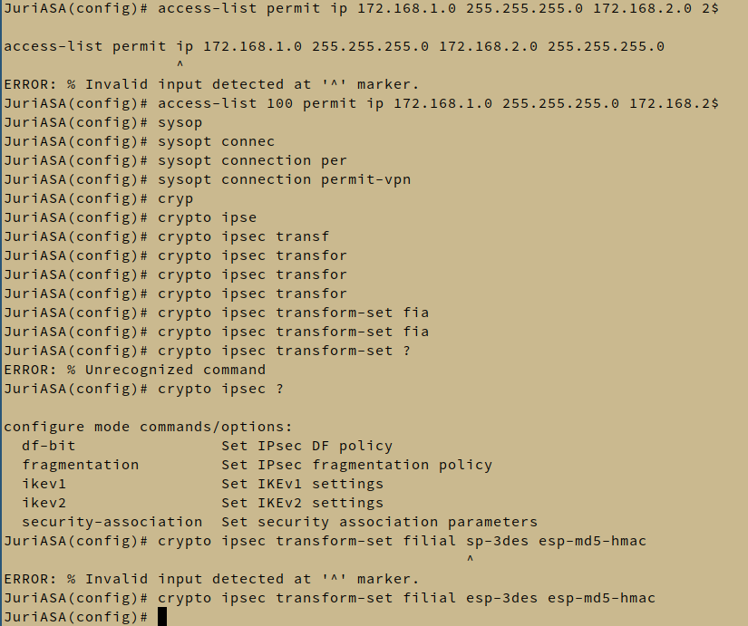
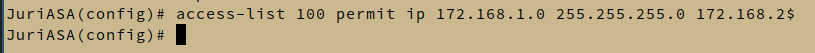
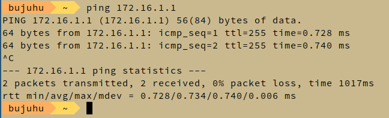
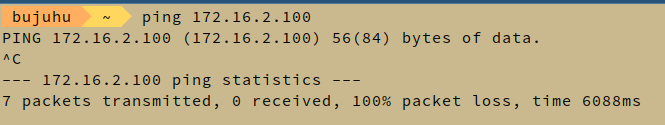

Die Übung wurde gemeinsam mit Markus Kloiber durchgeführt.
Das Testnetz wird nach der Angabe Aufgebaut

# Verbinden mit dem Testgerät
Es wird versucht eine Serielle Verbindung zur ASA herzustellen. Dazu wird zunächst Minicom eine Serielle Verbindung herzustellen, was zunächst nicht gelingt. Danach wird mit Hilfe von screen eine Verbindug hrgestellt.

`screen /dev/ttyUSB0`

# Configuration der ASA
Nach der Vergabe des Hostnamens und anderen standard Einstellungen, werden die zur Übung spezifischen konfigurationen Vorgenommen:


```
! Vlan konfiguration

interface Vlan10
 nameif outside
 security-level 0
 ip address 172.16.0.1 255.255.255.0

interface Vlan20
 nameif inside
 security-level 100
 ip address 172.16.1.1 255.255.255.0

 ! Zuweisung der VLAN zu en entpsrechenden Ports
 interface Ethernet0/0
  switchport access vlan 10

 interface Ethernet0/1
  switchport access vlan 20

! access list konfiguration (für NAT)
access-list 100 extended permit ip 172.168.1.0 255.255.255.0 172.168.2.0 255.255.255.0

! default route
route outside 0.0.0.0 0.0.0.0 172.16.0.2

! VPN Tunnel konfiguration
rypto ipsec ikev1 transform-set filial esp-3des esp-md5-hmac
crypto ipsec security-association pmtu-aging infinite
crypto map filialmap 30 match address 100
crypto map filialmap 30 set peer 172.16.0.2
crypto map filialmap 30 set ikev1 transform-set filial
crypto map filalmap 30 set peer 172.16.0.2
crypto map filalmap 30 set ikev1 transform-set filial
crypto map filalmap interface outside
crypto ca trustpool policy
crypto ikev1 enable outside
crypto ikev1 policy 10
 authentication pre-share
 encryption 3des
 hash md5     
 group 2      
 lifetime 86400
 exit
tunnel-group 172.16.0.2 type ipsec-l2l
tunnel-group 172.16.0.2 ipsec-attributes
 ikev1 pre-shared-key test
 exit
```





## Teten

Pingen vom eigenen Rechner zum ASA Gerät im selben LAN:



Pingen von JUriASA zu MarkusASA:
```
JuriASA# ping 172.16.0.2
Type escape sequence to abort.
Sending 5, 100-byte ICMP Echos to 172.16.0.2, timeout is 2
seconds:
!!!!!
Success rate is 100 percent (5/5), round-trip min/avg/max =
1/2/10 ms
```

Pingen von Laptop 1 zu Laptop 2:




Das Pingen schlägt fehl. Wir schauen auf der Firewall nach, ob ein Tunnel zwischen JuriASA und MarkusASA geöffnet wurde.

```
JuriASA(config)# show crypto ipsec sa

There are no ipsec sas
```
Es wurde kein Tunnel geöffnet!

Von der Firewall wurde zuletzt folgende Fehlermeldungen ausgegeben:

```
Nov 08 07:10:05 [IKEv1]Group = 172.16.0.2, IP = 172.16.0.2, QM FSM error (P2 struct &0xcc19ed48, mess id 0xfc16eec2)!
Nov 08 07:10:05 [IKEv1]Group = 172.16.0.2, IP = 172.16.0.2, Removing peer from correlator table failed, no match!
Nov 08 07:10:05 [IKEv1]Group = 172.16.0.2, IP = 172.16.0.2, Session is being torn down. Reason: crypto map policy not found
Nov 08 07:10:10 [IKEv1]Group = 172.16.0.2, IP = 172.16.0.2, QM FSM error (P2 struct &0xcc3cb7b0, mess id 0x3012dbd)!
Nov 08 07:10:10 [IKEv1]Group = 172.16.0.2, IP = 172.16.0.2, Removing peer from correlator table failed, no match!
Nov 08 07:10:10 [IKEv1]Group = 172.16.0.2, IP = 172.16.0.2, Session is being torn down. Reason: crypto map policy not found
Nov 08 07:10:15 [IKEv1]Group = 172.16.0.2, IP = 172.16.0.2, QM FSM error (P2 struct &0xcc19a300, mess id 0x77a7a125)!
Nov 08 07:10:15 [IKEv1]Group = 172.16.0.2, IP = 172.16.0.2, Removing peer from correlator table failed, no match!
Nov 08 07:10:15 [IKEv1]Group = 172.16.0.2, IP = 172.16.0.2, Session is being torn down. Reason: crypto map policy not found
Nov 08 07:10:20 [IKEv1]Group = 172.16.0.2, IP = 172.16.0.2, QM FSM error (P2 struct &0xcc19ee30, mess id 0xa3d4a473)!
Nov 08 07:10:20 [IKEv1]Group = 172.16.0.2, IP = 172.16.0.2, Removing peer from correlator table failed, no match!
Nov 08 07:10:20 [IKEv1]Group = 172.16.0.2, IP = 172.16.0.2, Session is being torn down. Reason: crypto map policy not found
```

Leider blieb uns bei der Laborübung nichtmehr genug Zeit die Fehler zu troubleshooten.
