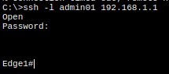
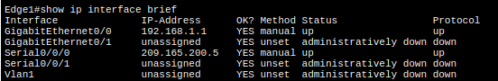
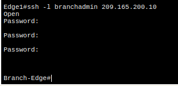
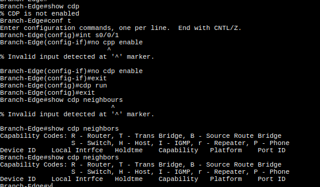
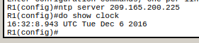
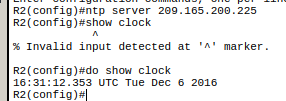
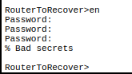
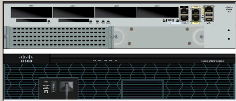
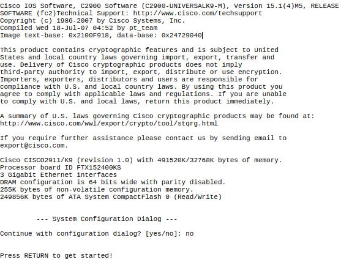

# 2.2 - Map a Network

Device | Interface | IP Address | Subnet Mask | Local Interface and Connected Neighbor
-- | --
Edge1 | G0/0 | 192.168.1.1 | 255.255.255.0 | G0/1 - S1
 Edge1 | S0/0/0 | 209.165.200.5 | 255.255.255.252 | S0/0/0 - ISP
Branch-Edge | S0/0/1 | 209.165.200.10 | 255.255.255.252 | S0/0/1 - ISP
Branch-Edge | G0/0 | 192.168.3.249 | 255.255.255.248 | G0/0 -

Vom Computer **Admin PC** wird eine SSH Verbindung mit **Edge1** *(192.168.1.1)* via SSH aufgebaut. Dazu wird der Befehel `ssh –l admin01 192.168.1.1` eingegeben.






Von **Edge1** wird nun eine SSH Verbindung zu **Remote Branch Office** aufgebaut

```
ssh –l branchadmin 209.165.200.10
```



Von diesem Gerät können wir nun das Gerät und Subnet Mask von Interface S0/0/1 bestimmen. Und die Tabelle mit zusätzlichen Informationen füllen.

## CDP Configuration

Um mehr über die Angeschlossenen Geräte des **Branch-Edge** Gerätes zu erfahren, wird CDP am Gerät aktiviert.



Es sind keine weitern CDP Geräte angeschlossen


# 2.3 - Configure and Verify NTP

**R1** und **R2** werden als NTP Clients vom Server **N1** *(209.165.200.225)* konfiguriert.

```
ntp server 209.165.200.225
```

Danach wird mit dem `show clock` Befehl sichregestellt, das die Konfiguration erfolgreich war.

## Router 1



## Router 2



# 2.4 - Router to Recorver

Da das Enable Password nicht bekannt ist, muss der Router zurückgesetzt werden.



## 1 Router ausschalten

Das Gerät wird ausgeschalten.



## 2 System zurcksetzen

Um das Gerät zurückzusetzen, muss beim hochfahren es Geräts die Tastenkombination **Ctrl + Break** gedrückt werden.
Dadurch wird die Konfiguration gelöscht.


