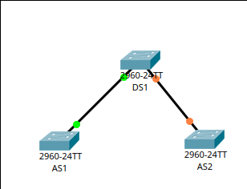
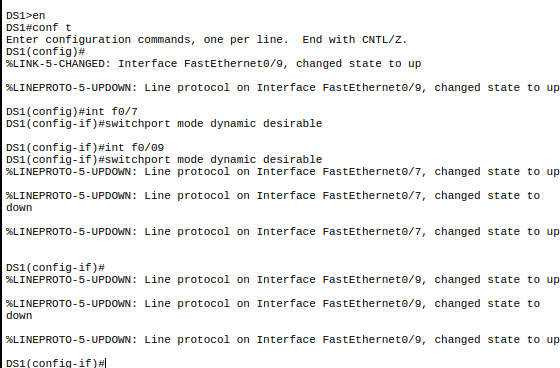
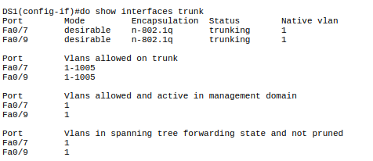
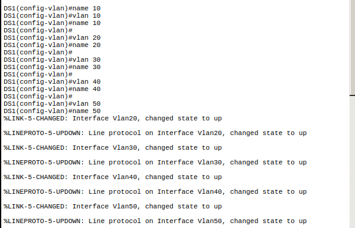
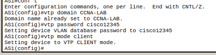
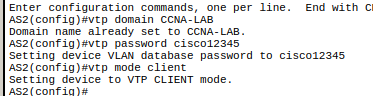
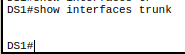
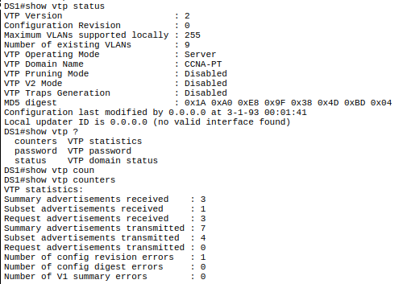

# Packet Tracer Übung 3.1

## Switches physisch verbinden



## DTP Configuieren

```
int f0/7
switchport mode dynamic desirable
int f0/09
switchport mode dynamic desirable
```



Die Interfaces sollten nun als trunk configuriert sein, da DTP aktiviert wurde.



Dertrunking mode ist desirable

## VTP konfiguriern

### DS1

```
vtp domain CCNA-LAB
vtp password cisco12345
vtp mode server

vlan 10
vlan 20
vlan 30
vlan 40
vlan 50
```




### AS1 & AS2

```
vtp domain CCNA-LAB
vtp password cisco12345
vtp mode client
```






# Packet Tracer Übung 3.1


## VTP Server konfiguriern

```
vtp domain CCNA-PT
vtp mode Server
vtp password 123PT
```

## Troubleshooting



Es sind auf DS1 keine trunk ports konfiguriert

```
int f0/1
switchport mode dynamic desirable

int f0/2
switchport mode dynamic desirable

int f0/3
switchport mode dynamic desirable
```



Alle 3 VTP Clients sind mit dem Sever verbunden. Es besteht kein VTP problem
