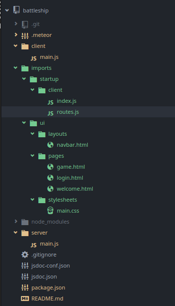

## Start der Entwicklung er Programmilogik

Bevor mit der Entwicklung begonenn wird, wird das Projekt korrekt strukturiert. Dazu wird als Vorlage die [Todo Example Application]
(https://github.com/meteor/todos) verwendet.



*Neue Projektstruktur*

## Erstellen des Datenbankmodells

Es werden bemötigte Module für die Datenbankobjekte erstellt

Da die Verwendete mongoDB Datenbank eine Schemalose Datenbank ist, kann optional auf Clientseite ein Schema definiert werden, um mögliche Programmehler früher zu erkennen. Dazu wird das paket `aldeed:simple-schema` installiert

```
meteor add aldeed:simple-schema
```

Danach werden die Module nach der (Vorlage)[https://www.meteor.com/tutorials/blaze/collections] erstellt

Definition der 'Ships' Collection in der MongoDB Datenbank

```js
import { Mongo } from 'meteor/mongo';
import { SimpleSchema } from 'meteor/aldeed:simple-schema';

export const Ships = new Mongo.Collection('Ships')

Ships.schmea = new SimpleSchema({
  _id: { type: String, regEx: SimpleSchema.RegEx.Id },
  name: { type: String },
  length: { type: [Number] }
});

```

## Entfernen des Insecure Pakets

Standardmäßig ist in meteor die Paket *insecure* und *autopublish* installiert, welche es erlauben direkt vom Clienten auf die Datenbank zuzugreifen. Das ist in der ersten Entwicklungsphase praktisch, da es einfacher ist, Softwarefehler zu erkennen. Allerdings kann die Anwendung in dieser Konfiguration nicht veröffentlich werden, da sonst alle Nutzer der Website einen direkten Datenbankzugriff haben. Die Paket werden entfernt.

```
meteor remove insecure
meteor remove autopublish
```

Damit die Anwendung weiterhin korrekt funktioniert, muss etwas Boilerplatecode geschrieben werden, damit der Client wieder Zugriff auf den Server bekommt.

Serverseittig `imports/api/ships/shps.js`

```js
if(Meteor.isServer) {
  Meteor.publish('ships.find', function shipsPublication() {
    return Ships.find();
  });
}
```

Clientseittig `imports/ui/newgame.js`

```js
Template.newgame.onCreated(function onNewGameCreated() {
  Meteor.subscribe('ships.find')
})
```
