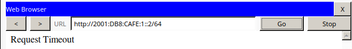

# 4.4 Configure and Verify eBGP

## Testen

Um zu testen, ob der ISP den Router richtig konfiguriert hat wird er *ISP-Entry2* von *OtherCo1* angepingt.


Es wird getestet ob ein Gerät in ACME *172.16.10.2* anpingen kann. Dies sollte noch nicht funktionieren.


## Konfiguriern

### Konfiguration bei ACME1
```
router bgp 65001
neighbor 1.1.1.1 remote-as 65003
network 192.168.0.0 mask 255.255.255.0
```


### Konfiguration bei OtherCo1

```
router bgp 65002
neighbor 1.1.1.9 remote-as 65003
network 172.16.10.0 mask 255.255.255.0
```

### Kontrolle


# 4.5 Troubleshooting IPv6 ACLs

## Troubleshoot HTTP Access

### HTTP Tests bei L0, L1 und L2

Es wird versucht mit den Geräten L0, L1 und L2 eine HTTP Verbindung zu Server1 und Server2 herzustellen:

**Erwartetes Ergebnis**

L0 sollte sich mit keinem Server verbinden. L1 und L2 mit beiden.

**Ergebnis bei L0:**




**Ergebnis bei L1:**


**Ergebnis bei L2:**


**Die durchgeführten Tests sind ident mit dem erwarteten Ergebnis.**

####ICMP Test bei L0
Es wird getestet, ob L0 Server1 und Server2 anpingen kann. Das zu erwartende Ergebnis ist Ja.


**Der Ping hat nicht funktioniert.**

### HTTPS Test bei PC0

Es wird getestet ob PC0 auf die https Diesnte auf Server1 und Server2 zugreifen kann. Das Erwartete Ergebnis ist, es funktioniert.


### ACL Konfiguration von R1


Es fehlt das permit ipv6 any any kommando. Ansonsten wird sämtlicher Traffic von der ACL konfiguration blockiert.

#### Fehlerbehebung

```
ipv6 access-list G0-ACCESS
permit ipv6 any any
```


## Troubleshoot FTP Access

### Testen
L1 sollte keine Verbindung zum FTP Server herstellen können, die restlichen Geräte schon

**L0**


**L1**


**L2**


**L1 kann unerwarteter weiße eine FTP verbindung herstellen**

### Fehlerbehebung

Die ACL `G1-ACCESS` ist am Interface fälschlicher weiße als outbound und nicht inbound konfiguriert.

```
int g0/1
no ipv6 traffic-filter G1-ACCESS out
ipv6 traffic-filter G1-ACCESS in

```


### Testen


L1 kann nun keine FTP verbindung mehr zum Server herstellen.


## Troubelshoot SSH Access

Schon bei der Inspektion der ACl Konfiguration, ist aufgefallen, dass das `permit ipv6 any any` kommando an erster stelle steht und damit sämtlicher Traffic durch dieses ACl durchgelassen wird.

#### Fehlerbehebung

```
ipv6 access-list G2-ACCESS
no permit ipv6 any any
permit ipv6 any any
```


#### Testen

**PC0**


**L0**


**L1**


**L2**


Nachdem SSH auf dem Router richtig kongiguriert wird, können die Geräte sich erwatungsweiße mit dem Router verbinden.
