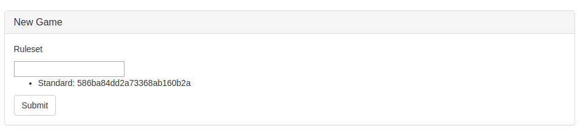
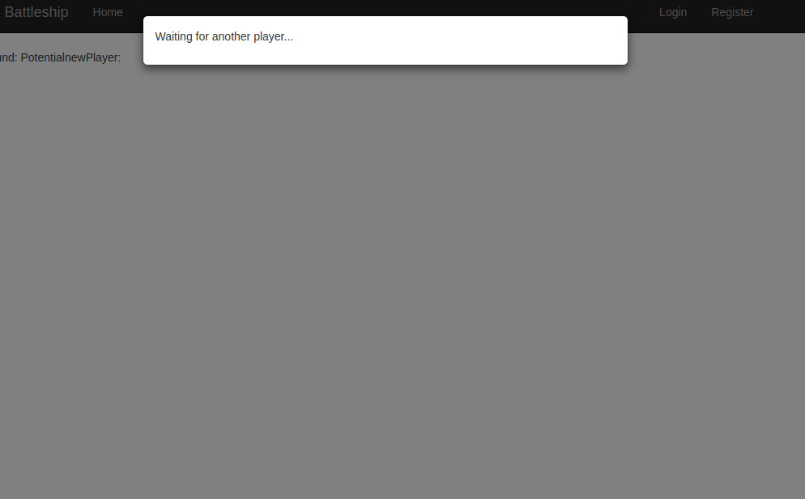
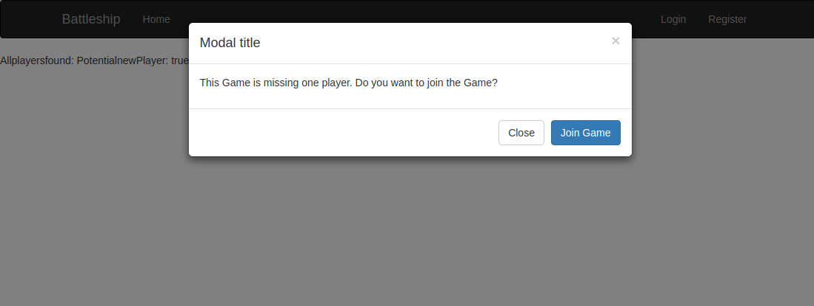

Es wird die Logik erstellt um ein Spiel zu starten und zu Spielen. Dazu wurde bereits zuvor eine minimale Seite zur Konfiguration eines Spiels erstellt:



```html
<form class="new-game">
  <input class="game-mode" type="text" aria-label="..." />
    <ul>
      {{#each gameRules}}
        {{> gameRulePrototype}}
      {{/each}}
    </ul>
  <input type="submit" class="btn btn-default" />
</form>
```

Dazu wird nun der erforderliche Javascript Code erstellt um mit dem Server zu kommunizieren.

Bevor ein neues Spiel gestartet werden kann, muss erstmal die SessionID von 2 Nutzern gefunden werden. Das wird nun umgesetzt.

Bei der erzeugng des Spiels wird die SessionID des ersten NUtzers in der Datenbank gespeichert. Sobald ein zweiter Nutzer dem Spiel beitritt, wird dieser gefragt ob er dem Spiel beitretn möchte. Wenn er das mit ja akzeptiert, wird die 2. SessionId in die Datenbank eingetragen und die Spieler dürfen ihre Spilfiguren setzen.

**Mitspieler der auf den 2. Spieler wartet**



**2. Spieler der auf die Website zugreift**



Als nächstes muss der Server dem 1. Mitspieler mitteilen, wann der 2. Benutzer das Spiel betreten hat.
Gleichzeitig wird am Server auch direkt bestimmt, welcher Spieler als erstes dran ist. Dies wird aber erst Angezeigt, sobald beide Spieler ihre Spielfiguren gesetzt haben.

Um vom Server mit einem Clienten reden zu können, wird das Paket `anti:methods` genutzt

```
meteor add anti:methods
```
