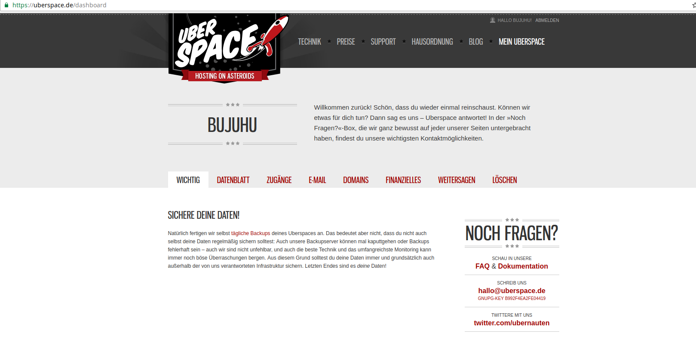
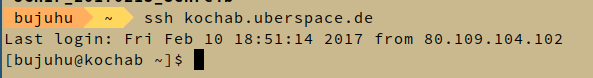
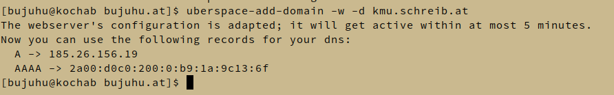
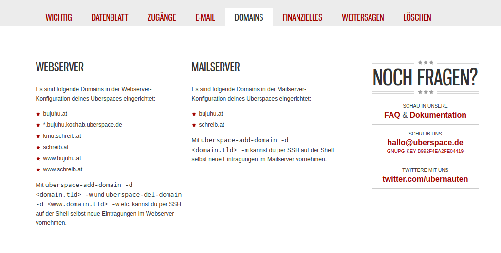
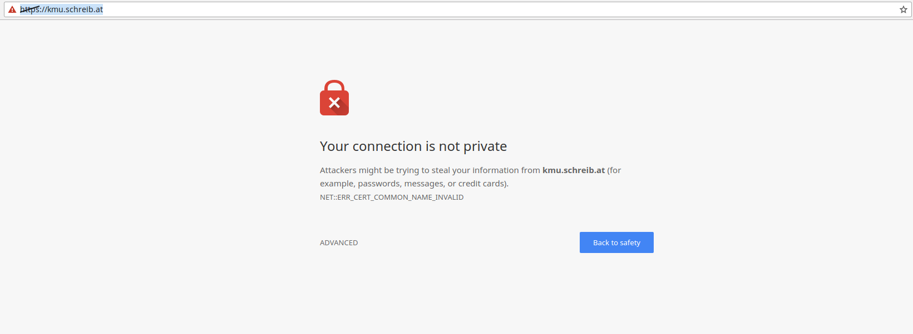

# Software

Folgende Produkte wird auf den Serven installiert

## Acadia
- OpenSSH (SSH, SFTP)
- E-Mail
  - Postfix (SMTP / MTA)
  - Dovecot (IMAP / MDA)
  - Roundcube (Webmail / MUA)
- Asterisk (VoIP)
- NGINX (Webserver)
  - NextCloud (Contacts, Calendar, File Server, Collaboration Tools, etc.)
  - Gitlab
  - Webmin (Computer Administration Front End)
- OpenVPN Server
- Für die Mittagspause
  - Grand Theft Auto San Andreas Multiplayer Server
  - Minecraft Server

## Badlands
- OpenSSH (SSH, SFTP)
- LDAP (openLDAP)
- Bind (DNS Server)

## Redwood
- Apache (Webserver)
  - Öffentliche Unternehmensportfolio (statische Website)
- OpenSSH (SSH, SFTP)

Der Computer wird über die Grafische Benutzeroberfläche von Uberspace verwaltet

## R1
- DHCP

Alle Anwendungen (mit Ausnahem vom öffentlichen Webserver auf Rewood) werden in Docker Containern auf den Servern installiert um diese voneinander zu Isolieren und einfacher verwalten zu können. Dazu wrid ein Dockerfile erstelllt, welche definiert, wie die einzelnen Container miteinander und mit er Außenwelt Kommuniziert. Am Physischen Server selbst, wird nur Docker, openSSH (Administration) und IPTables (Firewall) installiert und nur authentifizierungsoptionen konfiguriert.

Da Uberspace ein shared Hoster ist (viele Benutzer auf einem Server) ist eine ähnlich weitgehende Konfiguration nicht möglich. Es wird ledeglich die Unternehmswebseite auf Uberspace abgelegt und diese mit den vorinstallierten Werkzeugen öffentlich geschaltet.

# Aufsetzen von Redwood

**Info** Zur einsparung von Kosten wird ein bereits vorhandenes Uberspace Konto für die Webseite genutzt. Als platzhalter für die Unternehmenswebsite wird meine Private seite genutzt.

Es wird auf Uberspace ein Konto erstellt und sich auf der Weboberfläche angemeldet



Danach wird der SSH Public Key eines Administrators im "Zugägnge" Tab hinzugefügt.


Danach verbindet sich ein Administrator über die Kommandozeile mit den Zugangsdaten, welceh von Uberspace zur verfügung gestellt wurden



Mithilfe von Git wird die Unternehmenswebsite auf den Server geladen

```bash
git clone https://github.com/Bujuhu/bujuhu.at.git
```

Da auf dem Server mehrere Projekte unter verschiedenen Domains laufen, wird mithilfe einer htaccess Datei eine auf Uberspace Dokuemntierte Methode genutzt, mehrere pesudo-document roots zu verwenden. Dazu wird ein unterverzeichnis erstellt, das den selben namen wie die aufgerufne Domain trägt udn danach folgedene Htaccess Dokumentation eingespielt

### .htaccess

```
# Force	Https
RewriteEngine On
RewriteCond %{HTTPS} !=on
RewriteCond %{ENV:HTTPS} !=on
RewriteRule .* https://%{SERVER_NAME}%{REQUEST_URI} [R=301,L]

# If there is a host-specific pseudo-DocumentRoot, use it instead of the default one
RewriteCond %{REQUEST_URI} !^/f?cgi-bin/
RewriteCond /var/www/virtual/bujuhu/%{HTTP_HOST} -d
RewriteRule (.*) /var/www/virtual/bujuhu/%{HTTP_HOST}$1
```

Im nächsten Schritt wird eine Domainweiterleitung eingerichtet. Zunächst wird in Uberspace mithilfe des `uberspace-add-domain` kommandos eine neue Domain hinzugefügt:



Die **-w** flag gibt an, dass die Domain dem Webserver bekannt gegebenen wird.

Danach wird Kontrolliert ob die Domain korrekt hinzugefügt wurde



Als nächstes werden neue DNS Einträge hinzugefügt, damit der Server über die neue Subdomain erreichbar ist. Dabei wird der Domainregistrar [Inwx](https://www.inwx.de) genutzt.


Es wird getestet ob die Website erreichbar ist



Der Server ist bereits erreichbar, allerdings wurde noch kein gültges Zertifikat ausgetellt. Das Zertifikat wird nächste Woche hinzugefügt.
