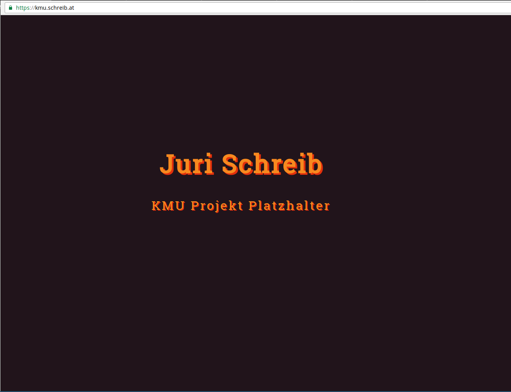

# Hinzufügen eines Zertifikats auf der Unternehmenswebsite

## Erstellen eines Let's Encrypt Zertifikats

Aktualisieren der Let's Encrypt Konfiguration


### cli.ini

```
rsa-key-size = 4096

server = https://acme-v01.api.letsencrypt.org/directory

authenticator = webroot

# Don't change this without real good reasons. Our web frontend
# uses a separate backend for answering ACME challenges which
# *enforces* to use the default web root.
# If you change this, things will break. You have been warned!
webroot-path = /var/www/virtual/bujuhu/html

config-dir = /home/bujuhu/.config/letsencrypt
work-dir = /home/bujuhu/.local/share/letsencrypt/work
logs-dir = /home/bujuhu/.local/share/letsencrypt/logs

email = bujuhu@kochab.uberspace.de

# Beware that Let's Encrypt does NOT support wildcard hostnames.
# If you're using wildcards you have to add each subdomain explicitly.
domains = bujuhu.at,schreib.at,www.bujuhu.at,www.schreib.at,kmu.schreib.at

text = True

# To prevent being forced to agree manually to the terms
agree-tos = True
```

Danach wird werden neue Zertifikate mit dem `letsencrypt certonly` kommando generiert


Das neue Zertifikat wird am Webserver mithilfe von `uberspace-add-certificate` aktiviert

Es wird einige Minuten gewartet, um die Aktualsierung des Zertifikats abzuwarten



Die Website ist nun unter [kmu.schreib.at](http://kmu.schreib.at) erreichbar.
