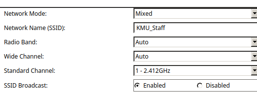
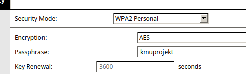
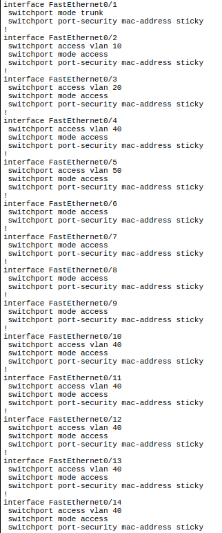
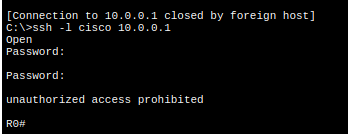
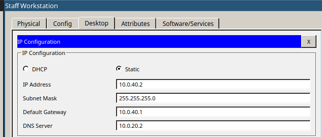

### Vorweg-Information zum ASA Gerät

Da die ASA mit der standard Lizenz nur 2-Vlans forwoarding konfiguriert werden kann, wird ein 2. kleiners Testnetzwerk modeliert, um die funktionsweiße der ASA zu testen und demonstrieren. Da der DHCP Server nach der [Dokumentation](../5CHIF_20170221_Schreib) auf dem Router läuft, wird am Router einfach inter-vlan routing genutzt, um zwischen den verschiedenen VLANs zu kommunizieren.

Das Device hardening wird im ersten Schritt erstmal ausgelassen. Es geht erst mal Darum, eine funktionierendes Netzwerk aufzusetzen.

# Netzwerkkonfiguration


## IP Konfiguration

Dem Router wird die öffentliche IP Adresse 1.1.1.2 im Netz 1.1.1.0/24 zur verfügung gestellt. Das Internet wird durch einen Server mit der IP Adresse 1.1.1.1 emuliert.

Alle anderen statischen IP Adressen und Interfaces werden so wie in [3 Sofrware & Unternehmenswebsite](../5CHIF_20170123_Schreib) definiert vergeben.

Da es im Packet Tracer keinen Access Pint gibt, der 802.1Q unterstüzt, wrid dieser durch 2 Acess Points ersetzt, die sich in den jeweiligen vlans (Guest & Staff) befinden und einer sich in dem jewiligen Subnet befindlichen IP Adresse zugewiesen werden. Der einfachheit halber bliebt auf diesen Geräten NAT und DHCP aktiviert.

### Konfiguration Staff AP


### Konfiguration Guest AP


### Testen


## Wireless Configuration

SSID | Verschlüsselungsmethode | Password
-|-
KMU_Guest | - | -
KMU_Staff | kmuprojekt | WPA2/PSK (AES)

### Konfiguration Staff AP





### Konfiguration Guest AP


## Nat Konfiguration am Router
Im echten Netzwerk muss die öffentliche Ip Adresse, mit der des ISPs ersetzt werden.

Das Interface g0/0 wird als outside interface definiert. Alle subinterface von g0/1 als inside.

```
ip nat pool NAT 10.0.0.1 10.0.50.255 netmask 255.255.0.0
ip nat inside source list 1 interface GigabitEthernet0/0 overload
ip classless
!
ip flow-export version 9
!
!
access-list 1 permit 10.0.0.0 0.0.255.255
```
### Testen


Es wird der DNS Server auf Badlands, und der Webserver auf dem Internet Server aktiviert


Es wird getestet ob alle Endgeräte (bis auf Staff Workstation, da hier noch DHCP konfiguriert werden musss) auf die öffentliche Website kommen


## DHCP Konfiguration am Router
Da DHCP im Guest Vlan in diesem Modell vom Access-Point übernommen wird, muss nur ein DHCP pool im Staff VLAN aktiviert werden.

```
ip dhcp pool Staff
network 10.0.40.0 255.255.255.0
default-router 10.0.40.1
dns-server 10.0.20.2
ip dhcp excluded-address 10.0.40.1 10.0.40.100
```

### Testen


## Authentication & Router hardening

Gleichzeitig mit dem Router hardening wird auf den Geräten SSH aktiviert.

Konfiguration die über alle Geräte hinweg gleich ist:

```
banner motd #unauthorized access prohibited#
security passwords min-length 10
service password-encryption
enable secret ciscoclass
username cisco privilege 15 secret ciscoclass
ip domain-name schreib.at
crypto key generate rsa
2048
ip ssh version 2
ip ssh time-out 90
ip ssh authentication-retries 2
line vty 0 15
login local
transport input ssh
transport output ssh
exec-timeout 20
line con 0
login	local
transport output ssh
exec-timeout 20
```

### Port Security Konfiguration am Switch

Die Port Security wird bei allen Ports auf sticky gestellt. Nicht benutzer Ports werden administrativ deaktiviert




Die SSH verbindung wird getestet



## Radius

Als erstes wird der Radius service am Badlands Server aktiviert


Danach wird AAA auf den Intermediate Devices aktiviert

```
aaa new-model
radius-server host 10.0.20.2 key ciscoclass
aaa authentication login default group radius local
login block-for 120 attempts 5 within 60
login on-success log
login on-failure log
```

Der Switch unterstützt im Packet Tracer kein AAA, daher wird diese Konfiguration am Switch in der Testumgebung ausgelassen. Die Obere Konfiguration kann allerdings 1 zu 1 für den Switch übernommen werden, um AAA zu aktivieren.

### Testen


## Running-config Files

### R0

```
no service timestamps log datetime msec
no service timestamps debug datetime msec
service password-encryption
security passwords min-length 10
!
hostname R0
!
login block-for 120 attempts 5 within 60
login on-failure log
login on-success log
!
!
enable secret 5 $1$mERr$UBS6AqpcFjkupAnmSUCGG.
!
!
ip dhcp excluded-address 10.0.40.1 10.0.40.100
!
ip dhcp pool Staff
 network 10.0.40.0 255.255.255.0
 default-router 10.0.40.1
 dns-server 10.0.20.2
!
!
aaa new-model
!
aaa authentication login default group radius local
!
!
!
!
!
!
!
ip cef
no ipv6 cef
!
!
!
username cisco privilege 15 secret 5 $1$mERr$UBS6AqpcFjkupAnmSUCGG.
!
!
license udi pid CISCO1941/K9 sn FTX1524813R
!
!
!
!
!
!
!
!
!
ip ssh version 2
ip ssh authentication-retries 2
ip ssh time-out 90
ip domain-name schreib.at
!
!
spanning-tree mode pvst
!
!
!
!
!
!
interface GigabitEthernet0/0
 ip address 1.1.1.2 255.255.255.0
 ip nat outside
 duplex auto
 speed auto
!
interface GigabitEthernet0/1
 no ip address
 duplex auto
 speed auto
!
interface GigabitEthernet0/1.1
 encapsulation dot1Q 1 native
 ip address 10.0.0.1 255.255.255.0
 ip nat inside
!
interface GigabitEthernet0/1.10
 encapsulation dot1Q 10
 ip address 10.0.10.1 255.255.255.0
 ip nat inside
!
interface GigabitEthernet0/1.20
 encapsulation dot1Q 20
 ip address 10.0.20.1 255.255.255.0
 ip nat inside
!
interface GigabitEthernet0/1.30
 encapsulation dot1Q 30
 ip address 10.0.30.1 255.255.255.0
 ip nat inside
!
interface GigabitEthernet0/1.40
 encapsulation dot1Q 40
 ip address 10.0.40.1 255.255.255.0
 ip nat inside
!
interface GigabitEthernet0/1.50
 encapsulation dot1Q 50
 ip address 10.0.50.1 255.255.255.0
 ip nat inside
!
interface Vlan1
 no ip address
 shutdown
!
ip nat pool NAT 10.0.0.1 10.0.50.255 netmask 255.255.0.0
ip nat inside source list 1 interface GigabitEthernet0/0 overload
ip classless
!
ip flow-export version 9
!
!
access-list 1 permit 10.0.0.0 0.0.255.255
ip access-list extended sl_def_acl
 deny tcp any any eq telnet
 deny tcp any any eq www
 deny tcp any any eq 22
 permit tcp any any eq 22
!
banner motd ^Cunauthorized access prohibited^C
!
radius-server host 10.0.20.2 auth-port 1645 key ciscoclass
!
!
!
line con 0
 transport output ssh
 exec-timeout 20 0
!
line aux 0
!
line vty 0 4
 exec-timeout 20 0
 transport input ssh
 transport output ssh
line vty 5 15
 exec-timeout 20 0
 transport input ssh
 transport output ssh
!
!
!
end
```

### SW0

```
no service timestamps log datetime msec
no service timestamps debug datetime msec
service password-encryption
!
hostname SW0
!
enable secret 5 $1$mERr$UBS6AqpcFjkupAnmSUCGG.
!
!
!
ip ssh version 2
ip ssh authentication-retries 2
ip ssh time-out 90
ip domain-name schreib.at
!
username cisco secret 5 $1$mERr$UBS6AqpcFjkupAnmSUCGG.
!
!
spanning-tree mode pvst
!
interface FastEthernet0/1
 switchport mode trunk
 switchport port-security mac-address sticky
!
interface FastEthernet0/2
 switchport access vlan 10
 switchport mode access
 switchport port-security mac-address sticky
!
interface FastEthernet0/3
 switchport access vlan 20
 switchport mode access
 switchport port-security mac-address sticky
!
interface FastEthernet0/4
 switchport access vlan 40
 switchport mode access
 switchport port-security mac-address sticky
!
interface FastEthernet0/5
 switchport access vlan 50
 switchport mode access
 switchport port-security mac-address sticky
!
interface FastEthernet0/6
 switchport mode access
 switchport port-security mac-address sticky
!
interface FastEthernet0/7
 switchport mode access
 switchport port-security mac-address sticky
!
interface FastEthernet0/8
 switchport mode access
 switchport port-security mac-address sticky
!
interface FastEthernet0/9
 switchport mode access
 switchport port-security mac-address sticky
!
interface FastEthernet0/10
 switchport access vlan 40
 switchport mode access
 switchport port-security mac-address sticky
!
interface FastEthernet0/11
 switchport access vlan 40
 switchport mode access
 switchport port-security mac-address sticky
!
interface FastEthernet0/12
 switchport access vlan 40
 switchport mode access
 switchport port-security mac-address sticky
!
interface FastEthernet0/13
 switchport access vlan 40
 switchport mode access
 switchport port-security mac-address sticky
!
interface FastEthernet0/14
 switchport access vlan 40
 switchport mode access
 switchport port-security mac-address sticky
!
interface FastEthernet0/15
 switchport access vlan 30
 switchport mode access
 switchport port-security mac-address sticky
!
interface FastEthernet0/16
 switchport access vlan 30
 switchport mode access
 switchport port-security mac-address sticky
!
interface FastEthernet0/17
 switchport access vlan 30
 switchport mode access
 switchport port-security mac-address sticky
!
interface FastEthernet0/18
 switchport access vlan 30
 switchport mode access
 switchport port-security mac-address sticky
!
interface FastEthernet0/19
 switchport access vlan 30
 switchport mode access
 switchport port-security mac-address sticky
!
interface FastEthernet0/20
 switchport access vlan 30
 switchport mode access
 switchport port-security mac-address sticky
!
interface FastEthernet0/21
 switchport mode access
 switchport port-security mac-address sticky
 shutdown
!
interface FastEthernet0/22
 switchport mode access
 switchport port-security mac-address sticky
 shutdown
!
interface FastEthernet0/23
 switchport mode access
 switchport port-security mac-address sticky
 shutdown
!
interface FastEthernet0/24
 switchport mode access
 switchport port-security mac-address sticky
 shutdown
!
interface GigabitEthernet0/1
!
interface GigabitEthernet0/2
!
interface Vlan1
 ip address 10.0.0.2 255.255.255.0
!
interface Vlan10
 mac-address 00d0.ff1b.ee01
 no ip address
!
interface Vlan20
 mac-address 00d0.ff1b.ee02
 no ip address
!
interface Vlan30
 mac-address 00d0.ff1b.ee03
 no ip address
!
interface Vlan40
 mac-address 00d0.ff1b.ee04
 no ip address
!
interface Vlan50
 mac-address 00d0.ff1b.ee05
 no ip address
!
ip default-gateway 10.0.0.1
!
banner motd ^Cunauthorized access prohibited^C
!
!
!
line con 0
 login local
 exec-timeout 20 0
!
line vty 0 4
 exec-timeout 20 0
 login local
 transport input ssh
 transport output ssh
line vty 5 15
 exec-timeout 20 0
 login local
 transport input ssh
 transport output ssh
!
!
!
end
```

# ASA Konfiguration

DA die ASA im Packettracer nicht sonderlich gut simuliert wird, wird ein kleineres Netzwerk aufgebaut, um die Konfiguration der ASA durchzuführen. Indiesem mini-netzwerk werden nur die Geräte FW0, Staff Workstation und Badlands simuliert, da mehr als 2 VLANs nicht unterstützt werden.




Die Vlans sollten auf der echten ASA mit folgenden Security levels konfiguriert werden:

ID | Name | Security-Level
-- | --
1 | Management | 100
2 | Outside | 0
10 | DMZ | 0
20 | Intranet | 40
30 | VOIP | 60
40 | Staff | 80
50 | Guest | 0

Alle konfigurierten access listen werden als inbound definiert. Die Acess Listen werden auf der konfiguration der ASA noch mit keinem Interface in verbindung gebracht, da diese vom Testnetzwerk und vom realen Netzwerk abweichen.

Um die DMZ nutzen zu könenn muss folgendes Kommando zusätzlich an der ASA ausgeführt werden:

```
route outside 0.0.0.0 0.0.0.0 10.0.20.1
```

Um die Outside Access-List einem Interface zuzuweißen, muss folgendes Kommando angegeben werden:

```
access-group outside in interface outside
```

Da es in der Testumgebung das Outside interface nicht exestiert, ist es nicht möglich, diese Befehle auszuführen.

## Running-config der ASA

```
hostname FW0
names
!
interface Ethernet0/0
 switchport access vlan 2
!
interface Ethernet0/1
!
interface Ethernet0/2
!
interface Ethernet0/3
!
interface Ethernet0/4
!
interface Ethernet0/5
!
interface Ethernet0/6
!
interface Ethernet0/7
!
interface Vlan1
 nameif intranet
 security-level 50
 ip address 10.0.20.1 255.255.255.0
!
interface Vlan2
 nameif staff
 security-level 100
 ip address 10.0.40.1 255.255.255.0
!
interface Vlan20
 no nameif
 no security-level
 no ip address
!
object network acadia
 host 10.0.20.1
!
!
access-list outside extended permit tcp any object acadia
access-list outside extended permit tcp any object acadia eq smtp
access-list outside extended permit tcp any object acadia eq pop3
access-list outside extended permit tcp any object acadia eq www
access-list outside extended permit tcp any object acadia eq 22
access-list outside extended permit tcp any object acadia eq 25565
access-list outside extended permit tcp any object acadia eq 1194
access-list outside extended permit tcp any object acadia eq 8001
access-list outside extended permit tcp any object acadia eq 27900
access-list outside extended permit udp any 10.0.30.0 255.255.255.0 eq 5060
!
!
!
!
!
!
!
!
!
telnet timeout 5
ssh timeout 5
!
dhcpd auto_config outside
```
