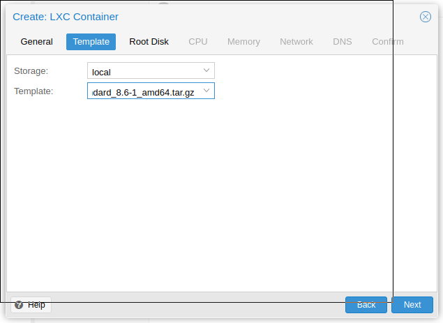
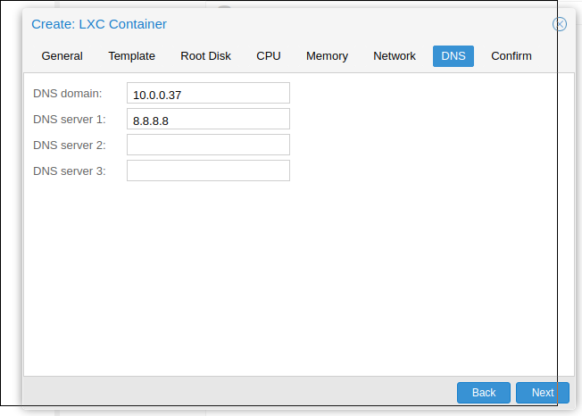

# Virtuelle Maschinen erstellen

Für das Test-Set-up werden zunächst 2 Lxc Container auf meinem privaten Proxmox Hypervisor erstellt. Einige Services, wie ssh und VNC werden in der Initialen Konfiguration von Proxmox automatisch aktiviert.

## Acadia







## Badlands
Es wird dieselbe Konfiguration ausgeführt, mit dem Unterschied, dass auf Badlands die IP-Adresse 10.0.0.37 und die Bezeichnung kmu-badlands gewählt wird.

# Internetverbindung für Acadia öffentlich stellen

Im Nat Device wird ein neues DMZ-Gerät und ein Firewall-Eintrag hinzugefügt:


Danach ist der V-Server Acadia öffentlich erreichbar:


# Webanwendungen auf Acadia installieren und verfügbar machen.

OpenSSH ist bereits vorinstalliert, daher muss das nicht mehr manuell aufgesetzt werden.

Vor der Installation wird das System mit `apt-get update; apt-get upgrade` auf den aktuellsten Stand gebracht

## Installation von Docker und Docker-Compose

Docker wird [nach der Anleitung der Docker Website](https://store.docker.com/editions/community/docker-ce-server-debian?tab=description) installiert.

Docker-Compose wird ebenfalls [nach der Anleitung](https://docs.docker.com/compose/install/) installiert.

Um zu testen ob die Anwendungen installiert sind, wird zum testen `docker -v` und `docker-compose -v` verwendet.


Nach der Vollständigen Installation von Docker-Compose kann nun mit der Installation der einzelnen Komponenten begonnen werden

## Installation von Webmin

Webmin wird [http://www.debianadmin.com/install-webmin-on-debian-7-6-wheezy.html](http://webmin.com/deb.html) unter Debian installiert.

Die Verschlüsselung des Webmin Miniserv wird deaktiviert, da die Verschlüsselung von Nginx übernommen wird.

`nano /etc/webmin/miniserv.conf` Der Parameter *ssl=1* wird auf *ssl=0* gesetzt. Danach wird Webmin neu gestartet.


## Installation von NGINX

Webmin wird ebenfalls direkt auf dem Host installiert

`apt-get install -y nginx`


Die Installation von NGINX war erfolgreich.

### Subdomäne erstellen

Dafür wird als erstes eine eigene Subdomain für den Server erstellt

Dazu wird beim DNS Server ein neuer CNAME Record erstellt


Der Einfachheit halber wird die Wildcard Domain \**.acadia.schreib.at* erstellt, um auf alle Dienste des Servers zugreifen zu können.


### NextCloud (Docker)

NextCloud wird in einem Docker Container deployed. Dazu wird die von NextCloud [vorkonfigurierte Docker-Compose Projekt](https://github.com/indiehosters/nextcloud) genutzt.

Um das nutzen zu können wird als erstes git installiert: `apt-get install -y git`

Des weiteren wird mit `docker network create lb_web` ein internes Netzwerk erstellt

Danach wird das Projekt mit den folgenden Befehlen installiert und gestartet:

```bash
git clone https://github.com/indiehosters/nextcloud.git
cd nextcloud
MYSQL_ROOT_PASSWORD=ciscoclass docker-compose up
```


Es tritt ein Fehler auf. Nach Recherche scheint das Problem zu sein, dass in Proxmox Lxc Containern kein Docker unterstützt wird. Deshalb wird NextCloud sowie gitlab nativ auf dem Server installiert.

### NextCloud (Nativ)

Als erstes wird NextCloud heruntergeladen und in das richtige Verzeichnis verschoben:

```bash
cd ~
wget https://download.nextcloud.com/server/releases/nextcloud-11.0.2.zip
unzip nextcloud-11.0.2.zip
mkdir /var/www/
mv nextcloud /var/www/
rm nextcloud-10.0.2.zip
chown -R www-data: /var/www/nextcloud
```

Um Nginx verwenden zu können wird auch noch ein MySQL kompatibler Server benötigt. Dafür wird MariaDB gewählt und installiert

`sudo apt-get install -y mariadb-server`

Das Administratorpassword der Datenbank wird auf *ciscoclass* gesetzt.

### GitLab

Gitlab wird [nach der Anleitung auf der GitLab Seite](
https://about.gitlab.com/downloads/#debian8) installiert.

Der externe Port wird von 80 auf 8080 verändert, indem die external_url konfigurationsparameter in `/etc/gitlab/gitlab.rb` auf external_url `http://127.0.0.1:8080/` gesetzt wird. Danach wird gitlab mit dem Befehl `gitlab-ctl reconfigure` neugestartet.


### NGINX konfgurieren

Damit NextCloud richtig funktioniert muss erstmal php für NGINX installiert weren. Dafür werden die Pakete `php5`, `php5-cgi`, `php5-gd`, `php5-curl`, `php5-mysql` und `php5-fpm` benötigt

NGINX wird dazu genutzt, auf die einzelnen Webanwendungen mithilfe von subdomänen zugreifen zu können (sprich webmin.acadia.schreib.at für webmin, git.acaida.schreib.at für gitlab und acadia.schreib.at für NextCloud)

Nginx Konfigurationsdatei:

```
# Webmin
server {
  server_name webmin.acadia.schreib.at;
  listen 80;
  location / {
    proxy_redirect http://127.0.0.1:10000/ http://webmin.acadia.schreib.at/;
    proxy_pass http://127.0.0.1:10000/;
    proxy_set_header        Host    $host;
  }
}
# GitLab
server {
  server_name git.acadia.schreib.at;
  listen 80;
  location / {
    proxy_redirect http://127.0.0.1:8080/ http://git.acadia.schreib.at/;
    proxy_pass http://127.0.0.1:8080/;
    proxy_set_header        Host    $host;
  }
}

# NextCloud
server {
    listen 80;
    server_name cloud.acadia.schreib.at;

    #ssl_certificate /etc/ssl/nginx/cloud.example.com.crt;
    #ssl_certificate_key /etc/ssl/nginx/cloud.example.com.key;

    root /var/www/;

    # set max upload size
    client_max_body_size 10G;

    # Disable gzip to avoid the removal of the ETag header
    gzip off;

    # Uncomment if your server is build with the ngx_pagespeed module
    # This module is currently not supported.
    #pagespeed off;

    index index.html index.php;
    error_page 403 /core/templates/403.php;
    error_page 404 /core/templates/404.php;

    rewrite ^/.well-known/carddav /remote.php/dav/ permanent;
    rewrite ^/.well-known/caldav /remote.php/dav/ permanent;

    # The following 2 rules are only needed for the user_webfinger app.
    # Uncomment it if you're planning to use this app.
    #rewrite ^/.well-known/host-meta /public.php?service=host-meta last;
    #rewrite ^/.well-known/host-meta.json /public.php?service=host-meta-json last;

    location = /robots.txt {
    allow all;
    log_not_found off;
    access_log off;
    }

    location ~ ^/(build|tests|config|lib|3rdparty|templates|data)/ {
    deny all;
    }

    location ~ ^/(?:\.|autotest|occ|issue|indie|db_|console) {
    deny all;
    }

    location / {

    rewrite ^/remote/(.*) /remote.php last;

    rewrite ^(/core/doc/[^\/]+/)$ $1/index.html;

    try_files $uri $uri/ =404;
    }

    location ~ \.php(?:$|/) {
      fastcgi_param HTTP_PROXY "";

      fastcgi_pass unix:/var/run/php5-fpm.sock;
      fastcgi_index index.php;
      include fastcgi_params;
    }

    # Adding the cache control header for js and css files
    # Make sure it is BELOW the location ~ \.php(?:$|/) { block
    location ~* \.(?:css|js)$ {
    add_header Cache-Control "public, max-age=7200";
    # Add headers to serve security related headers
    add_header Strict-Transport-Security "max-age=15768000; includeSubDomains; preload;";
    add_header X-Content-Type-Options nosniff;
    add_header X-Frame-Options "SAMEORIGIN";
    add_header X-XSS-Protection "1; mode=block";
    add_header X-Robots-Tag none;
    add_header X-Download-Options noopen;
    add_header X-Permitted-Cross-Domain-Policies none;
    # Optional: Don't log access to assets
    access_log off;
    }

    # Optional: Don't log access to other assets
    location ~* \.(?:jpg|jpeg|gif|bmp|ico|png|swf)$ {
    access_log off;
    }
}
```

Besagte Konfigurationsdatei mit dem namen `proxy-config` wird im folgenden Verzeichnis abgelegt:

`/etc/nginx/sites-available`


Um diese zu aktivieren muss die aktuelle konfiguration aus dem `sites-enabled` Ordner gelöscht und durch die neue ersetzt werden:


Danach wird der NGINX Service neugestartet.

Jetzt sind die einzelnen Webdienste erreichbar.


### Einrichten von NextCloud


### Einrichten von GitLab

Das Passwort wird auf ciscoclass gesetzt.


### Let's Encrypt Zertifikat Generieren

Die Let's Encrypt Zertifikate werden als Teil einer späteren Übung konfiguriert.

# VPN
Es wird pptpd installiert
`àpt-get install pptpd`

Konfigurationsdatei `etc/pptp.conf`:
```
option /etc/ppp/options.pptpd
localip 10.0.0.37   # local vpn IP
remoteip 10.0.0.200-204  # ip range for connection
```
Konfigurationsdatei `etc/ppp/options.pptpd`:

```
#custom settings for a simple fast pptp server
ms-dns 8.8.8.8
ms-dns 4.2.2.2
lock
name pptpd
require-mschap-v2
# Require MPPE 128-bit encryption
# (note that MPPE requires the use of MSCHAP-V2 during authentication)
require-mppe-128
```
