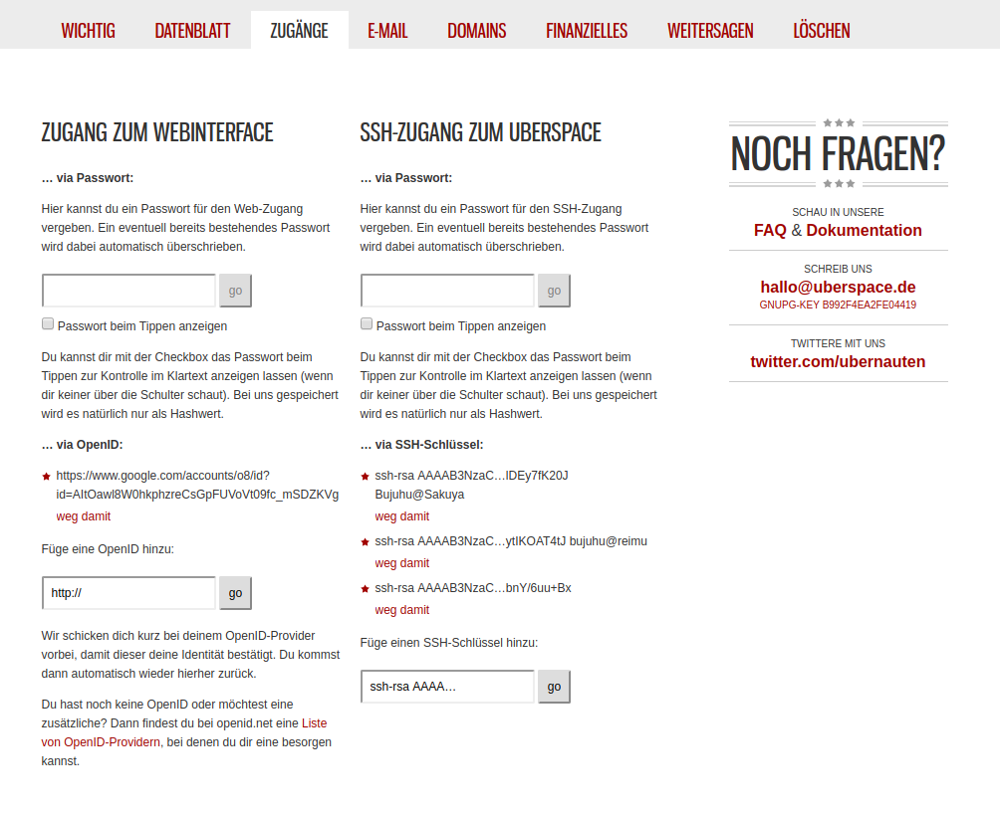
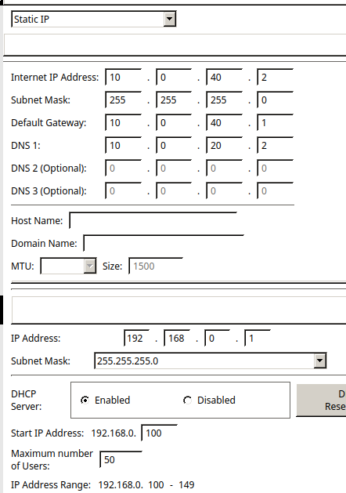
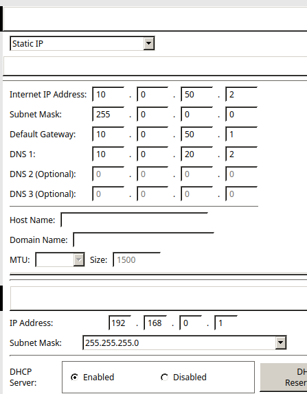
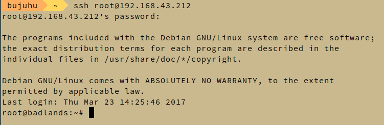

# Projektdokumentation

## Zeitaufwand zur erfüllung der einzelnen Komponenten

- **Netzwerkplanung und Konfiguration** (4h)
- **Auswahl der Softwärelösungen, definieren der Anforderungen** (1h)
- **Aufsetezn des Teamspeak servers** (1h)
- **Aufsetzen des öffentlichen Webservers** (kmu.schreib.at) (3h)
- **Aufsetzen von OpenLDAP und phpldapadmin auf Badlands** (2h)
- **Basiskonfiguration von Acadia (NGINX, Webmin)** (2h)
- **Aufsetzen von Sandstorm mit anbindung an OpenLDAP** (1h)
- **Aufsetzen von Nextcloud mit anbindung an OpenLDAP** (2h)
- **Aufsetzen des E-Mails servers inklusive Roundcube mit anbindung an OpenLDAP** (8h)
- **Dokumentation** (5h)

Gesamter Zeitaufwand für das Projekt: **30h**

# Technische Dokumentation

**Hinweis** Die Technsiche Dokumentation ist nur eine gekürzte Fassung der Laborberichte.

# KMU 1 Netzwerkplanung

## Netze

ID | Name | Network Address | Subnet
-- | --
1 | Management | 10.0.0.0 | 255.255.255.0
10 | DMZ | 10.0.10.0 | 255.255.255.0
20 | Intranet | 10.0.20.0 | 255.255.255.0
30 | VOIP | 10.0.30.0 | 255.255.255.0
40 | Staff | 10.0.40.0 | 255.255.255.0
50 | Guest | 10.0.50.0 | 255.255.255.0


## Netzwerkgeräte

### Server und Netzwerkgeräte

Hostname | IP | VLAN | Gateway | DNS
-- | --
R0 | *ISP provided Public IP* | - | - | *ISP Provided DNS Server*
 | 10.0.0.1 | 1 | - | -
 | 10.0.10.1 | 10  | - | -
 | 10.0.20.1 | 20 | - | -
 | 10.0.30.1 | 30 | - | -
 | 10.0.40.1 | 40 | - | -
 | 10.0.50.1 | 50 | - | -
 | 10.0.50.1 | 60 | - | -
FW0 | 10.0.0.2 | 1 | 10.0.0.1 | 10.0.0.1
SW0 | 10.0.0.3 | 1 | 10.0.0.1 | 10.0.0.1
AP0 | 10.0.0.4 | 1 | 10.0.0.4 | 10.0.0.4
Acadia | 10.0.10.2 | 10 | 10.0.10.1 | 10.0.10.1
Badlands | 10.0.20.2 | 20 | 10.0.20.1 | 10.0.20.1
Drucker | 10.0.20.100 | 20 | 10.0.20.1 | 10.0.20.1
Redwood | *Hoster provided Public IP* | - | - | *Hoster provided public DNS Server*
Cloud Backup | *N/A* | - | - | -

### Endnutzergeräte

Hostname | IP | VLAN | Gateway | DNS
-- | --
Staff Phone | *(DHCP)* 10.0.30.2 - 10.0.30.254 | 30 | 10.0.30.1 | 10.0.30.1
Staff Workstations, VPN Clients & Staff wireless Devices | *(DHCP)* 10.0.40.2 - 10.0.40.254 | 40 | 10.0.40.1 | 10.0.40.1
Guest Wireless Devices | *(DHCP)* 10.0.50.2 - 10.0.50.254 | 50 | 10.0.50.1 | 10.0.50.1


## Betriebssystemauswahl

Zu beginn werden nur 2 Betriebssysteme verwendet

### Ubuntu (Serverbetriebssystem)

Auf allen Unternehmensserven wird Ubuntu 16.04 LTS installiert. Folgende Eigenschaften begünstigen die Verwendung von Ubuntu gegenüber anderen Betriebssystemen

- Lange Updatecyclen (nur sicherheitsaktualisierungen werden sofort zur verfügung gestellt)
- Aufwändiger Produkttestcyclus
- Hohe kompatbilität mit anderer Software
- Minimales Betriebssystem mit wenig vorinstallierten überflüssigen Werkzeugen
- Hohe performance
- Kostenfrei
- Linux basierend und somit leicht ins Unternehmen eingleiderbar

### Linux Mint (Endnutzerbetriebssystem)

Linux Mint in Version 18.1 64bit in der Cinnamon Variante wird auf allen Desktop Unternehemnsgeräten vorinstalliert. Durch folgende Eigenschaften hebt sich Linux Mint von den Konkurrenzprodukten ab:

- Einfache, an Windows angelehnte Grafische Benutzeroberfläche
- Am häufigsten genutzes Desktop Betriebssystem
- Meisten wichtigen Werkzeuge sind bereits vorinstalliert
- Kostenfrei
- Linux basierend und somit leicht ins Unternehmen eingleiderbar

Sollten Mitarbeiter ein anderes Betriebssystem zur Arbeit bevorzugen, ist ihnen erlaubt ihr eigenes Gerät zur Arbeit mitzunehmen und im Unternehmenswlan oder über VPN zu nutzen. Allerdings wird dieses Gerät nicht von der Unternehmens-Systemadministration verwaltet.

Sprich, der Mitarbeiter ist selbst dafür verantworlich, sein Gerät sicher und aktuell zu halten, sowie die Unternehmensdaten zu schützen.

# Software

Folgende Produkte wird auf den Serven installiert

## Acadia
- OpenSSH (SSH, SFTP)
- E-Mail
  - Postfix (SMTP / MTA)
  - Dovecot (IMAP / MDA)
  - Roundcube (Webmail / MUA)
- Teamspeak (VoIP)
- NGINX (Webserver)
  - NextCloud (Contacts, Calendar, File Server, Collaboration Tools, etc.)
  - Gitlab
  - Webmin (Computer Administration Front End)
- Sandstorm

## Badlands
- OpenSSH (SSH, SFTP)
- LDAP (openLDAP)
- phpldapadmin

## Redwood
- Apache (Webserver)
  - Öffentliche Unternehmensportfolio (statische Website)
- OpenSSH (SSH, SFTP)

Der Computer wird über die Grafische Benutzeroberfläche von Uberspace verwaltet

## R1
- DHCP

Alle Anwendungen (mit Ausnahem vom öffentlichen Webserver auf Rewood) werden in Docker Containern auf den Servern installiert um diese voneinander zu Isolieren und einfacher verwalten zu können. Dazu wrid ein Dockerfile erstelllt, welche definiert, wie die einzelnen Container miteinander und mit er Außenwelt Kommuniziert. Am Physischen Server selbst, wird nur Docker, openSSH (Administration) und IPTables (Firewall) installiert und nur authentifizierungsoptionen konfiguriert.

Da Uberspace ein shared Hoster ist (viele Benutzer auf einem Server) ist eine ähnlich weitgehende Konfiguration nicht möglich. Es wird ledeglich die Unternehmswebseite auf Uberspace abgelegt und diese mit den vorinstallierten Werkzeugen öffentlich geschaltet.

# Aufsetzen von Redwood

**Info** Zur einsparung von Kosten wird ein bereits vorhandenes Uberspace Konto für die Webseite genutzt. Als platzhalter für die Unternehmenswebsite wird meine Private seite genutzt.

Es wird auf Uberspace ein Konto erstellt und sich auf der Weboberfläche angemeldet


Danach wird der SSH Public Key eines Administrators im "Zugägnge" Tab hinzugefügt.



Danach verbindet sich ein Administrator über die Kommandozeile mit den Zugangsdaten, welceh von Uberspace zur verfügung gestellt wurden


Mithilfe von Git wird die Unternehmenswebsite auf den Server geladen

```bash
git clone https://github.com/Bujuhu/bujuhu.at.git
```

Da auf dem Server mehrere Projekte unter verschiedenen Domains laufen, wird mithilfe einer htaccess Datei eine auf Uberspace Dokuemntierte Methode genutzt, mehrere pesudo-document roots zu verwenden. Dazu wird ein unterverzeichnis erstellt, das den selben namen wie die aufgerufne Domain trägt udn danach folgedene Htaccess Dokumentation eingespielt

### .htaccess

```
# Force	Https
RewriteEngine On
RewriteCond %{HTTPS} !=on
RewriteCond %{ENV:HTTPS} !=on
RewriteRule .* https://%{SERVER_NAME}%{REQUEST_URI} [R=301,L]

# If there is a host-specific pseudo-DocumentRoot, use it instead of the default one
RewriteCond %{REQUEST_URI} !^/f?cgi-bin/
RewriteCond /var/www/virtual/bujuhu/%{HTTP_HOST} -d
RewriteRule (.*) /var/www/virtual/bujuhu/%{HTTP_HOST}$1
```

Im nächsten Schritt wird eine Domainweiterleitung eingerichtet. Zunächst wird in Uberspace mithilfe des `uberspace-add-domain` kommandos eine neue Domain hinzugefügt:


Die **-w** flag gibt an, dass die Domain dem Webserver bekannt gegebenen wird.

Danach wird Kontrolliert ob die Domain korrekt hinzugefügt wurde


Als nächstes werden neue DNS Einträge hinzugefügt, damit der Server über die neue Subdomain erreichbar ist. Dabei wird der Domainregistrar [Inwx](https://www.inwx.de) genutzt.


# Hinzufügen eines Zertifikats auf der Unternehmenswebsite

## Erstellen eines Let's Encrypt Zertifikats

Aktualisieren der Let's Encrypt Konfiguration


### cli.ini

```
rsa-key-size = 4096

server = https://acme-v01.api.letsencrypt.org/directory

authenticator = webroot

# Don't change this without real good reasons. Our web frontend
# uses a separate backend for answering ACME challenges which
# *enforces* to use the default web root.
# If you change this, things will break. You have been warned!
webroot-path = /var/www/virtual/bujuhu/html

config-dir = /home/bujuhu/.config/letsencrypt
work-dir = /home/bujuhu/.local/share/letsencrypt/work
logs-dir = /home/bujuhu/.local/share/letsencrypt/logs

email = bujuhu@kochab.uberspace.de

# Beware that Let's Encrypt does NOT support wildcard hostnames.
# If you're using wildcards you have to add each subdomain explicitly.
domains = bujuhu.at,schreib.at,www.bujuhu.at,www.schreib.at,kmu.schreib.at

text = True

# To prevent being forced to agree manually to the terms
agree-tos = True
```

Danach wird werden neue Zertifikate mit dem `letsencrypt certonly` kommando generiert


Das neue Zertifikat wird am Webserver mithilfe von `uberspace-add-certificate` aktiviert

Es wird einige Minuten gewartet, um die Aktualsierung des Zertifikats abzuwarten


Die Website ist nun unter [kmu.schreib.at](http://kmu.schreib.at) erreichbar.

### Information zum ASA Gerät

Da die ASA mit der standard Lizenz nur 2-Vlans forwoarding konfiguriert werden kann, wird ein 2. kleiners Testnetzwerk modeliert, um die funktionsweiße der ASA zu testen und demonstrieren. Da der DHCP Server nach der [Dokumentation](../5CHIF_20170221_Schreib) auf dem Router läuft, wird am Router einfach inter-vlan routing genutzt, um zwischen den verschiedenen VLANs zu kommunizieren.

Das Device hardening wird im ersten Schritt erstmal ausgelassen. Es geht erst mal Darum, eine funktionierendes Netzwerk aufzusetzen.

# Netzwerkkonfiguration


## IP Konfiguration

Dem Router wird die öffentliche IP Adresse 1.1.1.2 im Netz 1.1.1.0/24 zur verfügung gestellt. Das Internet wird durch einen Server mit der IP Adresse 1.1.1.1 emuliert.

Alle anderen statischen IP Adressen und Interfaces werden so wie in [3 Sofrware & Unternehmenswebsite](../5CHIF_20170123_Schreib) definiert vergeben.

Da es im Packet Tracer keinen Access Pint gibt, der 802.1Q unterstüzt, wrid dieser durch 2 Acess Points ersetzt, die sich in den jeweiligen vlans (Guest & Staff) befinden und einer sich in dem jewiligen Subnet befindlichen IP Adresse zugewiesen werden. Der einfachheit halber bliebt auf diesen Geräten NAT und DHCP aktiviert.

### Konfiguration Staff AP



### Konfiguration Guest AP



## Wireless Configuration

SSID | Verschlüsselungsmethode | Password
-|-
KMU_Guest | - | -
KMU_Staff | kmuprojekt | WPA2/PSK (AES)

### Konfiguration Staff AP


### Konfiguration Guest AP


## Nat Konfiguration am Router
Im echten Netzwerk muss die öffentliche Ip Adresse, mit der des ISPs ersetzt werden.

Das Interface g0/0 wird als outside interface definiert. Alle subinterface von g0/1 als inside.

```
ip nat pool NAT 10.0.0.1 10.0.50.255 netmask 255.255.0.0
ip nat inside source list 1 interface GigabitEthernet0/0 overload
ip classless
!
ip flow-export version 9
!
!
access-list 1 permit 10.0.0.0 0.0.255.255
```

## DHCP Konfiguration am Router
Da DHCP im Guest Vlan in diesem Modell vom Access-Point übernommen wird, muss nur ein DHCP pool im Staff VLAN aktiviert werden.

```
ip dhcp pool Staff
network 10.0.40.0 255.255.255.0
default-router 10.0.40.1
dns-server 10.0.20.2
ip dhcp excluded-address 10.0.40.1 10.0.40.100
```


## Authentication & Router hardening

Gleichzeitig mit dem Router hardening wird auf den Geräten SSH aktiviert.

Konfiguration die über alle Geräte hinweg gleich ist:

```
banner motd #unauthorized access prohibited#
security passwords min-length 10
service password-encryption
enable secret ciscoclass
username cisco privilege 15 secret ciscoclass
ip domain-name schreib.at
crypto key generate rsa
2048
ip ssh version 2
ip ssh time-out 90
ip ssh authentication-retries 2
line vty 0 15
login local
transport input ssh
transport output ssh
exec-timeout 20
line con 0
login	local
transport output ssh
exec-timeout 20
```

### Port Security Konfiguration am Switch

Die Port Security wird bei allen Ports auf sticky gestellt. Nicht benutzer Ports werden administrativ deaktiviert


Die SSH verbindung wird getestet


## Radius

Als erstes wird der Radius service am Badlands Server aktiviert


Danach wird AAA auf den Intermediate Devices aktiviert

```
aaa new-model
radius-server host 10.0.20.2 key ciscoclass
aaa authentication login default group radius local
login block-for 120 attempts 5 within 60
login on-success log
login on-failure log
```

Der Switch unterstützt im Packet Tracer kein AAA, daher wird diese Konfiguration am Switch in der Testumgebung ausgelassen. Die Obere Konfiguration kann allerdings 1 zu 1 für den Switch übernommen werden, um AAA zu aktivieren.

## Running-config Files

### R0

```
no service timestamps log datetime msec
no service timestamps debug datetime msec
service password-encryption
security passwords min-length 10
!
hostname R0
!
login block-for 120 attempts 5 within 60
login on-failure log
login on-success log
!
!
enable secret 5 $1$mERr$UBS6AqpcFjkupAnmSUCGG.
!
!
ip dhcp excluded-address 10.0.40.1 10.0.40.100
!
ip dhcp pool Staff
 network 10.0.40.0 255.255.255.0
 default-router 10.0.40.1
 dns-server 10.0.20.2
!
!
aaa new-model
!
aaa authentication login default group radius local
!
!
!
!
!
!
!
ip cef
no ipv6 cef
!
!
!
username cisco privilege 15 secret 5 $1$mERr$UBS6AqpcFjkupAnmSUCGG.
!
!
license udi pid CISCO1941/K9 sn FTX1524813R
!
!
!
!
!
!
!
!
!
ip ssh version 2
ip ssh authentication-retries 2
ip ssh time-out 90
ip domain-name schreib.at
!
!
spanning-tree mode pvst
!
!
!
!
!
!
interface GigabitEthernet0/0
 ip address 1.1.1.2 255.255.255.0
 ip nat outside
 duplex auto
 speed auto
!
interface GigabitEthernet0/1
 no ip address
 duplex auto
 speed auto
!
interface GigabitEthernet0/1.1
 encapsulation dot1Q 1 native
 ip address 10.0.0.1 255.255.255.0
 ip nat inside
!
interface GigabitEthernet0/1.10
 encapsulation dot1Q 10
 ip address 10.0.10.1 255.255.255.0
 ip nat inside
!
interface GigabitEthernet0/1.20
 encapsulation dot1Q 20
 ip address 10.0.20.1 255.255.255.0
 ip nat inside
!
interface GigabitEthernet0/1.30
 encapsulation dot1Q 30
 ip address 10.0.30.1 255.255.255.0
 ip nat inside
!
interface GigabitEthernet0/1.40
 encapsulation dot1Q 40
 ip address 10.0.40.1 255.255.255.0
 ip nat inside
!
interface GigabitEthernet0/1.50
 encapsulation dot1Q 50
 ip address 10.0.50.1 255.255.255.0
 ip nat inside
!
interface Vlan1
 no ip address
 shutdown
!
ip nat pool NAT 10.0.0.1 10.0.50.255 netmask 255.255.0.0
ip nat inside source list 1 interface GigabitEthernet0/0 overload
ip classless
!
ip flow-export version 9
!
!
access-list 1 permit 10.0.0.0 0.0.255.255
ip access-list extended sl_def_acl
 deny tcp any any eq telnet
 deny tcp any any eq www
 deny tcp any any eq 22
 permit tcp any any eq 22
!
banner motd ^Cunauthorized access prohibited^C
!
radius-server host 10.0.20.2 auth-port 1645 key ciscoclass
!
!
!
line con 0
 transport output ssh
 exec-timeout 20 0
!
line aux 0
!
line vty 0 4
 exec-timeout 20 0
 transport input ssh
 transport output ssh
line vty 5 15
 exec-timeout 20 0
 transport input ssh
 transport output ssh
!
!
!
end
```

### SW0

```
no service timestamps log datetime msec
no service timestamps debug datetime msec
service password-encryption
!
hostname SW0
!
enable secret 5 $1$mERr$UBS6AqpcFjkupAnmSUCGG.
!
!
!
ip ssh version 2
ip ssh authentication-retries 2
ip ssh time-out 90
ip domain-name schreib.at
!
username cisco secret 5 $1$mERr$UBS6AqpcFjkupAnmSUCGG.
!
!
spanning-tree mode pvst
!
interface FastEthernet0/1
 switchport mode trunk
 switchport port-security mac-address sticky
!
interface FastEthernet0/2
 switchport access vlan 10
 switchport mode access
 switchport port-security mac-address sticky
!
interface FastEthernet0/3
 switchport access vlan 20
 switchport mode access
 switchport port-security mac-address sticky
!
interface FastEthernet0/4
 switchport access vlan 40
 switchport mode access
 switchport port-security mac-address sticky
!
interface FastEthernet0/5
 switchport access vlan 50
 switchport mode access
 switchport port-security mac-address sticky
!
interface FastEthernet0/6
 switchport mode access
 switchport port-security mac-address sticky
!
interface FastEthernet0/7
 switchport mode access
 switchport port-security mac-address sticky
!
interface FastEthernet0/8
 switchport mode access
 switchport port-security mac-address sticky
!
interface FastEthernet0/9
 switchport mode access
 switchport port-security mac-address sticky
!
interface FastEthernet0/10
 switchport access vlan 40
 switchport mode access
 switchport port-security mac-address sticky
!
interface FastEthernet0/11
 switchport access vlan 40
 switchport mode access
 switchport port-security mac-address sticky
!
interface FastEthernet0/12
 switchport access vlan 40
 switchport mode access
 switchport port-security mac-address sticky
!
interface FastEthernet0/13
 switchport access vlan 40
 switchport mode access
 switchport port-security mac-address sticky
!
interface FastEthernet0/14
 switchport access vlan 40
 switchport mode access
 switchport port-security mac-address sticky
!
interface FastEthernet0/15
 switchport access vlan 30
 switchport mode access
 switchport port-security mac-address sticky
!
interface FastEthernet0/16
 switchport access vlan 30
 switchport mode access
 switchport port-security mac-address sticky
!
interface FastEthernet0/17
 switchport access vlan 30
 switchport mode access
 switchport port-security mac-address sticky
!
interface FastEthernet0/18
 switchport access vlan 30
 switchport mode access
 switchport port-security mac-address sticky
!
interface FastEthernet0/19
 switchport access vlan 30
 switchport mode access
 switchport port-security mac-address sticky
!
interface FastEthernet0/20
 switchport access vlan 30
 switchport mode access
 switchport port-security mac-address sticky
!
interface FastEthernet0/21
 switchport mode access
 switchport port-security mac-address sticky
 shutdown
!
interface FastEthernet0/22
 switchport mode access
 switchport port-security mac-address sticky
 shutdown
!
interface FastEthernet0/23
 switchport mode access
 switchport port-security mac-address sticky
 shutdown
!
interface FastEthernet0/24
 switchport mode access
 switchport port-security mac-address sticky
 shutdown
!
interface GigabitEthernet0/1
!
interface GigabitEthernet0/2
!
interface Vlan1
 ip address 10.0.0.2 255.255.255.0
!
interface Vlan10
 mac-address 00d0.ff1b.ee01
 no ip address
!
interface Vlan20
 mac-address 00d0.ff1b.ee02
 no ip address
!
interface Vlan30
 mac-address 00d0.ff1b.ee03
 no ip address
!
interface Vlan40
 mac-address 00d0.ff1b.ee04
 no ip address
!
interface Vlan50
 mac-address 00d0.ff1b.ee05
 no ip address
!
ip default-gateway 10.0.0.1
!
banner motd ^Cunauthorized access prohibited^C
!
!
!
line con 0
 login local
 exec-timeout 20 0
!
line vty 0 4
 exec-timeout 20 0
 login local
 transport input ssh
 transport output ssh
line vty 5 15
 exec-timeout 20 0
 login local
 transport input ssh
 transport output ssh
!
!
!
end
```

# ASA Konfiguration

DA die ASA im Packettracer nicht sonderlich gut simuliert wird, wird ein kleineres Netzwerk aufgebaut, um die Konfiguration der ASA durchzuführen. Indiesem mini-netzwerk werden nur die Geräte FW0, Staff Workstation und Badlands simuliert, da mehr als 2 VLANs nicht unterstützt werden.


Die Vlans sollten auf der echten ASA mit folgenden Security levels konfiguriert werden:

ID | Name | Security-Level
-- | --
1 | Management | 100
2 | Outside | 0
10 | DMZ | 0
20 | Intranet | 40
30 | VOIP | 60
40 | Staff | 80
50 | Guest | 0

Alle konfigurierten access listen werden als inbound definiert. Die Acess Listen werden auf der konfiguration der ASA noch mit keinem Interface in verbindung gebracht, da diese vom Testnetzwerk und vom realen Netzwerk abweichen.

Um die DMZ nutzen zu könenn muss folgendes Kommando zusätzlich an der ASA ausgeführt werden:

```
route outside 0.0.0.0 0.0.0.0 10.0.20.1
```

Um die Outside Access-List einem Interface zuzuweißen, muss folgendes Kommando angegeben werden:

```
access-group outside in interface outside
```

Da es in der Testumgebung das Outside interface nicht exestiert, ist es nicht möglich, diese Befehle auszuführen.

## Running-config der ASA

```
hostname FW0
names
!
interface Ethernet0/0
 switchport access vlan 2
!
interface Ethernet0/1
!
interface Ethernet0/2
!
interface Ethernet0/3
!
interface Ethernet0/4
!
interface Ethernet0/5
!
interface Ethernet0/6
!
interface Ethernet0/7
!
interface Vlan1
 nameif intranet
 security-level 50
 ip address 10.0.20.1 255.255.255.0
!
interface Vlan2
 nameif staff
 security-level 100
 ip address 10.0.40.1 255.255.255.0
!
interface Vlan20
 no nameif
 no security-level
 no ip address
!
object network acadia
 host 10.0.20.1
!
!
access-list outside extended permit tcp any object acadia
access-list outside extended permit tcp any object acadia eq smtp
access-list outside extended permit tcp any object acadia eq pop3
access-list outside extended permit tcp any object acadia eq www
access-list outside extended permit tcp any object acadia eq 22
access-list outside extended permit tcp any object acadia eq 25565
access-list outside extended permit tcp any object acadia eq 1194
access-list outside extended permit tcp any object acadia eq 8001
access-list outside extended permit tcp any object acadia eq 27900
access-list outside extended permit udp any 10.0.30.0 255.255.255.0 eq 5060
!
!
!
!
!
!
!
!
!
telnet timeout 5
ssh timeout 5
!
dhcpd auto_config outside
```
# Virtuelle Maschinen erstellen


# Anwendungen auf Acadia installieren und verfügbar machen.

OpenSSH kann bereits bei der installation von Ubuntu installiert wird und muss nicht mehr mehr manuell aufgesetzt werden.

Vor der Installation wird das System mit `apt-get update; apt-get upgrade` auf den aktuellsten Stand gebracht

## Installation von Docker und Docker-Compose

Docker wird [nach der Anleitung der Docker Website](https://store.docker.com/editions/community/docker-ce-server-debian?tab=description) installiert.

Docker-Compose wird ebenfalls [nach der Anleitung](https://docs.docker.com/compose/install/) installiert.

Um zu testen ob die Anwendungen installiert sind, wird zum testen `docker -v` und `docker-compose -v` verwendet.


Nach der Vollständigen Installation von Docker-Compose kann nun mit der Installation der einzelnen Komponenten begonnen werden

## Installation von Webmin

Webmin wird [http://www.debianadmin.com/install-webmin-on-debian-7-6-wheezy.html](http://webmin.com/deb.html) unter Debian installiert.

Die Verschlüsselung des Webmin Miniserv wird deaktiviert, da die Verschlüsselung von Nginx übernommen wird.

`nano /etc/webmin/miniserv.conf` Der Parameter *ssl=1* wird auf *ssl=0* gesetzt. Danach wird Webmin neu gestartet.


## Installation von NGINX

Webmin wird ebenfalls direkt auf dem Host installiert

`apt-get install -y nginx`


Die Installation von NGINX war erfolgreich.

### Subdomäne erstellen

Dafür wird als erstes eine eigene Subdomain für den Server erstellt

Dazu wird beim DNS Server ein neuer CNAME Record erstellt


Der Einfachheit halber wird die Wildcard Domain \**.acadia.schreib.at* erstellt, um auf alle Dienste des Servers zugreifen zu können.


### NextCloud (Nativ)

Als erstes wird NextCloud heruntergeladen und in das richtige Verzeichnis verschoben:

```bash
cd ~
wget https://download.nextcloud.com/server/releases/nextcloud-11.0.2.zip
unzip nextcloud-11.0.2.zip
mkdir /var/www/
mv nextcloud /var/www/
rm nextcloud-10.0.2.zip
chown -R www-data: /var/www/nextcloud
```

Um Nginx verwenden zu können wird auch noch ein MySQL kompatibler Server benötigt. Dafür wird MariaDB gewählt und installiert

`sudo apt-get install -y mariadb-server`

Das Administratorpassword der Datenbank wird auf *ciscoclass* gesetzt.

### GitLab

Gitlab wird [nach der Anleitung auf der GitLab Seite](
https://about.gitlab.com/downloads/#debian8) installiert.

Der externe Port wird von 80 auf 8080 verändert, indem die external_url konfigurationsparameter in `/etc/gitlab/gitlab.rb` auf external_url `http://127.0.0.1:8080/` gesetzt wird. Danach wird gitlab mit dem Befehl `gitlab-ctl reconfigure` neugestartet.


### NGINX konfgurieren

Damit NextCloud richtig funktioniert muss erstmal php für NGINX installiert weren. Dafür werden die Pakete `php5`, `php5-cgi`, `php5-gd`, `php5-curl`, `php5-mysql` und `php5-fpm` benötigt

NGINX wird dazu genutzt, auf die einzelnen Webanwendungen mithilfe von subdomänen zugreifen zu können (sprich webmin.acadia.schreib.at für webmin, git.acaida.schreib.at für gitlab und acadia.schreib.at für NextCloud)

Nginx Konfigurationsdatei:

```
# Webmin
server {
  server_name webmin.acadia.schreib.at;
  listen 80;
  location / {
    proxy_redirect http://127.0.0.1:10000/ http://webmin.acadia.schreib.at/;
    proxy_pass http://127.0.0.1:10000/;
    proxy_set_header        Host    $host;
  }
}
# GitLab
server {
  server_name git.acadia.schreib.at;
  listen 80;
  location / {
    proxy_redirect http://127.0.0.1:8080/ http://git.acadia.schreib.at/;
    proxy_pass http://127.0.0.1:8080/;
    proxy_set_header        Host    $host;
  }
}

# NextCloud
server {
    listen 80;
    server_name cloud.acadia.schreib.at;

    #ssl_certificate /etc/ssl/nginx/cloud.example.com.crt;
    #ssl_certificate_key /etc/ssl/nginx/cloud.example.com.key;

    root /var/www/;

    # set max upload size
    client_max_body_size 10G;

    # Disable gzip to avoid the removal of the ETag header
    gzip off;

    # Uncomment if your server is build with the ngx_pagespeed module
    # This module is currently not supported.
    #pagespeed off;

    index index.html index.php;
    error_page 403 /core/templates/403.php;
    error_page 404 /core/templates/404.php;

    rewrite ^/.well-known/carddav /remote.php/dav/ permanent;
    rewrite ^/.well-known/caldav /remote.php/dav/ permanent;

    # The following 2 rules are only needed for the user_webfinger app.
    # Uncomment it if you're planning to use this app.
    #rewrite ^/.well-known/host-meta /public.php?service=host-meta last;
    #rewrite ^/.well-known/host-meta.json /public.php?service=host-meta-json last;

    location = /robots.txt {
    allow all;
    log_not_found off;
    access_log off;
    }

    location ~ ^/(build|tests|config|lib|3rdparty|templates|data)/ {
    deny all;
    }

    location ~ ^/(?:\.|autotest|occ|issue|indie|db_|console) {
    deny all;
    }

    location / {

    rewrite ^/remote/(.*) /remote.php last;

    rewrite ^(/core/doc/[^\/]+/)$ $1/index.html;

    try_files $uri $uri/ =404;
    }

    location ~ \.php(?:$|/) {
      fastcgi_param HTTP_PROXY "";

      fastcgi_pass unix:/var/run/php5-fpm.sock;
      fastcgi_index index.php;
      include fastcgi_params;
    }

    # Adding the cache control header for js and css files
    # Make sure it is BELOW the location ~ \.php(?:$|/) { block
    location ~* \.(?:css|js)$ {
    add_header Cache-Control "public, max-age=7200";
    # Add headers to serve security related headers
    add_header Strict-Transport-Security "max-age=15768000; includeSubDomains; preload;";
    add_header X-Content-Type-Options nosniff;
    add_header X-Frame-Options "SAMEORIGIN";
    add_header X-XSS-Protection "1; mode=block";
    add_header X-Robots-Tag none;
    add_header X-Download-Options noopen;
    add_header X-Permitted-Cross-Domain-Policies none;
    # Optional: Don't log access to assets
    access_log off;
    }

    # Optional: Don't log access to other assets
    location ~* \.(?:jpg|jpeg|gif|bmp|ico|png|swf)$ {
    access_log off;
    }
}
```

Besagte Konfigurationsdatei mit dem namen `proxy-config` wird im folgenden Verzeichnis abgelegt:

`/etc/nginx/sites-available`


Um diese zu aktivieren muss die aktuelle konfiguration aus dem `sites-enabled` Ordner gelöscht und durch die neue ersetzt werden:


Danach wird der NGINX Service neugestartet.

Jetzt sind die einzelnen Webdienste erreichbar.


### Einrichten von NextCloud


### Einrichten von GitLab

Das Passwort wird auf ciscoclass gesetzt.


# Aufsetzen von Badlands

Um den Server im Unterricht demonstrieren zu können wird Badlands innerhalb einer Virtuellen Maschine erstellt.

Das root passwort wird auf ciscoclass gesetzt. Der SSH Server wird automatisch mit installiert.

Danach wird die Installation voollständig ausgeführt.

Zur einfacheren konfiguration wird auf dem Gerät Webmin installiert

## ssh

SSH wurde bereits bei der Installation vorkonfiguriert. In den Konfigurationsdateien wird der root login aktiviert




## Webmin

Damit der Server einfacher verwaltet werden kann, wird nach dem selben Prozess der letzen Übung Webmin auf dem Server installiert.


## phpldapadmin

PHPldap wird mit dem befehl `apt-get install phpldapadmin` installiert.

## LDAP

Die Pakete `slapd ldap-utils ldapscripts` werden installiert.

Das Administrator Passwort wird auf ciscoclass gesetzt


### Konfiguration

Es wird ein SSL Zertifikat für LDAP generiert


# Administratordokumentation

## SSH und SFTP
Nutzen sie ihren Administratoraccount und greifen sie auf den Server mit dem SSh oder SFTP Applikation ihrer wahl darauf zu:


## LDAP

Rufen sie die Administrationsoberfläche phpldapadmin über die URL [https://ldap.kmu.schreib.at/phpldapadmin/](https://ldap.kmu.schreib.at/phpldapadmin/) auf.


Geben sie den DN ihres Administratoraccounts, sowie ihr Passwort an um sich anzumelden

### Erstellen eines Benutzers

Kopieren sie den max.muster benutzer und passen sie die Werte auf den neuen Benutzer an


## Webimn (Acadia)

Melden sie sich mit ihrem Benutzernamen und Passwort auf [http://webmin.acadia.schreib.at](webmin.acadia.schreib.at) an


# Benutzerdokumentation

## E-Mail

Wenn sich der Computer, welcher E-Mails nutzen möchte sich innerhalb des Unternehmensnetzwerkes befindet, kann ganz einfach mit einen Aufruf auf (https://mail.kmu.schreib.at/roundcube)[https://mail.kmu.schreib.at] geschehen.

Melden Sie sich mit ihrem Benutzernamen und Passwort an:


Danach haben Sie Zugriff auf Ihre E-Mails sowie die möglichkeit neue E-MAils zu verfassen.


## Kontakte, Kalender, Dateien

Um auf diese Dienste zugreifen zu können Nutzen sie folgenden Link: (https://acadia.kmu.schreib.at/)[http://acadia.kmu.schreib.at]

Melden sie sich auf dieser Seite mit ihren Informaitonen an


Danach werden sie von NextCloud durch eine installationsanleitung geführt:


## Git

Rufen sie Gitlab über

(https://git.acadia.kmu.schreib.at/)[http://git.acadia.kmu.schreib.at] auf. Geben sie ihre Benutzerdaten ein und Melden sie sich an:


Auf folgender Seite können sie nun Projekte und Gruppen erstellen, in welchen sie ihre Code-Repositores ablegen können:


## Sandstorm

Falls die passende Anwendung für sie noch nicht vorinstalliert ist, können Sie Sandstorm nutzen:

rufen sie dazu die domäne [https://bujuhu.sandcats.io:6080/](https://bujuhu.sandcats.io:6080/) auf.


Melden sie sich mit ihrem LDAP Konto an:


Darauf hin können sie eigene Cloudanwendungen über ein Installationsmenü hinzufügen:


## VoIP: Teamspeak

Um sich mit dem Unternehmens-Teamspeak server verbinden zu können, öffnen sie ihren teamspeak client und geben eine neue Verbindung zum Server **teamspeak.schreib.at** an.


## Aufrufen der öffentlichen Unternehmenswebsite

Dazu muss einfach die öffentlich erreichbare URL [https://kmu.schreib.at](https://kmu.schreib.at) aufgerufen werden.
