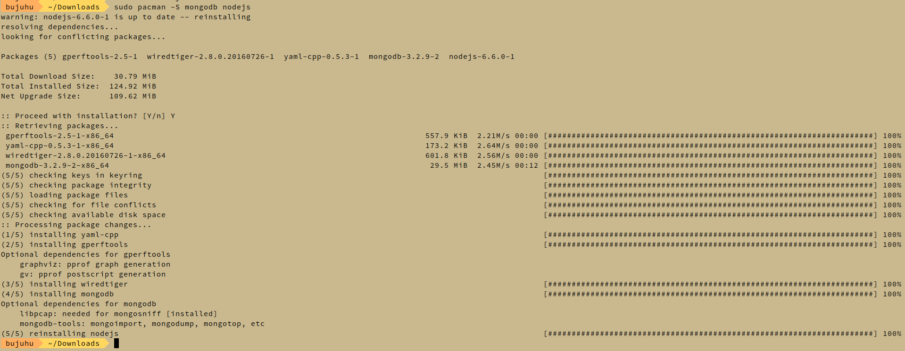
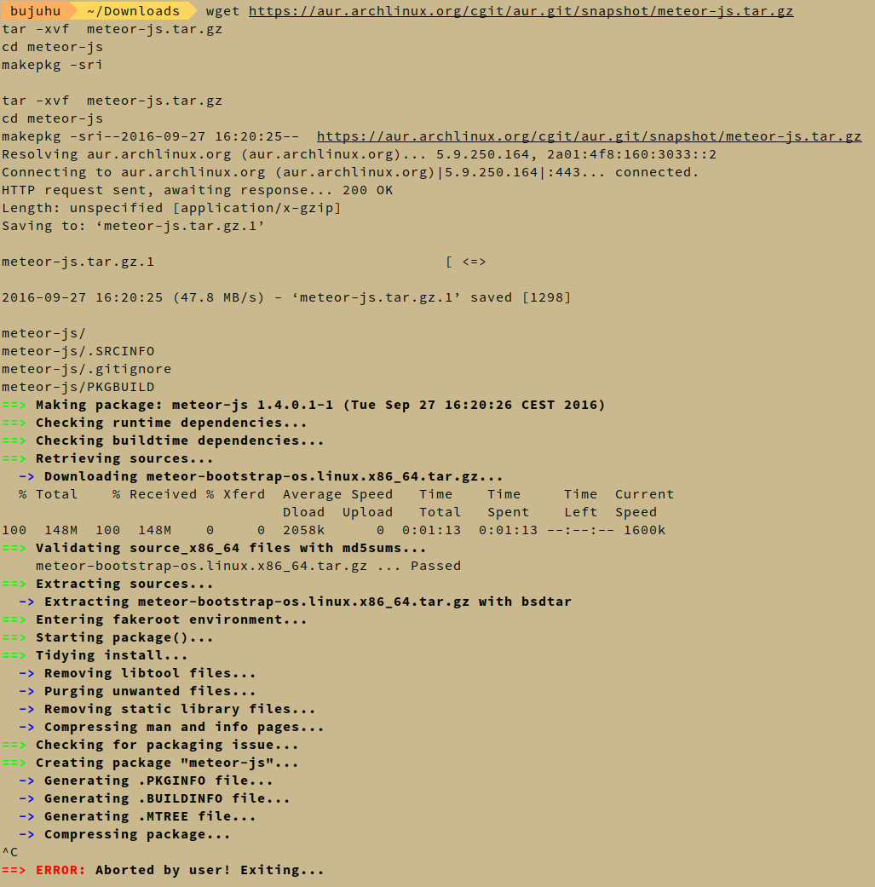
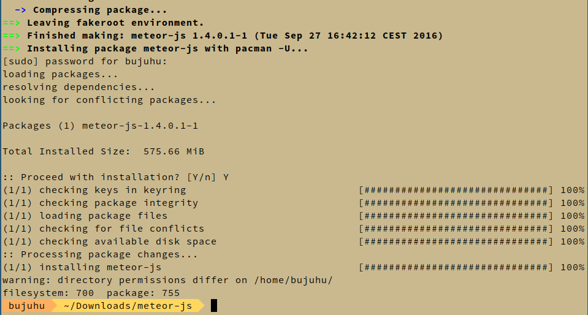

# Battleship 1

Wir haben uns für die Umsetzung des Projekts auf die Nutzung von [Meteor](https://www.meteor.com/), ein Javascript Framework, geeinigt. Um mit der Entwicklung beginnen zu können, müssen dafür erstmal die dafür notwendigen Pakete installiert werden.
## Installation der benötigten Software (Arch Linux)

Folgende Pakete aus dem Arch Linux Packet Manager [pacman](https://wiki.archlinux.org/index.php/pacman) werden zur installation benötigt:
- [mongodb](https://www.archlinux.de/?page=PackageDetails;repo=community;arch=x86_64;pkgname=mongodb)
- [nodejs](https://www.archlinux.de/?page=PackageDetails;repo=community;arch=x86_64;pkgname=nodejs)

Zusätzlich wird aus dem AUR ([Arch User Repository](https://wiki.archlinux.org/index.php/Arch_User_Repository#Installing_packages)) das Paket [meteor-js](https://aur.archlinux.org/packages/meteor-js) installiert.

### Installation der Software
```sh
# Installation der Pakete aus pacman
sudo pacman -S mongodb nodejs

# Manuelle installation von meteor-js aus dem Arch User Repository
wget https://aur.archlinux.org/cgit/aur.git/snapshot/meteor-js.tar.gz
tar -xvf  meteor-js.tar.gz
cd meteor-js
makepkg -sri
```
### Durchführung


**Die Installation der Pakete aus dem Packet Manager war Erfolgreich**



**Die Installation aus dem AUR hat sich beim Schritt "Compressing Package" aufgehangen und wurde manuell abgebrochen**

Auf dem Computer werden mit `sudo pacman -Syu` alle verfügbaren Softwareupdates installiert um das Fehlerportential zu minimieren.
Der Computer wird neugestartet. Danach wird die Installation wiederholt



**Die Installation war Erfolgreich**
